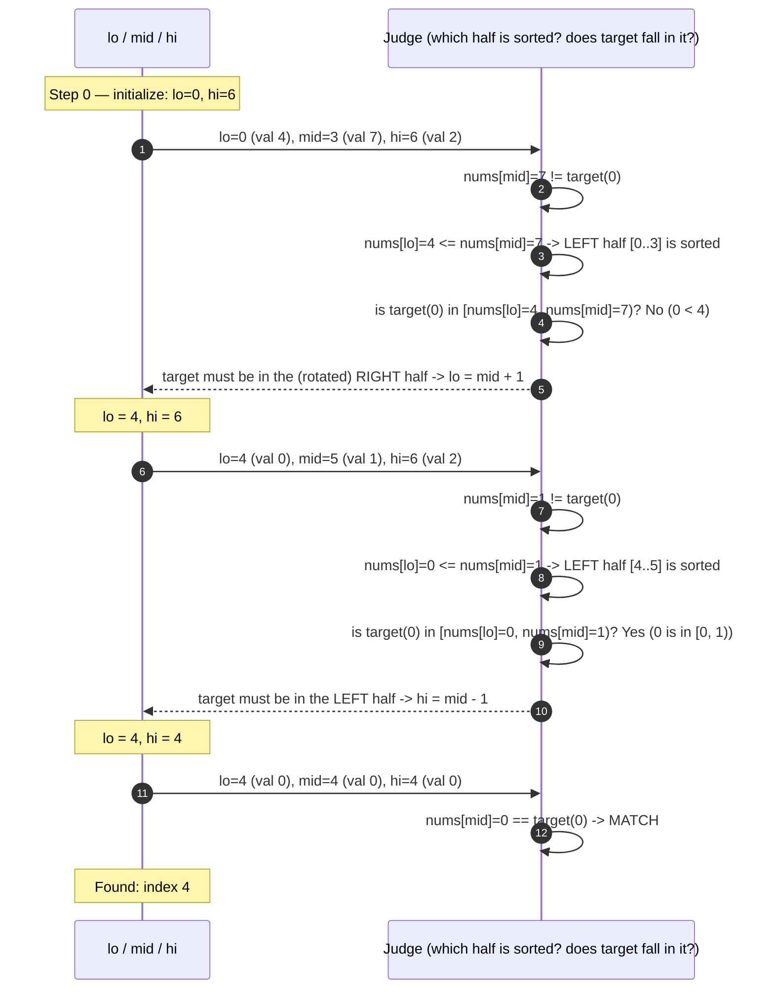

# Modified Binary Search — Trace Diagram (Worked Example)

This traces the exact `lo`/`mid`/`hi` positions and comparisons for searching `target = 0` in the rotated sorted array used in [problems/03-search-in-rotated-sorted-array.cpp](../problems/03-search-in-rotated-sorted-array.cpp):

```
nums  = [4, 5, 6, 7, 0, 1, 2]   (0-indexed; originally [0,1,2,4,5,6,7] rotated left by 4)
index =  0  1  2  3  4  5  6
target = 0
```



## How to read it

Each "round trip" is one loop iteration of the algorithm in [flow-diagram.md](flow-diagram.md): compute `mid`, ask the Judge which half is normally sorted, and use that to decide whether `target`'s value could possibly fall in the sorted half's known range. Notice the **halving**, not linear shrinkage: the range goes from 7 elements (`lo=0, hi=6`) to 3 elements (`lo=4, hi=6`) to 1 element (`lo=4, hi=4`) — each step discards roughly *half* of what remained, not a fixed number of elements. That multiplicative shrinkage is the entire reason this runs in O(log n) instead of O(n).

Also notice that on the very first iteration, `target` (0) is numerically *smaller* than every element in the left half `[4, 5, 6, 7]` — a classic mistake would be to compare `target < nums[mid]` the way plain binary search does and wrongly discard the *right* half, because 0 < 7 "looks like" target should be to the left. The rotated-array test avoids this exact trap by first checking which half is *sorted*, then checking whether `target` falls inside that specific half's value range — not by comparing `target` to `nums[mid]` alone.
