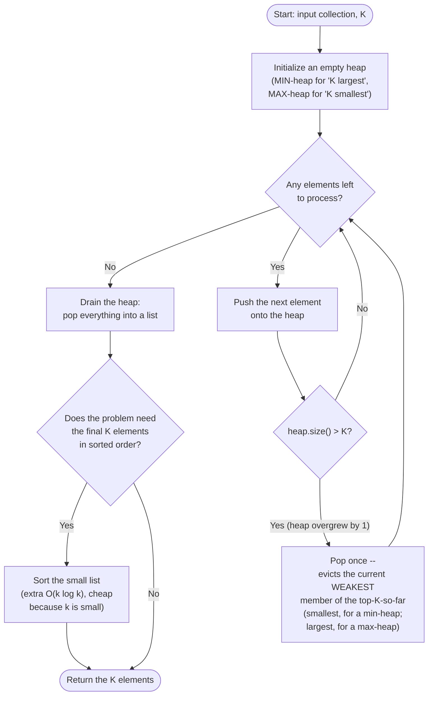

# Top K Elements — Flow Diagram

This traces the control flow of the general "K largest" size-K min-heap algorithm — the shape behind Kth Largest Element, Top K Frequent Elements (with a frequency key substituted for the raw value), and every other variant in this module. See [trace-diagram.md](trace-diagram.md) for a concrete worked example with actual numbers.

## How to read it

The loop body is exactly two steps, repeated once per input element: **push**, then **check the size and pop if oversized**. That is the entire mechanism — there is no separate "is this candidate even worth considering" comparison before the push. Every element gets pushed unconditionally; the heap's own size-triggered eviction is what decides, in O(log k), whether it was worth keeping. This is deliberately simpler than it might first seem: a candidate that turns out to be weaker than everything already held gets pushed and then immediately popped back off, at the same O(log k) cost as if you had checked first — so there is no correctness or performance reason to add a pre-check, only extra code to get wrong.

The **size check** (`heap.size() > K`) is the only place K appears in the whole loop, and it is why the heap never grows past K elements no matter how large the input is — that bound is what gives the pattern its O(k) space guarantee and its O(log k) per-element cost, both independent of the total input size n. Notice also the **drain-and-optionally-sort** step after the loop ends: the heap guarantees the *identity* of the top-K elements, not their relative order, so if the problem's output must be sorted, that is always a separate, explicit, cheap (O(k log k)) step tacked on afterward — never something the heap does for you automatically.
