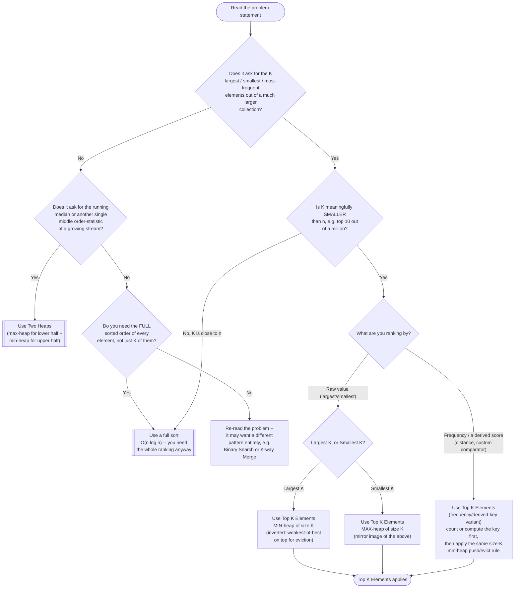

# Top K Elements — Recognition Diagram

Use this flowchart when you are staring at a new problem and trying to decide whether Top K Elements is the right tool, or whether the problem actually wants Two Heaps or a plain full sort instead.

## How to read it

Start at the top and answer each diamond honestly. The **first real fork** is the shape of the question itself: Top K Elements only applies when the answer is a *bounded* set of K extreme or frequent elements — if the problem actually wants a single *middle* value of a growing stream (the median), that is Two Heaps' territory, a different pattern that happens to also use heaps.

The **second fork** is the size relationship between K and n. This is the fork people skip most often, and skipping it is a real mistake: if K is close to n (say, K is 90% of n), the size-K heap's complexity advantage (O(n log k) vs. O(n log n)) evaporates almost entirely, and a plain full sort is simpler code for effectively the same cost. Top K Elements earns its keep specifically in the regime where K is small and fixed (a UI's "top 10" requirement) while n grows large (your data volume growing over time) — that gap is the pattern's entire reason to exist.

The **third fork** decides the heap type, and this is where the pattern's single most counter-intuitive rule lives: "largest K" pairs with a **min-heap**, and "smallest K" pairs with a **max-heap** — always the *opposite* of what first intuition suggests. If you cannot immediately state why (because the heap's top must be the weakest member of your current top-K, for cheap eviction), re-read the README's Solution section before writing any code; getting this backward either produces subtly wrong results or defeats the pattern's complexity advantage entirely. The "frequency/derived-key" branch is the same min-heap-of-size-K shape as "largest K" — only the thing being compared (a computed frequency or distance, instead of the raw value) changes.
