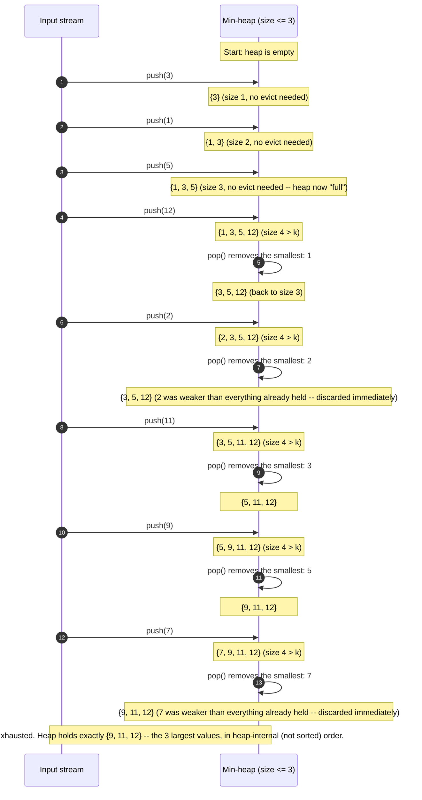

# Top K Elements — Trace Diagram (Worked Example)

This traces the exact contents of the size-K min-heap for the **3 largest of `[3, 1, 5, 12, 2, 11, 9, 7]`** example used in [code.cpp](../code.cpp)'s `main()` (`topKLargest(nums, 3)`, expected result `{12, 11, 9}`):

```
nums = [3, 1, 5, 12, 2, 11, 9, 7]
k = 3
heap type: MIN-heap (because we want the 3 LARGEST -- the inversion from the README's Solution section)
```



## How to read it

Each "round trip" is one input element processed by the algorithm's single loop body from [flow-diagram.md](flow-diagram.md): push, then check the size, then pop once if the heap now exceeds k. Watch the heap's contents after every step — it never holds more than 3 elements for longer than the instant between a push and its immediately following pop.

Two moments are worth slowing down on. First, when `2` is pushed (step 5), it is immediately evicted again — it never had a chance of being in the final answer because the heap already held three values (3, 5, 12) all larger than it, and the min-heap's top (`3` at that moment) correctly identified `2`'s only competition. Second, notice the eviction always removes the heap's **current minimum**, never the just-pushed element specifically — on the `push(12)` step, the evicted value is `1` (the original smallest), not `12` itself, because `12` is clearly one of the strongest candidates so far. This is exactly the "weakest of the current top-K is always the one at risk" property that makes the min-heap the correct choice for "K largest": the heap does not need to know which element was pushed most recently, only which one is currently the weakest.

By the end, the heap holds `{9, 11, 12}` — matching the expected `{12, 11, 9}` from `code.cpp`'s test once sorted descending for display. The heap itself never sorted these three values relative to each other; sorting them (if the caller wants that) is the separate, cheap, final step described in the Execution Flow section of the [README](../README.md).
