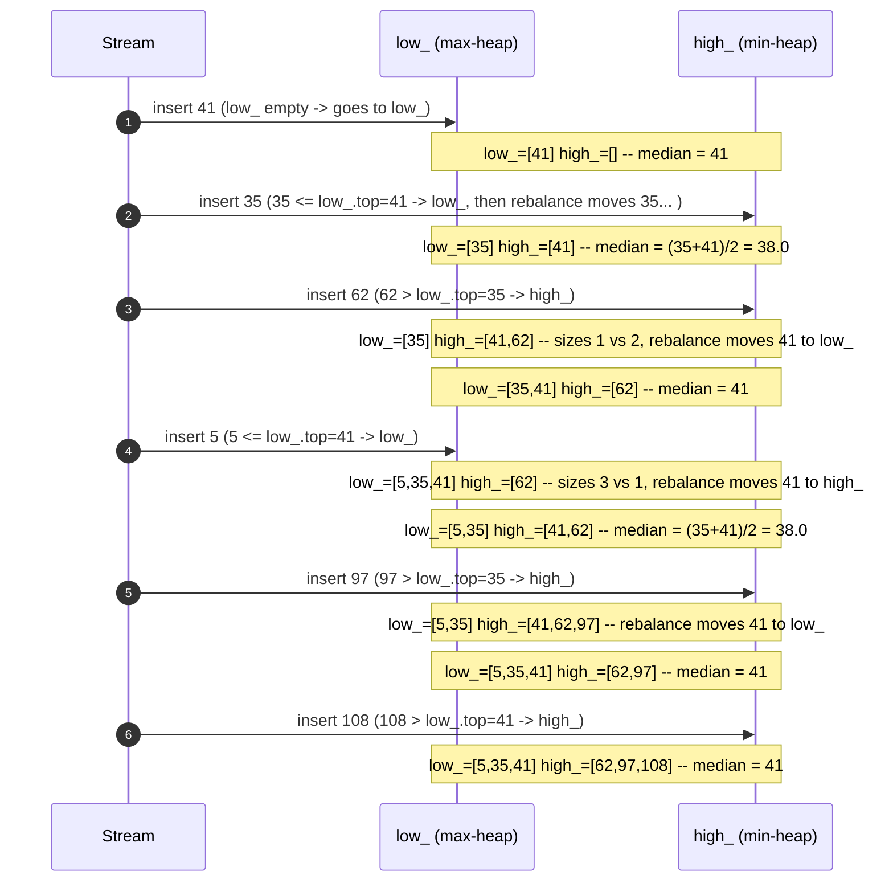

# Two Heaps — Trace Diagram

Tracing the stream `41, 35, 62, 5, 97, 108` (from LeetCode 295's classic example) through both heaps, one insertion at a time.

**How to read it:** watch how the size-balancing step (rebalance) fires every time one heap gets more than one element ahead of the other — it always moves exactly one element across, restoring the "differ by at most 1" invariant before the next number is read. The `low_` column always holds the smaller half (its *top*, via the max-heap ordering, is the largest of the small values — i.e. the boundary right below the median), and `high_`'s top is the smallest of the large values — the boundary right above the median. Reading the median is just looking at one or both of those two boundary values.
