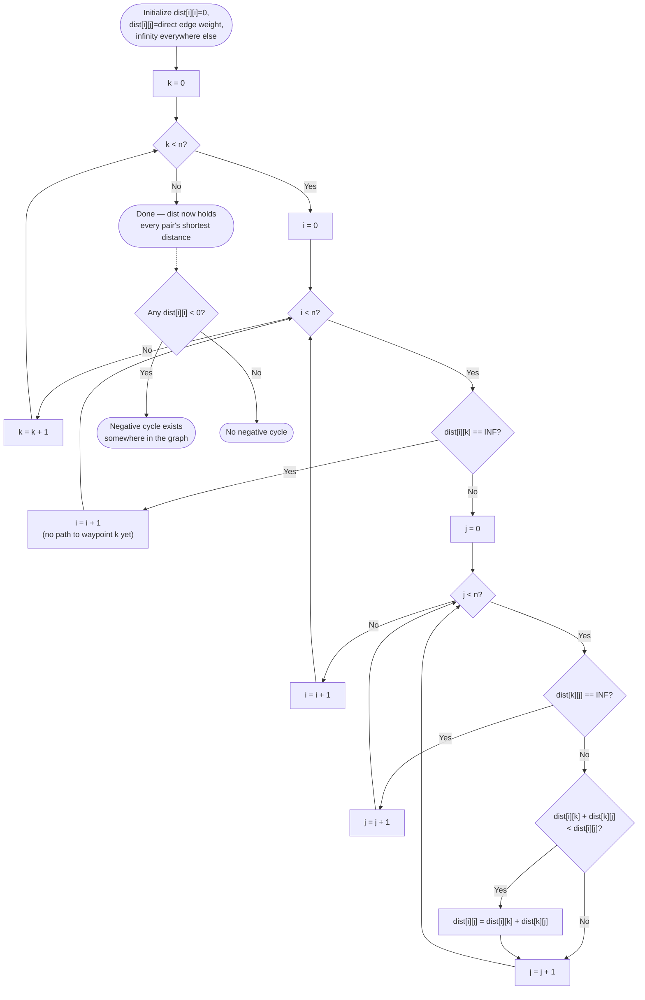

# Floyd-Warshall — Flow Diagram

See this diagram for the control flow of the triple-nested waypoint loop, exactly as implemented in [code.cpp](../code.cpp)'s `floydWarshall`, with the outer-`k` ordering requirement made explicit.

## How to read it

The outermost loop variable is `k`, not `i` or `j` — follow the diagram's own nesting order (`k` contains `i`, which contains `j`) and notice this is the *only* correct nesting. If `i` were made outermost instead, the diagram's `F` and `I` checks (`dist[i][k]`/`dist[k][j]` against infinity) would sometimes read values for a waypoint `k` that has not yet had its own turn in the outer position — meaning some relaxations would silently use a not-yet-fully-improved value, producing a partially correct matrix with no error or crash to signal it.

The two "== INF, skip" guards (`F` and `I`) exist purely to avoid computing `dist[i][k] + dist[k][j]` when one side is still the infinity sentinel — without them, that addition could silently overflow or produce a nonsensical small number that then corrupts `dist[i][j]` with a wrong "improvement." [code.cpp](../code.cpp) divides its infinity sentinel by 4 specifically so that even two infinities added together cannot overflow a `long long`, but the skip guards remain the correct, explicit way to avoid the addition entirely rather than relying on the sentinel's size alone.

The dotted line at the bottom shows the negative-cycle check running *after* the full triple loop completes, as a separate, final pass over just the diagonal — this is not part of the relaxation loop itself, but a one-line consequence of it: a diagonal entry that has dropped below zero is only possible if some path looped back through a cycle whose total weight is negative.
