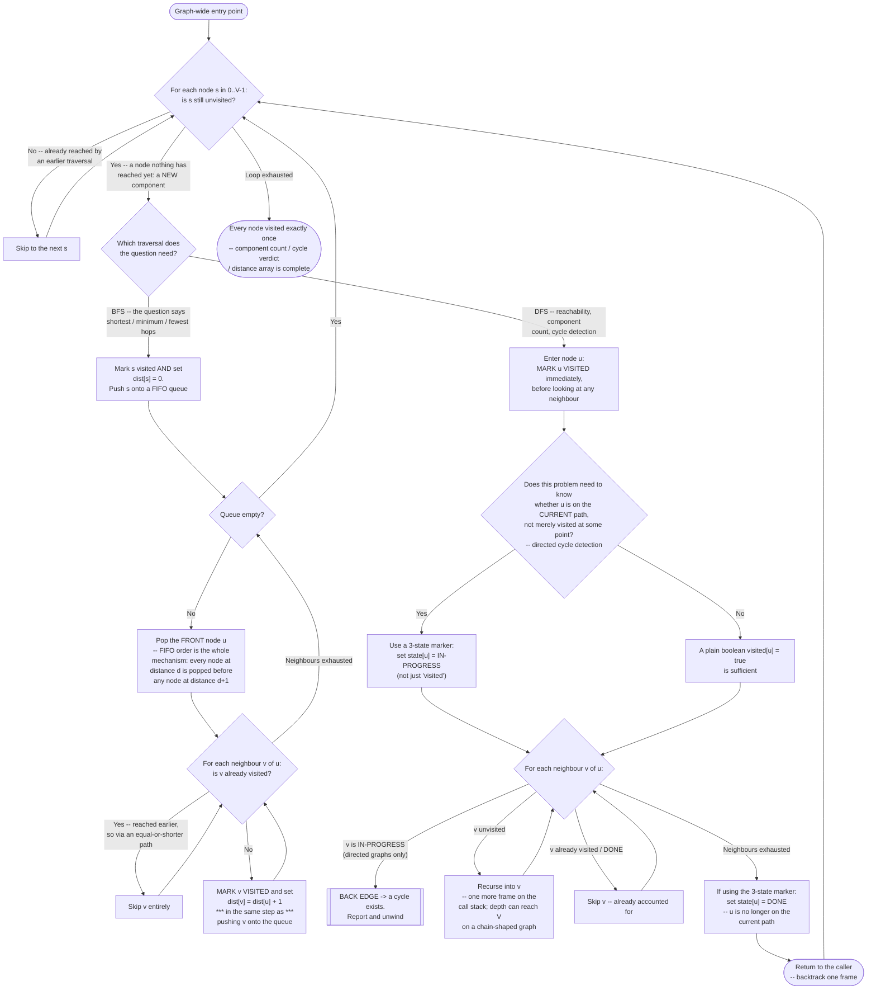

# Graph BFS/DFS — Flow Diagram

This traces the control flow of both guarded traversals side by side — BFS's queue loop on the left, DFS's recursion on the right — so the one structural difference between them is visible in a single picture. See [trace-diagram.md](trace-diagram.md) for a concrete worked example with actual node numbers.

## How to read it

**The outer loop is the frame around everything, and it is the piece most often left out.** Both traversals sit *inside* a loop over every node as a potential start. A single BFS or DFS from one node reaches exactly one connected component and no more, so any question with a graph-wide answer — how many components, does a cycle exist anywhere, is every node reachable — is wrong without it. The failure is silent: no crash, no exception, just an under-count. This is the loop `dfsConnectedComponents` and `hasCycleDirected` in [../code.cpp](../code.cpp) both wrap around their traversals, and the one `bfsShortestPath` deliberately does *not* have, because "distances from one specific source" is a single-source question by definition.

**On the BFS side, the single load-bearing box is "mark visited and set the distance in the same step as pushing."** Split that box in two — push now, mark when popped — and two different in-flight nodes that both point at the same undiscovered neighbour will both push it before either marks it. The node is then processed twice, the queue holds duplicates, and in a distance-counting context the second push can write a distance that came from a longer route. Mark on **discovery**, never on processing. The FIFO pop is the other load-bearing detail, and it is the entire proof of the shortest-path guarantee: because the queue is first-in-first-out and every push adds exactly one to the distance, nodes come out in non-decreasing distance order, so the first time a node is reached is via a shortest route. Swap the queue for a stack and you have DFS — that one substitution is the whole difference, and it is exactly what destroys the guarantee.

**On the DFS side, the interesting fork is the three-state question.** Most DFS problems need nothing more than a boolean: reachability, component counting, flood fill ([problems/01-number-of-islands.cpp](../problems/01-number-of-islands.cpp), [problems/02-number-of-provinces.cpp](../problems/02-number-of-provinces.cpp)) all just need "have I been here." Directed cycle detection is the exception, and the reason is specific: in a directed graph, arriving at an already-visited node is completely normal — a diamond `0->1, 0->2, 1->3, 2->3` reaches node 3 twice with no cycle anywhere. What proves a cycle is arriving at a node that is still **on the current path**, which a boolean cannot express. Hence `unvisited` / `in-progress` / `done`, with `in-progress` set on entry and cleared to `done` on exit — the marker is a mirror of the recursion stack itself.

**Both branches converge on "every node visited exactly once," and that is where the O(V + E) bound comes from.** The visited guard is not an optimisation layered on top of a working algorithm; it is what makes the algorithm terminate at all on a graph with a cycle, and it is simultaneously what bounds the total work: V node entries, plus each edge examined at most once per endpoint. Remove it and you do not get a slower correct traversal — you get a BFS whose queue never empties or a DFS that overflows the stack.

**Note also what the diagram does *not* show: any notion of distance on the DFS side.** There is no `dist[]` box in the right-hand branch, and that absence is the answer to "why not just use DFS for shortest path." DFS knows how deep it currently is; it does not and cannot know that the depth it arrived at a node with is the minimum. See [problems/04-word-ladder.cpp](../problems/04-word-ladder.cpp) for the concrete case where that difference turns a correct answer into a wrong one.
