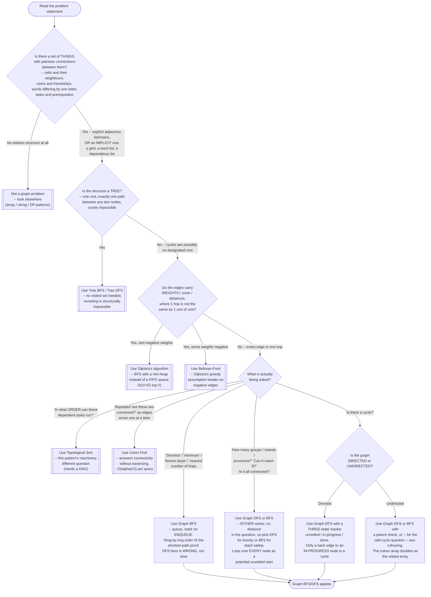

# Graph BFS/DFS — Recognition Diagram

Use this flowchart when you are staring at a new problem and trying to decide (a) whether it is even a graph problem, and (b) if it is, whether it wants BFS, DFS, or one of the neighbouring patterns — Topological Sort, Union Find, or Dijkstra — instead.

## How to read it

Start at the top and answer each diamond honestly. The **first fork is not about traversal at all** — it is about whether you have noticed there is a graph in front of you. A large share of real graph problems never use the word: a 2D grid is a graph whose edges are geometric ([problems/01-number-of-islands.cpp](../problems/01-number-of-islands.cpp)), a word list is a graph whose edges are "differs by one letter" ([problems/04-word-ladder.cpp](../problems/04-word-ladder.cpp)), an `isConnected` matrix is a graph in the least disguised possible way ([problems/02-number-of-provinces.cpp](../problems/02-number-of-provinces.cpp)). If there is a set of things and a rule saying which pairs are directly related, you have nodes and edges, whatever the input type says.

The **second fork** is the one that decides whether you need this module at all. If the structure is genuinely a tree — one root, exactly one path between any two nodes — then revisiting a node is structurally impossible and the `visited` set is dead weight; use [../../tree-bfs/](../../tree-bfs/) or [../../tree-dfs/](../../tree-dfs/). Everything below this fork exists because that guarantee is gone.

The **third fork is a trap door, and it is worth checking before anything else in the "what is being asked" group.** If edges carry weights — road distances, request latencies, dollar costs — then BFS's ring-by-ring order stops corresponding to "cheapest," and BFS will confidently return a wrong answer rather than an error. One 100-cost edge is not better than three 3-cost edges. That escalation is Dijkstra's algorithm (non-negative weights) or Bellman-Ford (negative weights allowed). Graph BFS is exactly Dijkstra with every weight pinned to 1, which is why it gets away with a plain FIFO queue and the cheaper O(V + E) bound.

The **fourth fork — "what is actually being asked" — is where the module's real decision lives**, and it splits five ways:

- **"Shortest / minimum / fewest / nearest," counting hops.** BFS, and this is the one branch where the choice is not stylistic. DFS commits to one direction and can reach the target via a long detour, marking the short route's nodes visited on the way; it returns a real path that is not the shortest one, silently. Making DFS correct means un-marking on backtrack and enumerating every simple path — exponential, not O(V + E).
- **"How many groups / can A reach B / is it connected."** Either traversal, and saying so out loud is the stronger answer. There is no distance anywhere in the question, so BFS's guarantee is unused. Pick DFS for brevity (`problems/01`, `problems/02`) or BFS when recursion depth is a genuine risk. The non-negotiable part is not the traversal — it is the **outer loop over every node as a potential unvisited start**, without which a disconnected component is silently never counted.
- **"Is there a cycle."** Here the traversal choice is forced by the *edge direction*, not by the question. A directed graph needs the three-state (`unvisited`/`in-progress`/`done`) marker of `hasCycleDirected` in [../code.cpp](../code.cpp), because reaching an already-finished node through a second parent is normal in a DAG and proves nothing. An undirected graph needs no third state: any edge to an already-visited non-parent node closes a cycle, and if the question is specifically about **odd** cycles ("is it bipartite"), the two-colouring in [problems/03-is-graph-bipartite.cpp](../problems/03-is-graph-bipartite.cpp) reuses the colour array as the visited array and treats a colour *match* — not the revisit — as the failure.
- **"In what order can these tasks run."** Topological Sort ([../../topological-sort/](../../topological-sort/)) — built on this exact machinery, answering a different question, and requiring a DAG (which is why a cycle check is usually its first step).
- **"Are these two connected, asked repeatedly as edges arrive."** Union Find ([../../union-find/](../../union-find/)), which maintains component membership incrementally and never traverses an edge to answer a query.
