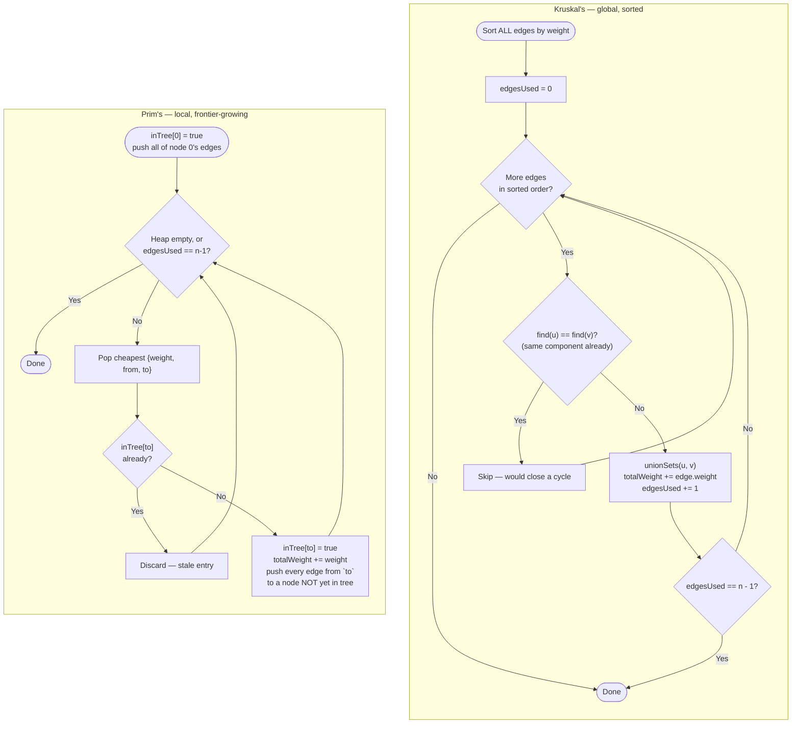

# Minimum Spanning Tree — Flow Diagram

See this diagram for the control flow of both Kruskal's and Prim's, side by side, exactly as implemented in [code.cpp](../code.cpp).

## How to read it

Both halves reach the same guarantee through structurally different bookkeeping. Kruskal's `K4` diamond (`find(u) == find(v)`) is checking a property of the **whole graph considered so far** — has *any* previously-processed edge already connected `u` and `v`, regardless of how far apart they are in the edge list. Prim's `P4` diamond (`inTree[to]`) is checking a property of **one specific tree growing outward from one specific starting node** — has `to` already been absorbed into *this* tree.

The loop termination conditions also differ in a way worth noticing: Kruskal's `K3b` checks `edgesUsed == n - 1` after every successful union, stopping the moment the tree is complete regardless of how many sorted edges remain unexamined. Prim's `P2` checks the same condition, but combines it with "is the heap empty" — a Prim's run on a disconnected graph empties its heap before `edgesUsed` ever reaches `n - 1`, which is exactly how disconnection is detected without any separate check.

Follow one edge through each side to see the contrast directly: in Kruskal's, an edge's position in the sorted list is fixed before the algorithm starts, and it is examined exactly once, regardless of where its endpoints are in the graph. In Prim's, an edge is only ever considered once at least one of its endpoints has already joined the growing tree — an edge between two nodes neither of which is `inTree` yet is never pushed onto the heap at all, until the tree's growth happens to reach one of them.
