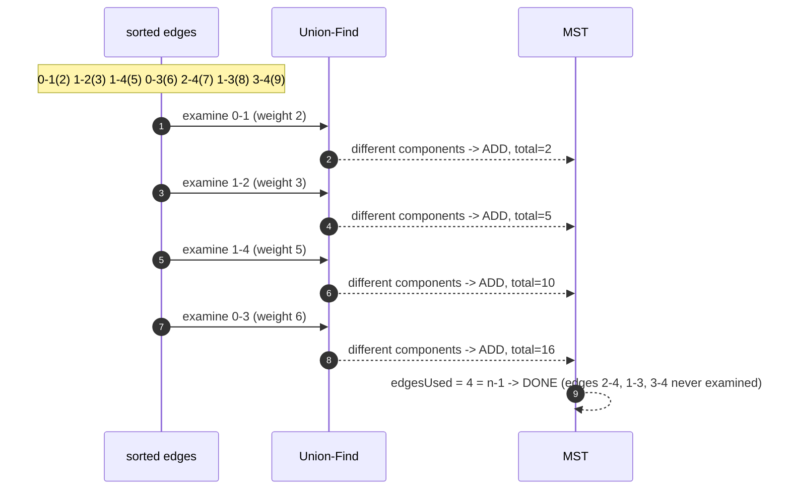

# Minimum Spanning Tree — Trace Diagram (Worked Example)

This traces both Kruskal's and Prim's on the 5-node graph used in [code.cpp](../code.cpp)'s first test case:

```
Graph (undirected, weights on edges):

    0 --2-- 1        1 --3-- 2        1 --5-- 4
    0 --6-- 3        1 --8-- 3        2 --7-- 4
                                       3 --9-- 4

5 nodes: 0, 1, 2, 3, 4.  Expected MST total weight: 16
```



## Kruskal's trace (global, sorted)

Sorted edges: `(0,1,2) (1,2,3) (1,4,5) (0,3,6) (2,4,7) (1,3,8) (3,4,9)`

| Step | Edge examined | `find(u) == find(v)`? | Action | Components after | `totalWeight` |
|---|---|---|---|---|---|
| 1 | `0–1` (2) | No | **Add** | `{0,1} {2} {3} {4}` | 2 |
| 2 | `1–2` (3) | No | **Add** | `{0,1,2} {3} {4}` | 5 |
| 3 | `1–4` (5) | No | **Add** | `{0,1,2,4} {3}` | 10 |
| 4 | `0–3` (6) | No | **Add** | `{0,1,2,3,4}` | 16 |

`edgesUsed` reaches `4 = n - 1` after step 4 — the loop stops immediately. The three remaining sorted edges (`2–4` weight 7, `1–3` weight 8, `3–4` weight 9) are **never examined at all**, not even to be rejected — the early exit means Kruskal's total work here is proportional to how quickly the tree completes, not to the full edge count.

## Prim's trace (local, frontier-growing, starting at node 0)

| Step | Heap before pop | Popped `{w, from, to}` | Stale? | Action | `totalWeight` |
|---|---|---|---|---|---|
| init | — | — | — | `inTree[0]=true`; push `{2,0,1}`, `{6,0,3}` | 0 |
| 1 | `{2,0,1} {6,0,3}` | `{2,0,1}` | no | `inTree[1]=true`; push `{3,1,2}`, `{8,1,3}`, `{5,1,4}` | 2 |
| 2 | `{6,0,3} {3,1,2} {8,1,3} {5,1,4}` | `{3,1,2}` | no | `inTree[2]=true`; push `{7,2,4}` | 5 |
| 3 | `{6,0,3} {8,1,3} {5,1,4} {7,2,4}` | `{5,1,4}` | no | `inTree[4]=true`; push `{9,4,3}` | 10 |
| 4 | `{6,0,3} {8,1,3} {7,2,4} {9,4,3}` | `{6,0,3}` | no | `inTree[3]=true`; `edgesUsed=4=n-1` — **done** | 16 |

## How to read it

Both algorithms select the **identical four edges** — `0–1`, `1–2`, `1–4`, `0–3` — and arrive at the same total weight, `16`. This is not a coincidence specific to this graph: because every edge weight here is distinct, the minimum spanning tree is **unique**, so any correct algorithm must find exactly this tree. (Compare this with [code.cpp](../code.cpp)'s 4-node-cycle test, where all edges tie at weight 1 — there, Kruskal's and Prim's could legitimately select *different* edge sets while still matching on total weight.)

What differs is not the *result* but the *reason each edge was examined at all*. Kruskal's step 3 (`1–4`, weight 5) is considered simply because it is next in the global sorted order — it has no relationship to which edges were added in steps 1 and 2 beyond needing the cycle check. Prim's step 3 (`{5,1,4}`) is only *available to be considered* because node 1 joined the tree back in step 1, which is what put `1–4` on the frontier in the first place — Prim's would never have looked at this edge at all until something already in the tree touched it.

The heap contents column is worth tracing closely for one specific reason: notice that `{6,0,3}` sits in the heap from the very first `init` step onward, surviving three full iterations before finally being popped in step 4. It was never stale and never needed to be discarded — it simply was not the *cheapest* available frontier edge until every other edge had already been consumed. Contrast this with a genuinely stale entry (not shown in this particular trace, but present in denser graphs): an entry that gets pushed, then later discarded via `if (inTree[to]) continue;` because a *different*, cheaper edge reached the same destination node first.
