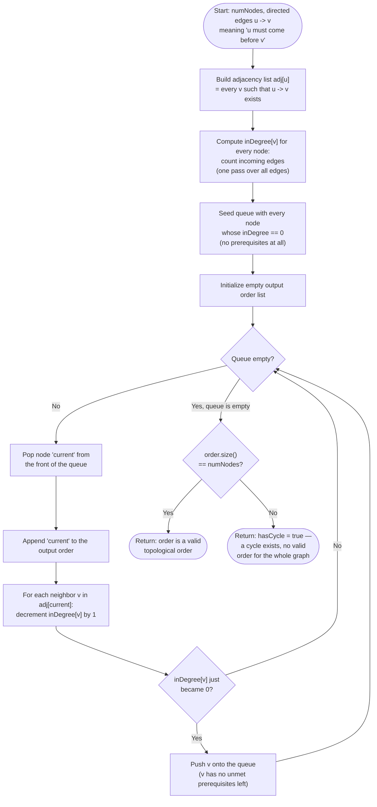

# Topological Sort — Flow Diagram (Kahn's Algorithm)

This traces the control flow of Kahn's algorithm — the BFS-based approach this module builds around. See [trace-diagram.md](trace-diagram.md) for a concrete worked example with actual in-degree values and queue contents.

## How to read it

The two setup boxes (`BuildAdj`, `BuildDegree`) are a single `O(E)` pass each over the edge list — they exist purely to answer, in `O(1)` time per lookup during the main loop, "who depends on this node?" and "does this node currently have zero unmet prerequisites?" Without them you would have to rescan the entire edge list on every step, turning a linear algorithm into a quadratic one.

The main loop (`Loop` through `Enqueue`) is where the actual ordering happens: every iteration pops exactly one node, emits it, and walks its (already-built) adjacency list to decrement neighbors' in-degrees, pushing any neighbor that just reached zero. This is precisely BFS, except the "has this node been visited" check that ordinary Graph BFS uses is replaced here by "has this node's in-degree reached zero" — the frontier is defined by satisfied dependencies, not by proximity to a start node.

The final diamond, `LengthCheck`, is the single most important box in the whole diagram and the one most often forgotten in a hastily-written implementation: comparing the final `order.size()` to `numNodes` is the *entire* cycle-detection mechanism. If every node was eventually emitted, the graph was a DAG and `order` is a valid answer. If the queue ran dry while nodes remain un-emitted, those remaining nodes were stuck — each waiting on a prerequisite that was itself (directly or transitively) waiting on it — which is only possible if a cycle exists among them.
