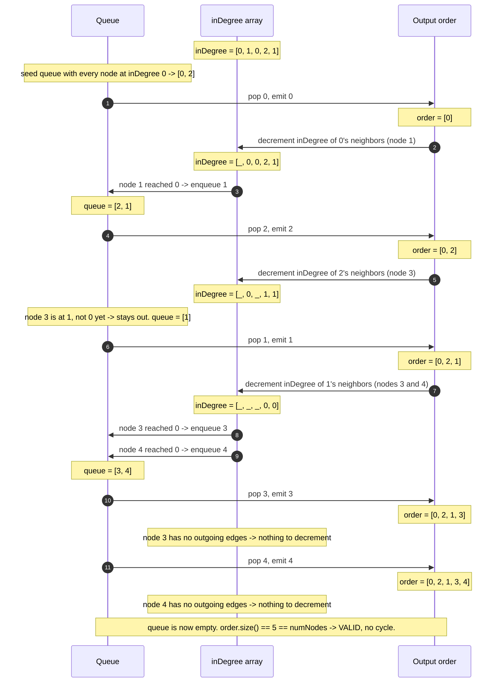

# Topological Sort — Trace Diagram (Worked Example)

This traces the exact in-degree values and queue contents for a concrete **5-course prerequisite graph** — the same example used in [code.cpp](../code.cpp)'s `main()`:

```
Course 0: Intro to Programming     (no prerequisite)
Course 1: Data Structures          (requires 0)
Course 2: Discrete Math            (no prerequisite)
Course 3: Algorithms               (requires 1 and 2)
Course 4: Operating Systems        (requires 1)

Edges (u -> v means "u must come before v"):
  0 -> 1
  1 -> 3
  2 -> 3
  1 -> 4

Initial in-degrees:
  inDegree[0] = 0   (nothing points into 0)
  inDegree[1] = 1   (from edge 0 -> 1)
  inDegree[2] = 0   (nothing points into 2)
  inDegree[3] = 2   (from edges 1 -> 3 and 2 -> 3)
  inDegree[4] = 1   (from edge 1 -> 4)
```



## How to read it

Notice the queue starts with **two** nodes (`0` and `2`) because both have in-degree 0 from the very beginning — they have no prerequisites at all. The order they get popped in (`0` before `2` here, because of plain FIFO behavior) is not the *only* valid order; `2, 0, 1, 3, 4` would be equally valid, since nothing requires `0` before `2` or vice versa. This is the concrete illustration of "Kahn's algorithm gives you *a* valid order, not *the* unique one."

Also notice node `3` needs **two** separate decrements (from both `1 -> 3` and `2 -> 3`) before it reaches in-degree 0 and becomes eligible — it does not enter the queue after `2` is processed (its in-degree only drops from 2 to 1), and only becomes eligible once `1` is also processed. This is exactly why in-degree bookkeeping must be precise: a node with multiple prerequisites must wait for *all* of them, not just one.

For contrast, here is what the same graph looks like with an added edge `3 -> 0` (creating a cycle among 0, 1, 3): `inDegree[0]` would start at 1, not 0, so the initial queue would be seeded with only `[2]`. Processing `2` decrements node `3`'s in-degree to 1 — but node `3` can never reach 0, because it is waiting on node `1`, which is waiting on node `0`, which is waiting on node `3`. The queue would empty after emitting only `2` (and possibly `4` if it had no cyclic dependency), leaving `order.size() = 1` or `2`, far short of `numNodes = 5` — exactly the stuck state that signals a cycle.
