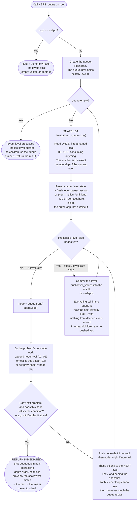

# Tree BFS — Flow Diagram

This traces the control flow of the queue-based level-by-level loop that every function in this module shares — `levelOrder` and `minDepth` in [code.cpp](../code.cpp), and all four files in [problems/](../problems/). The critical detail the diagram is drawn to make unmissable is **where the level-size snapshot is taken relative to the inner loop**. See [trace-diagram.md](trace-diagram.md) for the same loop walked through with actual node values.

## How to read it

The diagram has **two nested loops, and the whole pattern lives in the relationship between them.** The outer loop (`queue empty?` → `SNAPSHOT` → ... → `Commit` → back to `queue empty?`) advances one **level** per iteration. The inner loop (`Processed level_size nodes yet?` → `Dequeue` → `Work` → `PushKids` → back) advances one **node** per iteration. Nothing about the queue itself enforces that boundary — a queue is just a FIFO container, and `while (!queue.empty())` alone would happily consume the entire tree in one flat pass, correctly ordered but with no idea where one level ended. The boundary comes entirely from the `SNAPSHOT` box.

**Why the snapshot box sits where it does.** Look at the two arrows that touch the queue's contents: `Dequeue` removes one node from the front, and `PushKids` adds up to two nodes to the back — both inside the inner loop. So the queue's actual size is churning constantly while the inner loop runs. `level_size` is read *once*, before any of that churn begins, at a moment when the queue provably contains the current level and nothing else (every node in it was pushed by the previous level's `PushKids`, and no grandchildren exist in it yet because their parents have not been dequeued). Copying that number into a named local freezes the level's membership. Writing `for (size_t i = 0; i < q.size(); ++i)` instead re-reads the churning size on every iteration, so the loop keeps chasing a growing target and slides straight into the next level — the single most common bug in this pattern, and one that does not crash, it just silently merges levels.

**The `PerLevelInit` box is easy to skip and is why problem 04 is harder than it looks.** For [problems/01](../problems/01-binary-tree-level-order-traversal.cpp) and [problems/02](../problems/02-binary-tree-zigzag-level-order-traversal.cpp) the per-level state is a fresh `level_values` vector, and forgetting to create it fresh is obvious — the levels would visibly concatenate. For [problems/04](../problems/04-populating-next-right-pointers-ii.cpp) the per-level state is a single `prev` pointer, and if its declaration is hoisted *above* the outer loop, `prev` survives the level boundary and the last node of each level gets linked to the first node of the next one. Every node still ends up with a plausible `next`, nothing crashes, and the tree is quietly corrupted into one long diagonal chain. Same structural mistake, far less visible symptom — which is exactly why the box is drawn inside the outer loop rather than before it.

**The `EarlyExit` diamond is the only place BFS beats DFS on time, not just on convenience.** For collection problems it never fires and the loop drains the whole tree. For [problems/03](../problems/03-minimum-depth-of-binary-tree.cpp) it fires on the first leaf dequeued, and the return is safe *because of the queue's ordering property*, not because of anything about the condition: nodes come out in non-decreasing depth order, so nothing shallower can still be waiting. This is the structural advantage Tree DFS cannot replicate — a DFS minimum-depth solution has to finish every root-to-leaf path and keep a running minimum, since it might descend a fifty-node branch before ever seeing the two-node one that was the real answer. Note also *where* the diamond sits: after `Work` but before `PushKids`, because once you know you are returning there is no reason to enqueue children you will never look at.

**The `Commit` box is where "one level's worth of progress" gets recorded**, and its position — after the inner loop, not inside it — is what makes per-level results possible at all. This is also the honest cost side of the pattern, the one named in the README's Disadvantages: no level's result exists until every node in that level has been dequeued, so BFS cannot stream partial answers the way DFS can emit a result the instant it bottoms out in a recursive call. And because the queue at that moment holds the entire next level, the queue's peak size is the tree's **widest** level — up to roughly `n / 2` nodes for a complete binary tree, which is the whole reason Tree BFS costs O(n) space where Tree DFS costs O(h). Problem 04's second implementation exists to show the one escape from that cost: once a level is linked by `next` pointers, the level itself can act as the queue, and the explicit queue disappears entirely.
