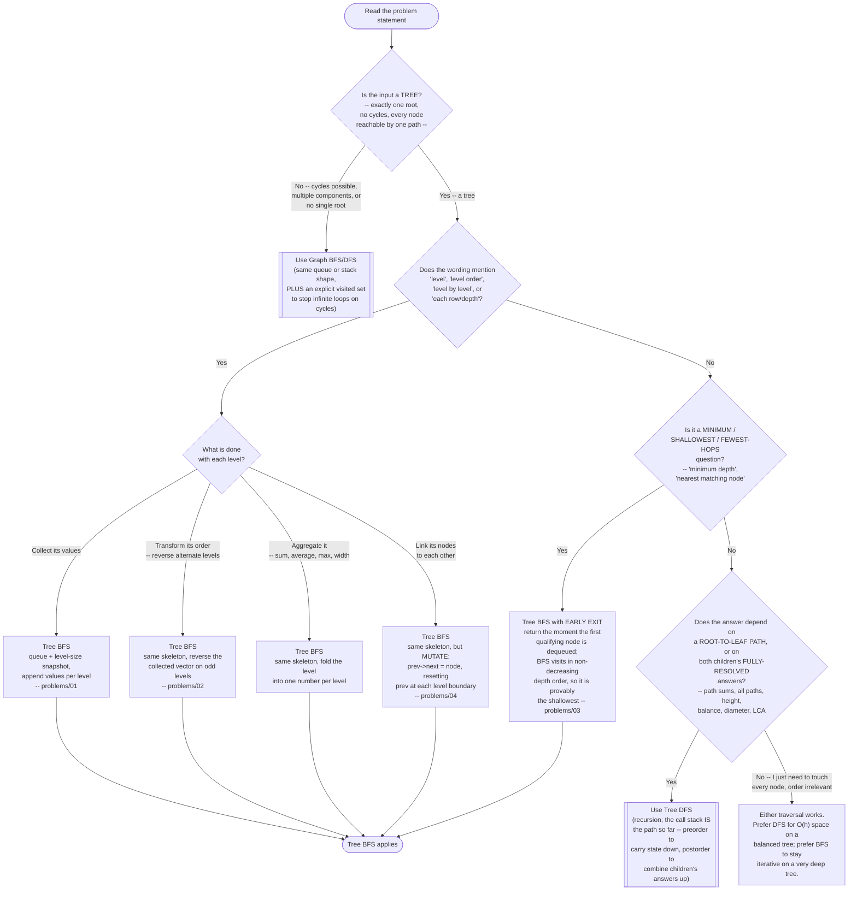

# Tree BFS — Recognition Diagram

Use this flowchart when you are staring at a new tree or graph problem and trying to decide whether Tree BFS is the right tool, or whether the problem actually wants Tree DFS or Graph BFS/DFS instead.

## How to read it

Start at the top and answer each diamond honestly. The **first fork is not about traversal at all** — it is about whether the input is genuinely a tree. A tree has exactly one root, no cycles, and exactly one path from the root to any node, which is precisely why Tree BFS never needs a `visited` set: no node can be reached, and therefore enqueued, twice. The moment the input can contain a cycle, be disconnected, or have several plausible starting points, the queue mechanic is unchanged but the algorithm is not — you need `visited`, and you are in Graph BFS/DFS territory (see [../../graph-bfs-dfs/](../../graph-bfs-dfs/)). Reaching for `visited` on a real tree is harmless but is a reliable sign the *reason* graphs need it has not clicked yet.

The **second fork is the word "level"** — the single strongest signal in this entire pattern. If the problem groups nodes by depth, aggregates per depth, reverses alternate depths, or connects nodes that share a depth, the level is the natural unit of work and Tree BFS hands it to you directly via the level-size snapshot. Notice that the four branches beneath it all lead to the same skeleton: `levelOrder` in [code.cpp](../code.cpp) is the shape, and collecting, reversing, folding, or linking is a thin per-level layer on top. That is the point of the fan-out — it is drawn wide to show that the *variations* are shallow, not that there are four different algorithms. [problems/02](../problems/02-binary-tree-zigzag-level-order-traversal.cpp) changes only how a level's collected vector is stored; [problems/04](../problems/04-populating-next-right-pointers-ii.cpp) changes only what happens to each dequeued node, replacing "append its value" with "point the previous node at it."

The **third fork catches the questions that never say "level" but are level questions anyway.** "Minimum depth," "the nearest node satisfying X," "the fewest hops to reach Y" are all really asking "the first level at which this becomes true." BFS answers them with a genuine early exit — it dequeues nodes in non-decreasing depth order, so the first match it sees is provably the shallowest and the rest of the tree never has to be touched ([problems/03](../problems/03-minimum-depth-of-binary-tree.cpp)). Tree DFS has no equivalent: it must explore every root-to-leaf path and keep a running minimum, because nothing in its visiting order favors shallow leaves.

The **fourth fork is the honest exit to Tree DFS** (see [../../tree-dfs/](../../tree-dfs/)). Two families belong there and not here. First, anything phrased around a *path* — "all root-to-leaf paths," "does any path sum to a target," "lowest common ancestor" — because a path is exactly what a recursive call stack carries for free and exactly what a queue of isolated nodes does not. Second, anything needing a *bottom-up* answer — height, balance, diameter, maximum path sum — because a parent's answer depends on both children's fully-resolved answers, and BFS's strictly top-down level order runs in the wrong direction for that dependency. If you find yourself trying to bolt a per-node path vector onto every queue entry, or trying to compute subtree heights level by level from the top down, you have taken a wrong turn at this diamond.

The **final leaf ("either traversal works")** is worth naming because it is common and often mis-argued: when you simply need to touch every node and the order is irrelevant (counting nodes, summing all values, searching for a value anywhere), both traversals are O(n) time and correct, and the tiebreaker is space and style — DFS costs O(h), which is O(log n) on a balanced tree and beats BFS's O(n) worst case; BFS stays iterative, which is the safer choice on a very deep, narrow tree where recursion risks a stack overflow.
