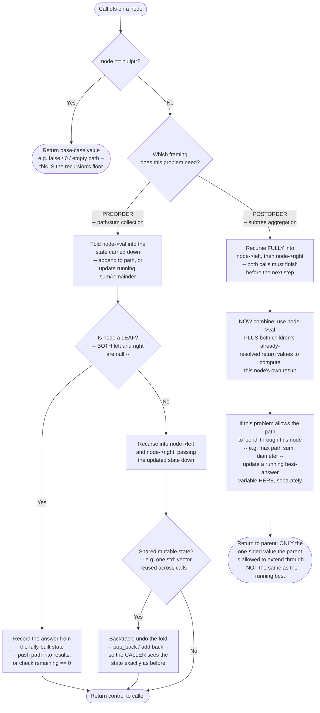

# Tree DFS — Flow Diagram

This traces the control flow of the general "descend, then combine on the way back up" shape shared by every Tree DFS problem — the two branches (preorder vs. postorder) diverge only in *when* the current node's value is folded into the answer relative to the two recursive calls. See [trace-diagram.md](trace-diagram.md) for a concrete worked example with actual node values.

## How to read it

The single most important fork in this diagram is **"which framing does this problem need"** — get that decision right before writing any code, because the two branches genuinely do different things in a different order. In the **preorder** branch (left), the current node's value is folded into the carried-down state *before* recursing, and the payoff happens the moment a leaf is reached — everything needed to record the answer is already sitting in the state parameter. In the **postorder** branch (right), nothing is computed from the current node until *both* recursive calls have fully returned — the node literally cannot know its own answer until its children have told it theirs.

The **"undo maybe" diamond** in the preorder branch is the backtracking discipline this module calls out repeatedly: if the state carried down is a *value copy* (a string built fresh at each call, as in Binary Tree Paths), there is nothing to undo — each call's copy simply goes out of scope. If the state is a *shared, mutable* structure (one vector reused across every call, as in Path Sum II), the fold must be paired with an explicit undo after the recursive calls return, or a sibling branch will silently inherit values left over from an already-finished branch.

The **"update best" box** in the postorder branch is where problems like Maximum Path Sum diverge from something as simple as `maxDepth`: the value returned to the parent (one-sided, extendable) and the value that competes to be the actual answer (possibly bending through both children, not extendable any further) are tracked as two genuinely different things — conflating them is the most common real mistake in this pattern's hardest problems.
