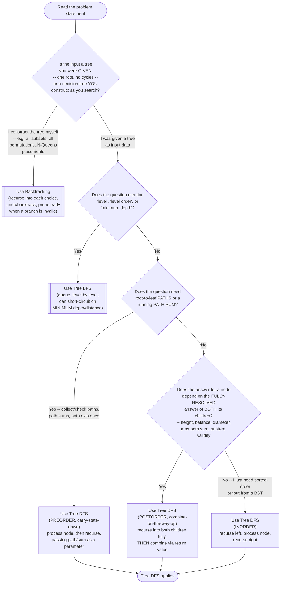

# Tree DFS — Recognition Diagram

Use this flowchart when you are staring at a new tree problem and trying to decide whether Tree DFS is the right tool, or whether the problem actually wants Tree BFS or Backtracking instead.

## How to read it

Start at the top and answer each diamond honestly. The **first real fork** is not about the tree traversal at all — it is about **what is being traversed**. If you are enumerating all subsets, permutations, or valid placements (N-Queens, Sudoku), you are not walking a tree that exists as input; you are *building* a decision tree of choices as you go, and pruning invalid branches early is central to the technique — that is Backtracking's territory, not this module's, even though the recursive shape (recurse, then undo) looks nearly identical.

If you were genuinely handed a tree as input, the **second fork** is "level" versus "path/depth." Any mention of level-order output, per-level aggregation, or **minimum** depth/distance is Tree BFS's signal — BFS reaches shallower nodes first, so it can stop the moment it finds the first (shallowest) match, something Tree DFS cannot do without exploring a potentially deep, irrelevant branch first.

The **third and fourth forks** separate the two Tree DFS flavors from each other: a question about root-to-leaf paths or a running sum wants **preorder** (carry state down as you descend, use it once you reach a leaf); a question about a value that depends on both children's fully-resolved answers (height, balance, diameter, "does the path bend through this node") wants **postorder** (recurse fully first, combine on the way back up via the return value). Inorder is called out separately because its headline use — visiting a binary search tree's nodes in sorted order — is narrower and less common outside BST-specific problems; if you find yourself reaching for it elsewhere, double check that sorted-order visitation is really what is needed.
