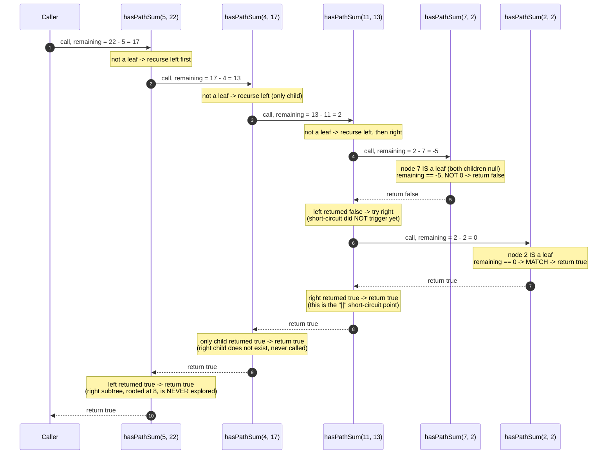

# Tree DFS — Trace Diagram (Worked Example)

This traces the recursive call stack descending and returning for **Path Sum** (LeetCode 112) — see [problems/01-path-sum.cpp](../problems/01-path-sum.cpp) — on the tree used throughout this module:

```
              5
        (left)  (right)
           4         8
      (left)      (left) (right)
       11           13      4
   (left)(right)          (right)
     7     2                 1

targetSum = 22
```



## How to read it

Each arrow going **down** (`->>`) is one recursive call being made — a new stack frame pushed, carrying the reduced `remaining` value as its parameter, exactly as described in the Execution Flow section of the [README](../README.md). Each arrow going **up** (`-->>`) is that call **returning**, popping its frame off the stack. Notice that the `remaining` value shown at each level is computed once, on the way *down*, and never needs to be recomputed on the way back up — it was carried, not recomputed.

The single most important detail in this trace is what happens **after** node `7` returns `false`: node `11`'s call does **not** give up. It still has an unexplored right child (`2`), so it calls into that branch too — this is the `||` in `hasPathSum(node->left, remaining) || hasPathSum(node->right, remaining)`. Only once `2` returns `true` does the short-circuit actually fire, at which point node `11`, then `4`, then `5` all return `true` in sequence **without ever calling into the right subtree rooted at `8` at all** — the calls to `hasPathSum(8, ...)`, `hasPathSum(13, ...)`, and `hasPathSum(4, ...)` (the second node valued `4`, on the right side) are never made, because C++'s `||` operator short-circuits the moment the left operand is `true`. This is why the diagram only ever shows five participants instead of all nine nodes in the tree — four nodes are never visited at all once the answer is already known.
