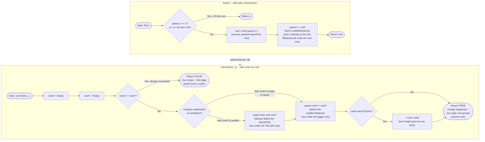

# Union Find — Flow Diagram (find with path compression, union by rank)

This traces the control flow of the two core operations — `find(x)` and `unionSets(x, y)` — and how they compose into "process one edge." See [trace-diagram.md](trace-diagram.md) for a concrete worked example with an actual forest of nodes.

## How to read it

The `find` subgraph is a single recursive climb: if the current node is already its own root, stop; otherwise recurse upward, and — critically — on the way back down, re-point the current node **directly** at the root that was found (`FCompress`). This is path compression: every node visited during this one `find` call gets flattened, so any future `find` on any of those nodes is O(1) instead of re-walking the same chain. The cost is paid once per chain, not once per future query.

The `unionSets` subgraph always calls `find` exactly twice first — to locate both elements' current roots — before deciding anything. The `USame` diamond is the cycle-detection signal used throughout this module's worked problems: if `x` and `y` already share a root, no merge is possible, and `unionSets` returning `false` is exactly how callers (see Redundant Connection and Number of Islands II) learn "this edge is redundant" without any separate cycle-detection logic. If the roots differ, the `URank` diamond is union by rank: the tree with the smaller rank (an upper bound on height) is always attached under the taller one, and the taller tree's rank only increases when both trees were exactly the same height — attaching a shorter tree under a taller one never increases the taller tree's own height, so its rank correctly stays unchanged. This is what keeps every tree's height growing logarithmically instead of linearly, which is the other half (alongside path compression) of the near-O(1) amortized bound.
