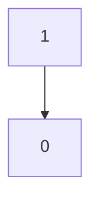
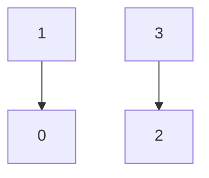
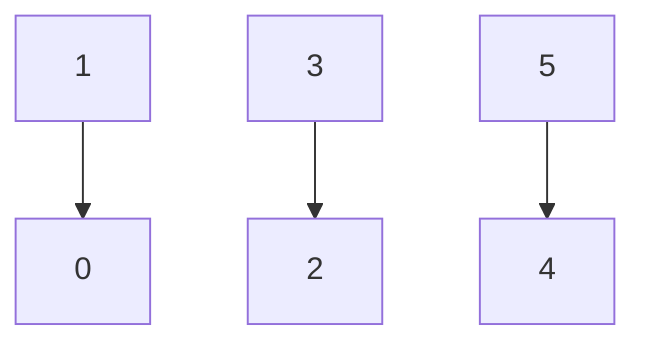
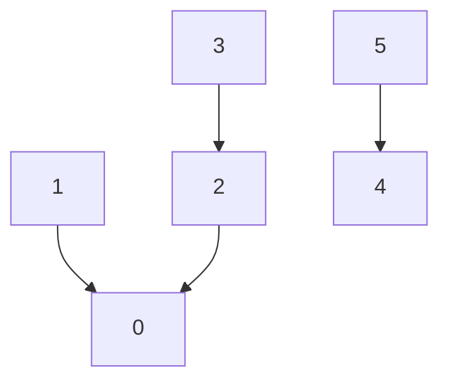
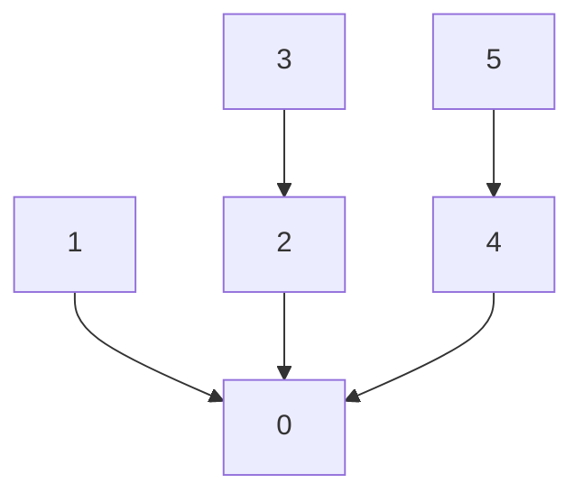
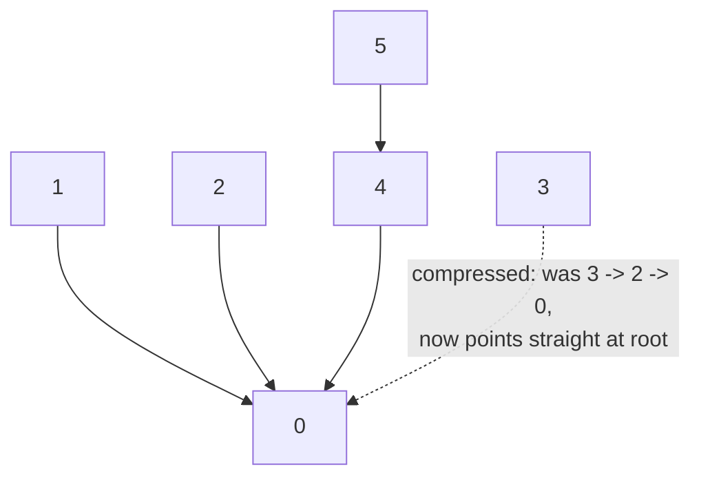

# Union Find — Trace Diagram (Worked Example)

This traces the exact `parent[]` array and the resulting forest shape across a concrete sequence of six elements (`0..5`), starting as six singleton groups, as unions are performed one at a time using **union by rank**, followed by a `find()` call that demonstrates **path compression** flattening a chain.

```
Elements: 0, 1, 2, 3, 4, 5
Initial:  parent = [0, 1, 2, 3, 4, 5]   rank = [0, 0, 0, 0, 0, 0]
          (six singleton groups -- every element is its own root)
```

## Step 1 — `unionSets(0, 1)`

Both roots (0 and 1) have rank 0 (equal). By convention the first argument's root stays on top when ranks tie: `parent[1] = 0`, then `rank[0]` increments to 1 (the tree's height just grew by one level).


`parent = [0, 0, 2, 3, 4, 5]` &nbsp; `rank = [1, 0, 0, 0, 0, 0]`

## Step 2 — `unionSets(2, 3)`

Same shape, a separate pair: `parent[3] = 2`, `rank[2]` increments to 1.


`parent = [0, 0, 2, 2, 4, 5]` &nbsp; `rank = [1, 0, 1, 0, 0, 0]`

## Step 3 — `unionSets(4, 5)`

A third separate pair: `parent[5] = 4`, `rank[4]` increments to 1.


`parent = [0, 0, 2, 2, 4, 4]` &nbsp; `rank = [1, 0, 1, 0, 1, 0]`

## Step 4 — `unionSets(0, 2)`

`find(0) = 0` (rank 1), `find(2) = 2` (rank 1) — ranks tie again, so `parent[2] = 0` and `rank[0]` increments to 2. This merges the `{0,1}` group and the `{2,3}` group into one four-element tree.


`parent = [0, 0, 0, 2, 4, 4]` &nbsp; `rank = [2, 0, 1, 0, 1, 0]`

## Step 5 — `unionSets(0, 4)`

`find(0) = 0` (rank 2), `find(4) = 4` (rank 1). Ranks differ, so **no swap**: the shallower tree (rooted at 4, rank 1) is attached under the taller one (rooted at 0, rank 2): `parent[4] = 0`. Because the ranks were *not* equal, `rank[0]` does **not** increase — attaching a shorter tree under a taller one never increases the taller tree's own height, so the rank correctly stays an accurate upper bound without being bumped.


`parent = [0, 0, 0, 2, 0, 4]` &nbsp; `rank = [2, 0, 1, 0, 1, 0]`

All six elements are now one component. Notice node `3` is two hops from the root (`3 -> 2 -> 0`) and node `5` is also two hops (`5 -> 4 -> 0`) — this is the "before path compression" shape.

## Step 6 — `find(3)` (path compression in action)

Walking up from `3`: `parent[3] = 2`, which is not the root, so recurse into `find(2)`. `parent[2] = 0`, and `0` IS the root (`parent[0] = 0`), so the recursion bottoms out returning `0`. Unwinding back up, **every node visited gets re-pointed directly at the root**: `parent[2]` was already `0` (no change needed), but `parent[3]` is now set directly to `0` instead of `2`.


`parent = [0, 0, 0, 0, 0, 4]` &nbsp; `rank = [2, 0, 1, 0, 1, 0]`

A **second** `find(5)` call would similarly compress `parent[5]` straight to `0` (currently `5 -> 4 -> 0`, two hops), flattening the last remaining chain. After enough `find()` calls touch every node at least once, the entire forest converges toward a shape that is almost flat — every node pointing directly (or nearly directly) at the shared root, regardless of how tall the tree grew during the union phase.

## How to read it

Each step shows the `parent[]` array (the only state that matters for correctness) alongside a small graph where an arrow `child --> parent` shows who currently points to whom — read the arrows **upward toward the root**, never downward. Union by rank is visible in Step 5: even though element `0`'s tree is already taller (rank 2) than element `4`'s tree (rank 1), the algorithm does **not** blindly attach whichever tree was passed first — it explicitly compares ranks and always attaches the shorter tree underneath, which is why `rank[0]` does not need to increase in that step (the merge did not make the *taller* tree any taller).

The final two steps are the entire point of path compression: **before** `find(3)` is called, reaching the root from node `3` takes two hops; **after**, it takes one. Every future `find()` or `connected()` call touching node `3` is now O(1) instead of O(height). Repeated `find()` calls across a real workload progressively flatten the whole forest, which is exactly why the amortized cost per operation collapses toward the near-constant `O(alpha(n))` bound discussed in the README's Complexity section, even though any *single* early `find()` call on a freshly-built tall tree can still walk several hops.
