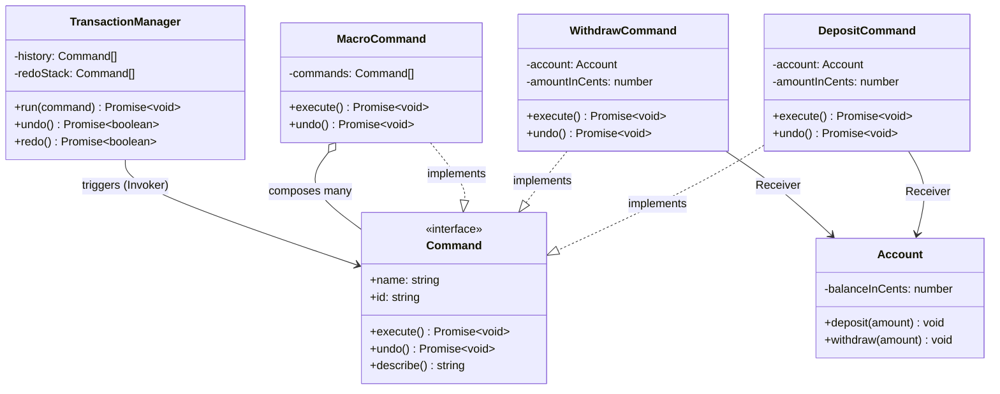
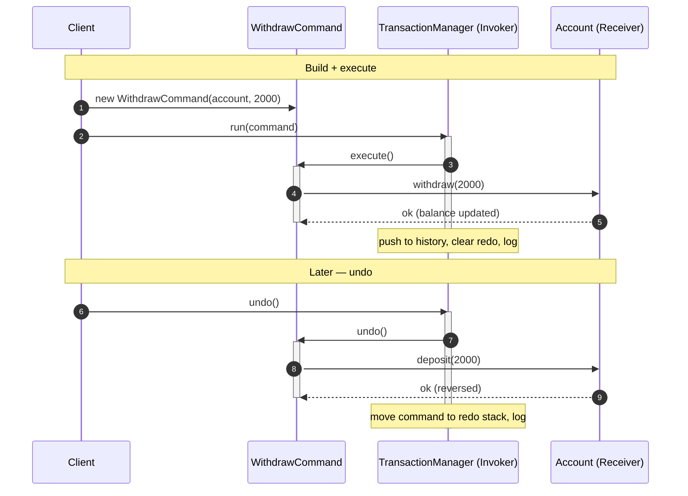

# Command Pattern

## Intent

Encapsulate a request as a standalone object so you can parameterize code with different requests, queue or log them, and support undoable operations — decoupling the object that *asks* for work from the object that *does* the work.

## Real Life Analogy

Think about ordering food at a restaurant.

You (the **customer**) do not walk into the kitchen and cook. You tell a **waiter** what you want, and the waiter writes it on an **order slip**: "Table 5 — one margherita pizza, no olives." That slip is a self-contained object. It holds *what* to do and *the parameters* (which table, which pizza, which modifications).

The waiter does not know how to cook, and the **chef** does not know who ordered it. The slip is the go-between. Because the request is now a physical slip of paper, magical things become possible:

- The waiter can **queue** slips and hand them to the kitchen in order.
- The kitchen can **pin the slips on a rail** — a history/log of everything requested.
- A slip can be **cancelled** (undo) before or after cooking.
- One slip can bundle **several dishes** (a macro/combo order).
- A different chef can pick up the slip later — the request outlives the moment it was made.

The Command Pattern is exactly this order slip, but for code. Instead of calling `kitchen.cookPizza()` directly, you create a `CookPizzaCommand` object and hand it to something that will execute it — now or later, once or many times, with the option to reverse it.

## Problem

### What engineering problem exists?

A normal method call — `account.withdraw(2000)` — is a *transient event*. The instant it runs, it is gone. You cannot hold it, store it, pass it around, replay it, or reverse it. The request and its execution are fused into a single moment.

Plenty of real backend requirements need the request to be a *thing* you can manipulate:

- **Undo / redo.** An operator applies the wrong adjustment to a customer's ledger and needs to reverse it. There is nothing to "reverse" if the operation was just a method call that already returned.
- **Deferred / asynchronous execution.** You want to accept work now (a webhook fires) but run it later on a background worker (send the email, resize the image, settle the payment). You need to *capture* the request and put it on a queue.
- **Logging, auditing, replay.** Regulated systems must record every operation that mutated state, and sometimes replay them to rebuild state after a crash (event sourcing). You cannot log a request you never turned into data.
- **Grouping.** "Run payroll" is really "do these 200 operations as one unit, and if it goes wrong, undo the whole thing." You need to treat a batch of requests as a single request.
- **Parameterizing over behavior.** A UI has buttons, a scheduler has cron jobs, a queue has jobs — all of them need to trigger "some operation" without knowing which one. They need to hold an operation as a value.

> **Term: Request.** In this context a "request" means an intention to invoke a specific operation with specific arguments on a specific target — e.g. "withdraw 2000 cents from account ACC-ALICE." Normally this exists only as a line of code. The Command Pattern makes it exist as an object.

### Why is this problem difficult?

- **Behavior is not normally first-class in a convenient, reversible form.** JavaScript functions *are* values, and you could pass a closure `() => account.withdraw(2000)`. But a bare closure cannot tell you its name for an audit log, cannot describe itself for persistence, and — crucially — has no matching `undo()`. You would end up bolting metadata onto closures until you reinvent an object anyway.
- **Undo requires remembering "before" state.** To reverse an operation you must capture enough information at execution time to invert it. That bookkeeping has to live *somewhere* tied to that specific request.
- **The thing that triggers work and the thing that performs work usually get tangled.** A button handler ends up full of business logic; a queue consumer ends up knowing about accounts and emails and images. Everything becomes coupled.

### What happens if we ignore it?

- **No undo, ever.** You either build a bespoke, brittle "reverse" path per feature, or you tell users "sorry, that's permanent."
- **Queuing becomes ad hoc.** Every feature invents its own way to stash "what to do later" (a row here, a JSON blob there), and none of them are uniform, testable, or replayable.
- **Invokers bloat.** The scheduler, the HTTP controller, and the queue worker all grow direct knowledge of every operation. Adding a new operation means editing all of them — the opposite of Open/Closed.
- **Audit and recovery are afterthoughts.** Because requests were never captured as data, you cannot reconstruct "what happened" or replay it to recover.

## Why Not Other Solutions?

**"Just call the method directly (`account.withdraw(2000)`)."**
Fine when you need the operation to happen *right here, right now, once,* and never reverse it. It gives you nothing for undo, queuing, logging, or grouping — the request evaporates the moment it runs.

**"Pass a plain closure/callback (`() => account.withdraw(2000)`)."**
This is the closest lightweight alternative and is genuinely good enough for simple deferral. But a closure is opaque: it has no name, no serializable description, and no paired reverse operation. The moment you need `undo()`, a log entry, persistence, or an idempotency key, you start attaching those to the closure — at which point you have an object with worse ergonomics than just defining a Command.

**"Use a giant `switch (action)` / if-else dispatcher."**
`function handle(action, payload) { switch(action){ case 'withdraw': ...; case 'deposit': ... } }`. Every new operation grows one central function, mixing all operations' logic in one place, and the reverse logic (undo) has to be a second parallel switch that drifts out of sync. This violates Open/Closed and becomes a merge-conflict magnet.

**"Store operations as raw data rows and interpret them everywhere."**
You can persist `{op: 'withdraw', amount: 2000}` rows, but then the *interpretation* logic (how to execute, how to undo) is scattered across whichever consumer reads the row. Command centralizes execute+undo with the data.

**"Use an event-sourcing / CQRS framework."**
That is often the *right* large-scale answer, and Command is a building block inside it (a command is literally the "C" in CQRS). But adopting a full framework for a feature that just needs undo or a small queue is over-engineering.

**Tradeoff summary:** All alternatives either lose the ability to treat a request as a manipulable object (direct calls, closures) or centralize/scatter the logic badly (switch dispatcher, raw rows). Command pays a small "one class per operation" tax to make requests into first-class, undoable, queueable, loggable objects.

## Solution

The core idea: **turn each request into an object that carries its own `execute()` (and usually `undo()`), then hand those objects to a separate trigger that runs them.**

You define a small **Command interface** — typically just `execute()` and `undo()`. Each concrete operation becomes a **ConcreteCommand** class that stores everything it needs: a reference to the **Receiver** (the object that does the real work), the action to call, and the parameters. The command's job is *not* to contain business logic; it is to remember "which receiver, which method, which arguments" and delegate.

Separately, an **Invoker** holds and triggers commands. The invoker knows only the `Command` interface — `execute()` and `undo()`. It has no idea whether it is running a bank transfer or dimming a light. That ignorance is the payoff: the invoker can keep a **history stack** for undo/redo, put commands on a queue, log every one, or retry them, all without knowing what any command actually does.

The thinking behind it:

1. **Separate "what to do" from "when/whether to do it."** The command captures the *what*; the invoker controls the *when*. This is why deferral, queuing, and scheduling fall out naturally.
2. **Make behavior a value.** Once a request is an object, you can store it in an array (history), a queue (jobs), a map (slot → command for a remote control), or a database row (event log).
3. **Pair every action with its inverse.** Storing `undo()` next to `execute()`, along with the state needed to reverse it, makes undo a local, well-defined concern instead of a global mess.

You do **not** put business logic in the command — that stays in the Receiver. You do **not** teach the invoker about specific operations. You add a new class per operation, and everything else stays untouched.

## Architecture

There are five participants:

1. **Command (interface):** The contract every request implements. Usually `execute()`, often `undo()`, and optionally metadata like `name`/`describe()` for logging and persistence. This is the only type the Invoker depends on.

2. **ConcreteCommand:** A class that binds a **Receiver**, a specific action, and the parameters for one kind of request (e.g. `WithdrawCommand` holds an `Account` and an amount). Its `execute()` calls the receiver; its `undo()` reverses it, using any "before" state it captured.

3. **Receiver:** The object that actually knows how to perform the work (e.g. `Account` with `deposit`/`withdraw`). It contains the real business logic and has no idea it is being driven by commands.

4. **Invoker:** The object that triggers commands and typically owns cross-cutting concerns: the undo/redo history, the queue, retries, logging. It talks only to the `Command` interface (e.g. `TransactionManager`, `CommandQueue`).

5. **Client:** The code that creates receivers, constructs and configures concrete commands, and hands them to invokers (the composition root). It decides *which* command to build; it does not run the operation itself.

Responsibilities in one line each:
- **Command:** defines `execute()`/`undo()` — the shape of a request.
- **ConcreteCommand:** remembers receiver + action + params; delegates work.
- **Receiver:** does the real work.
- **Invoker:** triggers commands and manages history/queue/logging.
- **Client:** builds and configures commands, wires everything together.

## Execution Flow

1. At setup, the **Client** creates the **Receiver** (e.g. `new Account("ACC-ALICE", 10000)`).
2. The Client creates a **ConcreteCommand**, injecting the receiver and parameters (e.g. `new WithdrawCommand(alice, 2000)`).
3. The Client hands the command to the **Invoker** (e.g. `manager.run(command)`).
4. The Invoker calls `command.execute()`. It does not know what the command does.
5. The command delegates to the receiver: `this.account.withdraw(2000)`.
6. The receiver performs the real work and updates its own state.
7. The Invoker records the command in its **history stack** (and logs it) — because the request is now an object, it can be stored.
8. Later, the Client asks the Invoker to `undo()`.
9. The Invoker pops the last command off the history and calls `command.undo()`.
10. The command reverses the effect via the receiver (e.g. `this.account.deposit(2000)`), possibly using state it captured during `execute()`.
11. The Invoker moves that command onto a **redo stack**, so `redo()` can `execute()` it again.
12. (Queue variant) Instead of running immediately, the Invoker enqueues the command; a worker later drains the queue, calling `execute()` on each — optionally checking an idempotency key so a duplicated delivery runs only once.

## Class Diagram



## Sequence Diagram



## Flow Diagram

```mermaid
flowchart TD
    Start([Client wants an operation done]) --> Build["Client builds a ConcreteCommand<br/>(receiver + action + params)"]
    Build --> Give["Hand command to Invoker"]
    Give --> Decide{Run now or later?}
    Decide -- Now --> Exec["Invoker calls command.execute()"]
    Decide -- Later --> Queue["Invoker enqueues command"]
    Queue --> Worker["Worker drains queue"]
    Worker --> Dup{Already processed?<br/>(idempotency)}
    Dup -- Yes --> Skip["Skip duplicate"]
    Dup -- No --> Exec
    Exec --> Work["Command delegates to Receiver<br/>(real work happens)"]
    Work --> Record["Invoker records in history + logs"]
    Record --> UndoQ{Undo requested?}
    UndoQ -- No --> End([Done])
    UndoQ -- Yes --> Undo["Pop history → command.undo()<br/>→ Receiver reverses → push redo stack"]
    Undo --> End
    Skip --> End
```

## Implementation

The implementation strategy in TypeScript:

1. **Define the `Command` interface first.** Keep it tiny: `execute()`, `undo()`, and just enough metadata (`id`, `name`, `describe()`) to log and de-duplicate. Make the methods `async` from day one — real receivers do I/O, and retrofitting `Promise` later is painful.

2. **Keep the Receiver dumb about commands.** The `Account` class has plain `deposit`/`withdraw` methods and enforces its own invariants (no negative balance). It never imports or mentions `Command`. This keeps business logic reusable and independently testable.

3. **Put "how to reverse" inside each ConcreteCommand.** For symmetric operations the inverse is obvious (deposit ↔ withdraw). For lossy operations (e.g. "set brightness to 20"), the command must **capture the previous value during `execute()`** so `undo()` can restore it. Capturing "before" state is the essence of the Memento pattern, which Command frequently borrows.

4. **Make the Invoker generic over `Command`.** `TransactionManager` manipulates a `Command[]` history and a redo stack; it never references `Account`. This is what lets one invoker drive any operation and own undo/redo/logging in one place.

5. **Handle failure explicitly.** `run()` executes *before* recording, so a throwing command never pollutes history. Multi-step commands (`TransferCommand`, `MacroCommand`) use **compensating actions** to stay all-or-nothing.

6. **For queuing, treat commands as jobs.** A `CommandQueue` stores commands and a worker drains them. Because queues deliver **at-least-once**, guard with an **idempotency key** (the command `id`) so a duplicate delivery does not double-apply.

We demonstrate all of this with a realistic banking/ledger service: deposits, withdrawals, transfers, an undoable history, a payroll macro, and a small idempotent job queue.

## Code Walkthrough

See [code.ts](code.ts) for the full runnable implementation. Here is what each part does and why it exists.

**`Account` (Receiver).**
Holds a balance in integer cents and exposes `deposit`/`withdraw`, each enforcing invariants (positive amounts, no overdraft). It throws `BankingError` on violations. It exists to hold the *real* business logic and state, completely unaware of the Command Pattern — which means you can unit-test it in isolation and reuse it outside any command.

**`Command` (interface).**
Declares `execute()`, `undo()`, plus `id`, `name`, and `describe()`. `execute`/`undo` are `Promise`-returning so commands can do async I/O. `id` gives each request a stable identity (used for idempotency and audit); `describe()` produces a loggable/serializable snapshot. This interface is the *only* thing invokers depend on.

**`DepositCommand` / `WithdrawCommand` (ConcreteCommands).**
Each stores a `Account` (the receiver) and an amount. `execute()` delegates to the matching receiver method; `undo()` calls the inverse. They are mirror images — depositing is undone by withdrawing and vice versa — which shows the cleanest case of reversibility. They contain *no* balance rules; those live in `Account`.

**`TransferCommand` (multi-receiver ConcreteCommand).**
Moves money between two accounts. `execute()` withdraws from the source then deposits to the destination, and if the deposit throws it **compensates** by refunding the source — so `execute()` is all-or-nothing. `undo()` reverses both legs. This demonstrates that a single command can coordinate several receivers while still presenting one clean `execute()`/`undo()` pair.

**`MacroCommand` (Composite command).**
Holds an array of child commands and runs them in order. It tracks `executedCount`, so if a child fails midway, `undo()` reverses only the children that actually ran, in reverse order. This is the Command Pattern combined with the Composite pattern: a group of commands *is itself* a command, so the invoker treats "run payroll" exactly like "make one deposit."

**`TransactionManager` (Invoker).**
Owns a `history` stack and a `redoStack`. `run()` executes the command *first* (so a failure records nothing), then pushes to history, clears the redo branch, and writes an audit entry. `undo()` pops history, reverses, and moves the command to the redo stack; `redo()` does the inverse. Its `AuditLog` is injected (Dependency Injection), so you can swap the console logger for a database-backed one without touching the manager. Crucially, it references only `Command` — never `Account`.

**`CommandQueue` (asynchronous Invoker).**
Stores pending commands and drains them in `processAll()`, one at a time. It keeps a `processedIds` set so a command delivered twice (the reality of at-least-once queues like BullMQ/SQS) runs only once — the **idempotency** guard. A failing command is logged and skipped rather than crashing the worker, mirroring a dead-letter-queue policy. This shows why Command and message queues are a natural fit: a command is already a self-contained, storable unit of work.

**`main()` (Client / composition root).**
Creates accounts, builds commands, and drives the invokers. It shows undo/redo on simple commands, a payroll macro undone as one unit, and an idempotent queue that skips a duplicate and survives a failing job. Note the client decides *which* commands to build but never performs banking logic itself.

## Advantages

- **Decouples invoker from receiver.** The thing that triggers work (button, scheduler, queue worker, HTTP controller) is completely independent of the thing that performs it. Either side can change without the other.
- **Undo / redo becomes natural.** Pairing `execute()` with `undo()` and keeping a history stack gives you reversible operations almost for free.
- **First-class deferral and queuing.** A command is a self-contained unit of work you can store, schedule, ship to another worker, or persist — the foundation of job queues.
- **Logging, auditing, replay.** Because every request is an object with a `describe()`/serialize path, you can record and later replay them (event sourcing, crash recovery).
- **Composability (macros).** Commands compose into bigger commands, so batches are handled uniformly.
- **Open/Closed Principle.** Add a new operation by adding one new command class — invokers and existing commands stay untouched.
- **Single Responsibility.** Each command captures exactly one request; the receiver holds business logic; the invoker holds scheduling/history. Concerns are cleanly split.

## Disadvantages

- **Class explosion.** Every operation becomes its own class. A system with many trivial operations accumulates many small files.
- **Indirection.** Reading the code, you jump Client → Command → Receiver instead of seeing a direct call. New readers must learn the pattern.
- **Undo is hard for non-reversible or side-effecting operations.** Reversing "charged a real credit card" or "sent an email" is not a simple inverse — you need compensating transactions, and sometimes undo is impossible.
- **State capture for undo adds subtlety.** Lossy operations must snapshot "before" state; getting this wrong produces incorrect undos that are hard to debug.
- **Memory growth of history.** An unbounded undo history holds references to every command (and possibly captured state). Long-lived sessions need a capped stack.
- **Serialization is non-trivial.** Persisting/queuing a command that holds a live receiver reference means you must reconstruct the receiver on the other side — you serialize *data*, not the object graph.

## Tradeoffs

**What we gain:** requests as manipulable objects — undo/redo, queuing, deferral, logging, replay, macros — plus loose coupling between invokers and receivers and adherence to SRP and OCP.

**What we lose:** simplicity and directness. We add a class per operation and a layer of indirection. We take on the responsibility of writing correct `undo()` logic (including "before" state capture) and, if we persist or queue commands, the burden of serialization and idempotency. For an operation that runs once, immediately, and never needs reversing, this is pure overhead — a plain method call is better. The pattern earns its keep precisely when you need at least one of: undo, queue, log/replay, or parameterize-over-operation.

## Complexity

**Code Complexity:** Low per command (each is small and focused) but the *count* of classes grows linearly with the number of operations. The invoker is simple; undo logic is where subtlety concentrates.

**Maintenance Complexity:** Low to moderate. Adding operations is isolated (new class). The risk area is keeping `undo()` correct as receivers evolve — an undo that no longer perfectly inverts `execute()` is a silent bug.

**Scalability:** Excellent for the workloads it targets. Because commands are self-contained, they distribute naturally across workers and queues — this is exactly how horizontally-scaled background-job systems operate. Undo history, however, is inherently per-session/in-memory and does not scale to distributed undo without extra design.

**Flexibility:** High. Commands can be reordered, queued, retried, composed into macros, logged, and replayed. New invokers (a scheduler, a CLI, a queue) can reuse the same command classes.

**Testability:** High. Commands are tested by executing then asserting receiver state, and by asserting `undo()` restores it. Invokers are tested with fake commands (assert `execute`/`undo` were called and history behaves) — no receivers needed. Receivers are tested directly.

## Performance Considerations

**Memory:** Each command is a small object, but the **history/redo stacks retain them** (and any captured "before" state) for the life of the session. Cap the history (e.g. keep the last N) for long-lived processes to avoid unbounded growth.

**CPU:** One extra virtual call per operation (invoker → command → receiver). Negligible against any real I/O. Macro/undo loops are linear in the number of sub-commands.

**Network:** The pattern adds no network hops by itself. But queued commands *are* what travel over the network to workers — keep their serialized payload small, and never embed large blobs in the command; reference them by id/URL instead.

**Database:** If you persist commands as an event log (event sourcing), you trade in-place updates for append-only writes — great for audit and replay, but rebuilding current state means folding over the log (often mitigated with snapshots). Idempotency keys usually require a uniqueness constraint or a processed-ids table.

**Object creation:** One command object per request. In extreme hot paths this allocation could matter; in typical I/O-bound backends it does not. Do not pool commands prematurely.

**Runtime:** Executing a command is as fast as the receiver call plus a tiny dispatch overhead. Undo/redo is O(1) per step (O(k) for a k-child macro). The real runtime characteristic to watch is a queue worker's throughput, which is bounded by the receivers' I/O, not by the pattern.

## Common Mistakes

- **Putting business logic in the command instead of the receiver.** Beginners write balance checks and DB writes inside `execute()`. *Why it happens:* it feels like the command "is" the operation. *Avoid:* the command only orchestrates ("which receiver, which method, which args"); the receiver holds the rules. This keeps logic reusable and testable outside commands.

- **Forgetting to capture "before" state for lossy undos.** For "set brightness to 20" or "rename to X", `undo()` needs the *previous* value, which must be snapshotted during `execute()`, not read at undo time (it may have changed). *Why:* symmetric examples (deposit/withdraw) hide the need. *Avoid:* in `execute()`, store whatever `undo()` will need.

- **Recording a command in history before it succeeds.** If you push to history then execute, a thrown command leaves a bogus entry whose `undo()` would corrupt state. *Avoid:* execute first, record only on success (as `TransactionManager.run` does).

- **Assuming everything is undoable.** Sending an email or capturing a card is not reversible by a simple inverse. *Why:* the pattern makes undo *look* universal. *Avoid:* model irreversible steps with compensating transactions, or explicitly mark commands as non-undoable.

- **Non-idempotent queued commands.** Queues deliver at-least-once; a command that runs twice double-charges. *Avoid:* give each command a stable `id` and skip already-processed ids (as `CommandQueue` does), or make the receiver operation naturally idempotent.

- **Fat invoker that knows concrete commands.** Adding `if (command instanceof WithdrawCommand)` in the invoker re-couples everything. *Avoid:* the invoker must speak only the `Command` interface.

- **Unbounded undo history.** Keeping every command forever leaks memory in long-running sessions. *Avoid:* cap the stack size.

## When To Use

- You need **undo/redo** (editors, admin tools that adjust data, drawing/CAD apps, transactional operator consoles).
- You need to **queue, schedule, or defer** operations, or run them on background workers (email/SMS dispatch, image processing, payment settlement, report generation).
- You need an **audit log or replay** of operations (regulated finance/healthcare, event-sourced systems, crash recovery).
- You need to **parameterize something with an operation** it will trigger later without knowing what it is (buttons/menu items mapped to commands, a generic scheduler, a retry framework).
- You need to **group operations** into a single reversible unit (macros, batch jobs, wizards/multi-step forms).

## When NOT To Use

- **The operation runs once, immediately, and never needs reversing, queuing, or logging.** A direct method call is simpler and clearer; a command is ceremony.
- **You only need lightweight deferral and never undo/metadata.** A plain closure/callback is often enough.
- **Undo is genuinely impossible and you do not need queuing/logging either.** The main draw is gone; reconsider.
- **The operation set is tiny and stable, and there is no invoker abstraction to serve.** Adding an interface + classes "just in case" is speculative generality (YAGNI).
- **Ultra-hot inner loops** where per-operation object allocation and a virtual call are measurable (rare in I/O-bound backends, relevant in tight numeric code).

## Real Production Examples

- **Node.js:** Job/queue libraries are Command in disguise — **BullMQ**, **Bee-Queue**, and **Agenda** store a named job with payload (a serialized command) and a worker later `execute()`s it. Database migration tools (**Knex**, **TypeORM**, **Sequelize**) model each migration as an object with `up()`/`down()` — a textbook `execute()`/`undo()` pair.
- **NestJS:** The official **`@nestjs/cqrs`** package is built directly on Command — you dispatch a `Command` object through a `CommandBus` to a `CommandHandler`. This is Command + Mediator working together.
- **Express:** Middleware pipelines and background task runners often wrap "work to do" as objects pushed onto a queue for a worker to process.
- **Java Spring:** `@Transactional` method invocations and Spring Batch `Step`/`Tasklet` objects encapsulate units of work; the Spring Framework's `Runnable`/`Callable` task submission to `TaskExecutor` is Command in practice.
- **.NET:** **MediatR**'s `IRequest`/`IRequestHandler` is Command + Mediator. WPF's `ICommand` (bound to buttons, with `CanExecute`/`Execute`) is the GUI Command pattern verbatim.
- **AWS:** **SQS** messages + Lambda consumers are commands enqueued and executed later; **Step Functions** state machines coordinate compensating/undo steps (the Saga pattern) for distributed rollbacks.
- **Azure:** **Service Bus** queues/topics carry command messages; **Durable Functions** orchestrate activities with compensation logic.
- **Google Cloud:** **Cloud Tasks** and **Pub/Sub** enqueue units of work for deferred, retried, idempotent execution by workers.
- **React (if applicable):** **Redux** actions + reducers are Command-flavored — an action object ("what to do", with payload) is dispatched and interpreted; **redux-undo** and editor libraries like **Slate**/**ProseMirror** implement undo via command/transaction histories.
- **Databases:** The **write-ahead log (WAL)** and transaction/redo/undo logs in PostgreSQL and other engines record operations as replayable/reversible entries — the same idea that powers crash recovery and point-in-time restore.
- **AI Systems:** LLM **tool/function calls** are commands — the model emits `{name, arguments}`, an executor runs it, and agent frameworks queue, log, and retry these tool-call objects.

## Where I Can Use This

Five realistic ideas for your own backend projects:

1. **Undoable admin actions.** In a NestJS admin panel, model "ban user", "refund order", "adjust credit" as commands with `undo()`, so operators can reverse mistakes and every action is audit-logged automatically.
2. **A BullMQ-backed job system.** Represent each background job (send email, generate PDF, sync to CRM) as a command; serialize it into a Redis-backed BullMQ job and execute it on a worker, using the command `id` as the idempotency key.
3. **Multi-step wizard with rollback.** A KYC/onboarding flow where each step is a command; if a later step fails, run the earlier commands' `undo()` (compensating actions) to leave the account in a clean state.
4. **Bulk operations as macros.** "Apply this discount to 500 orders" as a `MacroCommand`, executed and undone as one unit, with per-item failure tracking.
5. **Event-sourced ledger.** Store every balance-changing command as an append-only event; rebuild an account's state by replaying commands, and take periodic snapshots for speed — giving you a full audit trail and time-travel debugging.

## Similar Patterns

- **Strategy:** Both wrap behavior behind an interface, and they are easy to confuse. **Strategy** is an *interchangeable algorithm* the client plugs in to change *how* a single operation is done (e.g. which sorting or pricing algorithm), and it is typically stateless and not undoable. **Command** is a *whole request* — a receiver + action + params — that you store, queue, log, and reverse. Strategy answers "which algorithm?"; Command answers "what request, to run when?".
- **Memento:** Captures and restores an object's internal state without exposing it. Command frequently *uses* Memento to implement `undo()`: when an operation is lossy, the command stores a memento of the receiver's "before" state so it can restore it later. They are collaborators, not competitors.
- **Chain of Responsibility:** Passes a request along a chain of handlers until one handles it. Both objectify a request, but Chain is about *routing/deciding who handles it*, while Command is about *encapsulating and reifying the request itself*. They combine well (a command flowing through a validation/authorization chain).
- **Mediator:** Centralizes communication between objects so they do not refer to each other directly. A `CommandBus` (as in CQRS/MediatR) is Mediator + Command: commands are the messages, the bus is the mediator routing each command to its handler.
- **Observer:** Notifies subscribers of events. Sometimes confused because both involve "sending something." Observer broadcasts *that something happened* (past tense, many listeners); Command represents *a request to make something happen* (imperative, usually one executor).

| Pattern                 | Objectifies what? | Undoable? | Primary intent                                   | Typical state |
|-------------------------|-------------------|-----------|--------------------------------------------------|---------------|
| Command                 | A whole request   | Yes (via undo/Memento) | Encapsulate a request to run/queue/log/reverse | Holds receiver + params |
| Strategy                | An algorithm      | No        | Swap interchangeable behavior for one step       | Usually stateless |
| Memento                 | A state snapshot  | N/A (enables undo) | Save/restore state without breaking encapsulation | Holds a snapshot |
| Chain of Responsibility | A request (in transit) | No   | Route a request to the right handler             | Chain of handlers |
| Mediator                | Interactions      | No        | Centralize/decouple object communication         | Knows colleagues |
| Observer                | An event/notification | No   | Broadcast state changes to subscribers           | List of subscribers |

## Interview Discussion

Experienced engineers rarely treat Command as a toy "remote control" example. They discuss it as the conceptual backbone of **job queues, CQRS, and event sourcing** — the moment you accept a request now to run later, or you need a durable audit/replay log, you are doing Command whether you name it or not.

What senior engineers actually discuss:
- **"How do you undo something that touched the outside world?"** You cannot un-send an email. The mature answer is *compensating transactions* (a semantic inverse, e.g. "issue refund" undoes "charge"), and the **Saga pattern** for coordinating them across services. Distinguish reversible in-memory undo from real-world compensation.
- **"How does this relate to CQRS?"** The Command in CQRS is this pattern: an intent object dispatched through a bus to a handler, deliberately separated from queries. Follow-up: why separate reads and writes at all (independent scaling, different models).
- **"Idempotency in queued commands."** At-least-once delivery is the default in real queues; they will ask how you prevent double execution (idempotency keys, dedup tables, idempotent receiver operations).
- **"Where do you store the undo state?"** In-memory stack vs. persisted event log; the tradeoff between simple session undo and durable, distributed replay.
- **"Command vs a closure in JS?"** A fair challenge given first-class functions. The honest answer: closures suffice for pure deferral; you reach for a Command object when you also need `undo`, metadata, serialization, or idempotency.

Common misconceptions:
- *"Command is just Strategy."* No — Strategy swaps an algorithm; Command reifies a whole request with a receiver and lifecycle (queue/log/undo).
- *"Every command must have undo."* Not true; `undo()` is optional. Many command uses (queuing, logging) never undo.
- *"Command adds behavior."* It does not add behavior to an object (that is Decorator); it packages a request.
- *"The command does the work."* It delegates to the receiver; the command is orchestration, not implementation.

## Summary

- The Command Pattern **encapsulates a request as an object** — capturing a receiver, an action, and parameters — so requests become first-class values.
- Five participants: **Command** (interface), **ConcreteCommand** (binds receiver+action+params), **Receiver** (does the work), **Invoker** (triggers, keeps history/queue), **Client** (builds and wires).
- It **decouples** the object that invokes an operation from the one that performs it.
- It unlocks **undo/redo, queuing, deferral, logging, replay, and macros** — none of which a plain method call gives you.
- `undo()` needs the inverse action, and for lossy operations, **captured "before" state** (often via Memento).
- Real-world undo of side effects requires **compensating transactions**, not naive reversal.
- It is the foundation of **job queues (BullMQ), CQRS (`@nestjs/cqrs`), and event sourcing**.
- Cost: a class per operation, indirection, and the burden of correct undo/serialization/idempotency.

## Key Takeaways

1. Command turns a request ("withdraw 2000 from Alice") into an object you can store, queue, log, and reverse.
2. Five roles: Command interface, ConcreteCommand, Receiver, Invoker, Client.
3. It decouples the invoker (button/queue/scheduler) from the receiver (business logic).
4. Business logic lives in the Receiver; the command only orchestrates and remembers `undo()`.
5. Undo/redo comes from pairing `execute()` with `undo()` plus a history stack in the Invoker.
6. Lossy operations must capture "before" state at execute time — this is where Command meets Memento.
7. Commands are self-contained units of work, which is why they map perfectly onto job queues (BullMQ/SQS).
8. Queues deliver at-least-once, so queued commands need idempotency keys.
9. Reversing real-world side effects needs compensating transactions (Saga), not a simple inverse.
10. Use it for undo, queuing, logging/replay, or parameterizing-over-operations; skip it for one-shot, irreversible, immediate calls.

---

## Further Reading

**Books**
- *Design Patterns: Elements of Reusable Object-Oriented Software* — Gamma, Helm, Johnson, Vlissides (the "Gang of Four"), the original Command definition.
- *Head First Design Patterns* — Freeman & Robson (the remote-control Command chapter is excellent and beginner-friendly).
- *Patterns of Enterprise Application Architecture* — Martin Fowler (Unit of Work and command-like concepts).
- *Implementing Domain-Driven Design* — Vaughn Vernon (commands, CQRS, event sourcing in practice).
- *Enterprise Integration Patterns* — Hohpe & Woolf (command messages, message queues, idempotency).

**Open Source Projects / GitHub Repositories**
- BullMQ — Redis-backed job/queue system (commands as jobs) — https://github.com/taskforcesh/bullmq
- NestJS CQRS module (`@nestjs/cqrs`) — CommandBus/CommandHandler — https://github.com/nestjs/cqrs
- MediatR (.NET) — request/handler command dispatch — https://github.com/jbogard/MediatR
- redux-undo — undo/redo history for Redux command-style actions — https://github.com/omnidan/redux-undo

**Official Documentation**
- Refactoring.Guru — Command — https://refactoring.guru/design-patterns/command
- NestJS Docs — CQRS — https://docs.nestjs.com/recipes/cqrs
- BullMQ Docs — https://docs.bullmq.io/

**Blog Articles**
- Martin Fowler — "CQRS" — https://martinfowler.com/bliki/CQRS.html
- Martin Fowler — "Event Sourcing" — https://martinfowler.com/eaaDev/EventSourcing.html
- Microsoft — "Saga distributed transactions pattern" — https://learn.microsoft.com/en-us/azure/architecture/reference-architectures/saga/saga
- Refactoring.Guru — Command in TypeScript — https://refactoring.guru/design-patterns/command/typescript/example
