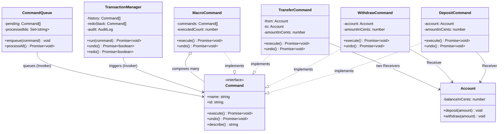

# Command Pattern — Class Diagram

Shows the five participants and their relationships. Every ConcreteCommand *implements*
the `Command` interface and *holds a reference to* a Receiver. The Invoker
(`TransactionManager`) depends only on the `Command` interface — never on a concrete
command or on the `Account` receiver. `MacroCommand` is itself a `Command` that
*composes* other commands (Command + Composite).

**How to read it**
- `..|>` (dashed, hollow triangle) = *implements interface*. Every concrete command implements `Command`.
- `-->` = *association / holds a reference*. Each command holds its `Account` receiver; the invokers hold `Command`s.
- `o--` = *aggregation / composition of many*. A `MacroCommand` is built from other `Command`s — and because it *is* a `Command`, an invoker treats "run payroll" exactly like a single deposit.
- The two invokers (`TransactionManager`, `CommandQueue`) have **no arrow to `Account`** — that is the whole point: they are decoupled from the receiver and know only the `Command` interface.
