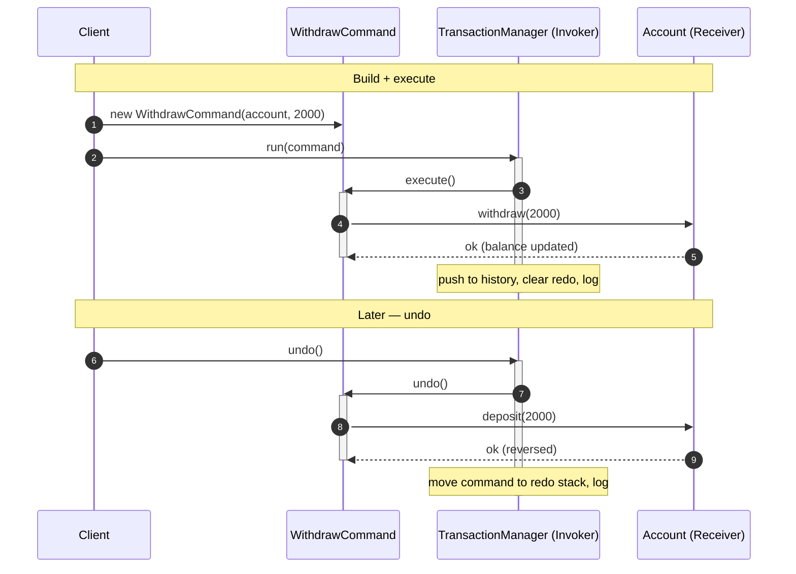

# Command Pattern — Sequence Diagram

Shows the runtime message exchange for one banking request: the Client builds a
command, the Invoker executes it, and later reverses it via undo.

**How to read it**
- The **Client** builds a `WithdrawCommand` (binding the receiver + params) and hands it to the Invoker — it never calls the account directly.
- The **Invoker** (`TransactionManager`) only speaks the `Command` interface: it calls `execute()` without knowing what the command does, then records it in history for undo.
- The **Command** delegates the real work to the **Receiver** (`Account`) and captures whatever it needs to reverse the effect later.
- The second block shows **undo**: the Invoker pops the command from history and calls `undo()`, which applies the inverse (`deposit`) on the receiver and moves the command to the redo stack.
