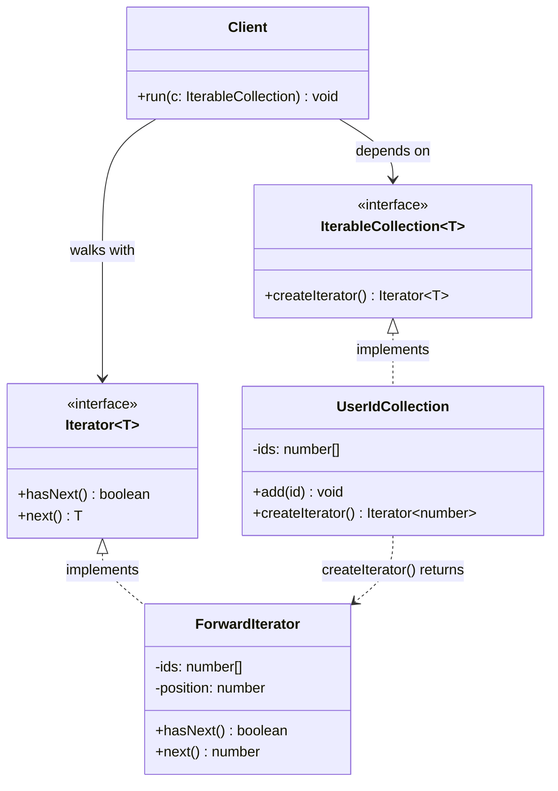
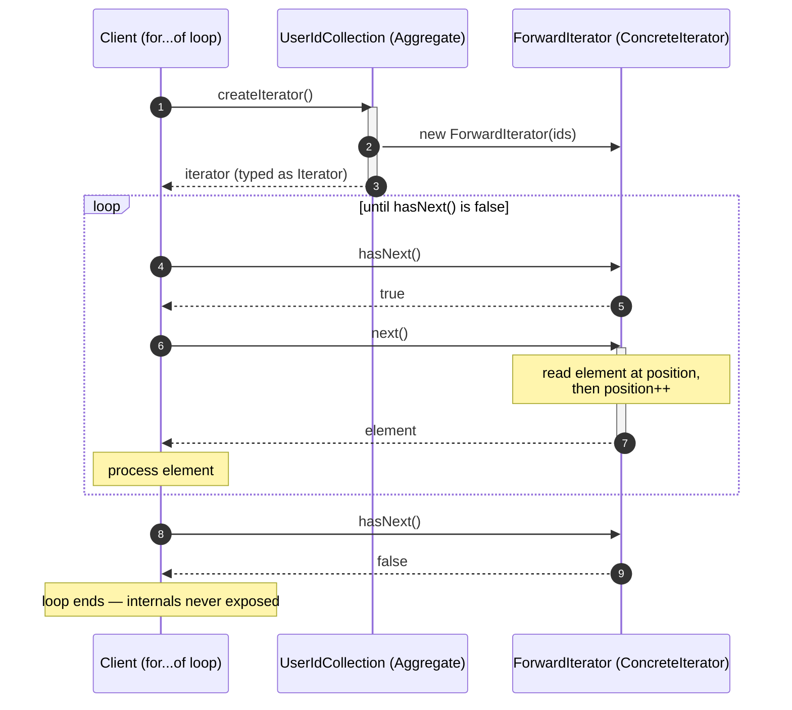
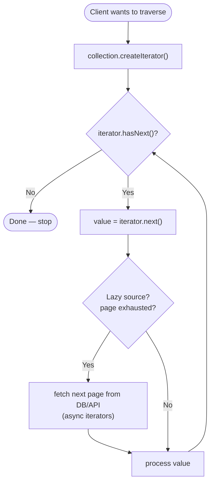

# Iterator Pattern

## Intent

Provide a way to access the elements of an aggregate object sequentially **without exposing its underlying representation**, so that the same collection can be traversed in different ways and different collections can be traversed uniformly.

> **Term: Aggregate object.** Any object that holds a group of other objects — an array, a list, a tree, a set, a database result set. The GoF book calls it the "aggregate"; in everyday language it is a *collection*.

## Real Life Analogy

Think of a music playlist on your phone. The playlist *stores* your songs somehow — maybe in an array, maybe in a database, maybe streamed from a server. You do not know and you do not care.

What you do have is a **"Next" button**. Press it and you get the next song. Press it again, the one after that. There is a "Previous" button too. You can also switch to *shuffle mode*, which is a completely different way of walking through the exact same songs.

The "Next" button is an **iterator**. It is a small object whose only job is to remember *where you are* and hand you *the next item*. The playlist itself never opens up and shows you its internal storage — it just gives you a button. Shuffle vs. in-order are two different iterators over one unchanged collection.

The Iterator Pattern is exactly this: a collection hands out a small "cursor" object that knows how to walk its elements one at a time, while the collection keeps its internal structure hidden.

## Problem

### What engineering problem exists?

You constantly need to loop over collections in backend code, but collections come in wildly different internal shapes:

- An in-memory array of user IDs.
- A binary tree of category nodes (you want in-order *and* breadth-first walks).
- A paginated HTTP API that returns 100 rows per page, cursor after cursor.
- A Postgres query returning 10 million rows that will not fit in memory at once.
- A Redis `SCAN` that dribbles keys back in unpredictable batches.

If every consumer has to know *how each collection stores its data* just to loop over it, you get two failures at once:

1. **Encapsulation breaks.** To iterate you must reach inside — read the private array, know the tree has `left`/`right` fields, know the page size, manage the cursor string by hand. Now the collection's internal representation is smeared across every caller.
2. **Traversal logic gets duplicated and tangled.** The code that decides *how to walk* (depth-first? newest-first? one page at a time?) ends up living inside business logic, copy-pasted, and impossible to reuse or swap.

> **Term: Encapsulation.** Hiding an object's internal data behind a public interface so callers depend on *what it does*, not *how it stores things*. Breaking encapsulation means the outside world starts depending on internals, so you can no longer change those internals safely.

### Why is this problem difficult?

- **Different collections have genuinely different traversal mechanics.** Walking an array is `i++`; walking a tree is recursion or a queue; walking a paginated API is "fetch next page when this one runs out." A single hand-written `for` loop cannot cover all of them.
- **The same collection often needs multiple traversal orders.** One tree, but sometimes you want depth-first, sometimes breadth-first. If traversal lives *inside* the collection as one fixed loop, you cannot offer both cleanly.
- **You frequently cannot hold everything in memory.** A 10-million-row result set or an "infinite" event stream cannot be materialized into an array first. You must pull elements *lazily*, one at a time, on demand.
- **You may need several independent cursors at once** — two loops walking the same collection at different speeds (e.g. merging two sorted streams). A single shared "current position" field on the collection makes that impossible.

### What happens if we ignore it?

- **Leaky abstractions.** Callers reach into `collection.internalArray` or `node.left`. The day you switch storage (array to linked list, offset pagination to keyset), every caller breaks.
- **Duplicated traversal code.** The same "fetch page, loop, fetch next page" logic is rewritten in ten services, and the copies drift.
- **Memory blowups.** Someone does `const all = await loadEverything()` on a huge table and the process OOM-crashes in production.
- **Rigid collections.** Adding a new traversal order (say "most recent first") means editing the collection class and risking the existing loops — a violation of the Open/Closed Principle.

## Why Not Other Solutions?

**"Just expose the internal array (a getter) and let callers loop."**
This is the most common shortcut and the most damaging. It permanently welds every caller to the array representation. You can never switch to a tree, a lazy stream, or a paginated source without a breaking change. It also cannot express traversal *orders* or *lazy* fetching at all.

**"Put a `forEach(callback)` method on the collection."**
Better — this is the *internal iterator* variant and it does hide storage. But it takes control away from the caller: you cannot pause, you cannot easily run two collections in lockstep, you cannot `break` cleanly out of nested iteration, and you cannot compose it with `for await` for async I/O without extra machinery. It works for simple "do X to each element" but not for streaming, merging, or early exit.

**"Load everything into an array first, then loop the array."**
Works only when the data is small and finite. For a huge query or an infinite stream it is either impossible (no memory) or catastrophic (OOM). It is also *eager*: you pay the full cost up front even if the consumer stops after the first element.

**"Write a bespoke `while` loop with cursor management at every call site."**
This is what the pattern exists to eliminate. Cursor bookkeeping (offset, page token, position) leaks into business logic, gets duplicated, and is a rich source of off-by-one and "forgot to fetch the last page" bugs.

**Tradeoff summary:** Every alternative either exposes the internal representation, hard-codes a single traversal, forces eager materialization, or duplicates cursor logic. The Iterator localizes "how to walk this" into one dedicated object, keeps the collection's internals private, supports lazy pull, and allows multiple independent and multiple *kinds* of traversal.

## Solution

The core idea: **extract the responsibility of traversal out of the collection and into a separate "iterator" object.**

The collection keeps its data private and exposes exactly one traversal-related capability: *"give me an iterator."* The iterator is a small, stateful cursor that answers two questions — *"is there another element?"* (`hasNext()`) and *"give me the next one"* (`next()`). It, and only it, tracks the current position.

The thinking behind it:

1. **Single Responsibility.** Storing elements and walking elements are two different jobs. The collection stores; the iterator walks. Separating them lets each change independently.
2. **Encapsulation stays intact.** Callers only ever see `hasNext()`/`next()`. The internal array, tree pointers, or page cursor never escape.
3. **Traversal becomes pluggable.** Because traversal lives in its own object, one collection can offer several iterators (forward/reverse, DFS/BFS), and every collection can offer the *same* iterator interface — so consumers loop over anything uniformly.
4. **Position lives in the iterator, not the collection.** Each iterator carries its own position, so you can have many active at once without them interfering.
5. **Laziness is natural.** Because the consumer *pulls* one element at a time via `next()`, the iterator can compute or fetch that element only when asked — enabling infinite sequences and page-by-page streaming.

Crucially for a Node/TypeScript engineer: **this pattern is baked into the language.** JavaScript's *iteration protocol* (`Symbol.iterator`), the `for...of` loop, spread `[...x]`, and especially **generators** (`function*` / `yield`) are the language's own implementation of the Iterator Pattern. You will almost never hand-write the GoF classes in modern TS — you will use generators. But you must understand the pattern to use them well.

## Architecture

There are four participants (the GoF names, with the JS equivalent in brackets):

1. **Iterator (interface)** — declares the traversal operations. Classic GoF: `hasNext()` and `next()`. Native JS: an object with `next(): { value, done }`. Its responsibility is to define *what it means to walk*, independent of any collection.

2. **ConcreteIterator** — implements the Iterator interface for a specific collection and a specific traversal order. **It holds the current position** and knows how to advance it. There can be several ConcreteIterators for one collection (forward vs reverse, DFS vs BFS).

3. **Aggregate / IterableCollection (interface)** — declares a factory method, classically `createIterator()` (native JS: `[Symbol.iterator]()`), that returns a fresh Iterator. Its responsibility is to promise "you can get a cursor over me" without revealing how I store data.

4. **ConcreteAggregate / ConcreteCollection** — the real collection (the array wrapper, the tree, the paginated source). It stores the elements and implements the factory method to hand back the matching ConcreteIterator.

Responsibilities in one line each:
- **Iterator:** defines *how to walk* (has-next / next).
- **ConcreteIterator:** tracks position and walks one specific structure one specific way.
- **Aggregate:** promises "you can get an iterator over me."
- **ConcreteAggregate:** stores elements, produces the right iterator.

> **Term: Factory Method.** A method whose job is to *create and return an object*, hiding which concrete class is actually built. `createIterator()` is a factory method: callers get *an* `Iterator`, never a specific class name.

## Execution Flow

1. The client asks the collection for an iterator: `const it = collection.createIterator()` (or the language does this implicitly when you write `for...of`).
2. The ConcreteAggregate constructs the matching ConcreteIterator, usually handing it a reference to its internal data and an initial position (e.g. index `0`).
3. The client enters a loop and calls `it.hasNext()`.
4. The iterator checks its position against the collection's bounds and returns `true` or `false`.
5. If `true`, the client calls `it.next()`.
6. The iterator reads the element at the current position, **advances its position**, and returns the element. (For a lazy/async iterator, "reads the element" may mean *fetch the next page from the DB/API right now*.)
7. The client does its work with that element.
8. Steps 3–7 repeat until `hasNext()` returns `false` (or, in native JS, until `next()` returns `{ done: true }`).
9. The loop ends. Throughout, the client never touched the collection's internal storage and never managed a position itself — the iterator did.
10. If the client needs a second, independent walk, it asks for a *new* iterator (step 1). The two iterators keep separate positions and do not interfere.

## Class Diagram

**How to read it:** the `Client` depends only on the two interfaces (`IterableCollection`, `Iterator`) — never on `UserIdCollection` or `ForwardIterator` directly. `UserIdCollection` *creates* a `ForwardIterator` (dashed dependency `..>`) but exposes it only as an `Iterator`, so its private `ids` array never leaks.

## Sequence Diagram

**How to read it:** the client gets an iterator once, then repeatedly asks `hasNext()`/`next()`. Only the iterator mutates the position. The collection is consulted once (to create the cursor) and never opened up afterward.

## Flow Diagram

**Key idea:** the consumer only ever loops on `hasNext()` / `next()`. Whether the next element is sitting in an array or must be fetched over the network *right now* (the lazy branch) is completely hidden inside the iterator. Swapping an in-memory collection for a paginated API changes nothing in the loop.

## Implementation

The implementation strategy in TypeScript, from classic to idiomatic:

1. **Define the `Iterator<T>` and `IterableCollection<T>` interfaces first** (the GoF form). This makes the roles explicit and is the clearest teaching form.

2. **Write a ConcreteIterator that keeps `position` private** and reads the collection's data through a reference passed in its constructor. The collection's storage stays private.

3. **Show that one collection can return several iterators** (forward and reverse) — this is the pattern's real payoff: traversal decoupled from storage.

4. **Then use the language.** Implement `[Symbol.iterator]()` so the object works with `for...of` and spread for free. This is the native JS Iterator Pattern.

5. **Reach for generators (`function*`, `yield`) as the default modern implementation.** A generator *is* an iterator and iterable at once; the compiler builds the position/done state machine for you. Show two lazy traversals (DFS/BFS) over one tree, and a lazy infinite sequence to prove laziness.

6. **For I/O, use async iterators (`Symbol.asyncIterator`, `for await...of`).** Model a paginated DB/HTTP cursor that fetches one page at a time. Memory stays `O(pageSize)`, not `O(total)`.

The runnable file demonstrates all five, culminating in the paginated cursor — the form you will use most in backend work.

## Code Walkthrough

See [code.ts](code.ts) for the full runnable implementation. Here is what each part does and why it exists.

**`Iterator<T>` and `IterableCollection<T>` (the two interfaces).**
`Iterator<T>` declares `hasNext()` and `next()` — the definition of "how to walk." `IterableCollection<T>` declares the factory method `createIterator()`. They exist so that clients depend on *abstractions*: any code that accepts an `Iterator<T>` can walk any collection, and any code that accepts an `IterableCollection<T>` can get a cursor over anything.

**`UserIdCollection` (ConcreteAggregate) + its inner `ForwardIterator` (ConcreteIterator).**
The collection stores IDs in a **private** array. The *only* way out is `createIterator()`, which returns a `ForwardIterator`. That iterator holds a private `position` and advances it on each `next()`, throwing if you call `next()` past the end. This proves the central promise: the array is never exposed, yet the elements can be walked. Because the position lives in the iterator, two iterators over the same collection are fully independent.

**`Playlist` with `createIterator()` and `createReverseIterator()` (one collection, two traversals).**
Same stored data (`tracks`), two different ConcreteIterators via the shared `ArrayCursor`, which supports `"forward"` and `"reverse"` directions. This is the point of the pattern: *traversal order is decoupled from storage*, so adding a new order does not touch how data is stored.

**`RingBuffer<T>` implementing `[Symbol.iterator]()` (native protocol).**
A fixed-size circular queue that is natively iterable. Because it implements the language's iteration protocol, callers use `for...of`, spread (`[...buffer]`), `Array.from`, destructuring — all for free — while the internal `store`, `head`, and `count` stay hidden. Each call to `[Symbol.iterator]()` returns a *fresh* iterator, so nested/parallel loops work correctly.

**`depthFirst` / `breadthFirst` / `infiniteIds` (generators).**
`depthFirst` and `breadthFirst` are generator functions that walk the *same* `TreeNode` structure in two different orders, yielding one node at a time — lazily. `yield*` (in `depthFirst`) delegates to the recursive sub-generator, which is how you compose generators. `infiniteIds` is an *infinite* generator: it `yield`s forever, but because generators are lazy it is perfectly safe as long as the consumer stops pulling. `take(iterable, n)` is a tiny combinator that pulls only the first `n` elements from *any* iterable, demonstrating early exit and composition.

**`PaginatedCursor<T>` + `PagedSource<T>` + `FakeUserApi` (async iterator — the star).**
`PagedSource<T>` is a port: "given a cursor, fetch one page." `FakeUserApi` simulates a real Postgres keyset query or HTTP API, serving `pageSize` rows at a time with simulated latency. `PaginatedCursor` implements `[Symbol.asyncIterator]()` as an `async *` generator: it fetches one page, yields each row, and only when the page is exhausted does it fetch the next. The consumer writes `for await (const user of cursor)` and is *completely unaware* of pages, cursors, or network calls. Memory usage stays bounded to one page — you can stream millions of rows without OOM. The demo output shows pages being fetched on demand (offset 0, then 5, then 10), proving laziness.

**Interactions.**
In every part the consumer talks only to the iterator/iterable surface (`hasNext`/`next`, or `for...of`/`for await...of`). The collection is consulted once to produce a cursor and never opened afterward. Swapping the in-memory `UserIdCollection` for the network-backed `PaginatedCursor` does not change the shape of the consuming loop — that uniformity is the whole point.

## Advantages

- **Encapsulation preserved.** Clients traverse without seeing the collection's internal representation; you can change storage (array → tree → stream) without breaking callers.
- **Single Responsibility Principle.** Storage lives in the collection; traversal lives in the iterator. Each evolves independently.
- **Multiple traversal orders.** One collection can expose many iterators (forward/reverse, DFS/BFS, sorted) without bloating the collection with loops.
- **Uniform interface.** Every collection exposes the same `hasNext`/`next` (or `Symbol.iterator`) surface, so generic algorithms (`take`, `map`, `filter`) work across all of them.
- **Multiple simultaneous cursors.** Because position lives in the iterator, several independent walks can run at once (essential for merging sorted streams).
- **Laziness and memory efficiency.** Elements are pulled on demand, enabling infinite sequences and page-by-page streaming of huge datasets with `O(pageSize)` memory.
- **Open/Closed Principle.** Add a new traversal by adding a new iterator — no edits to existing collection or client code.

## Disadvantages

- **Overkill for simple cases.** For a plain array you already loop over, adding iterator classes is pure ceremony — just use `for...of` or `.forEach`.
- **More moving parts (in the classic form).** Two interfaces and a concrete iterator per traversal is more code than a `for` loop. (Generators largely erase this cost.)
- **Stateful cursors are fragile under mutation.** If the collection is modified while an iterator is mid-walk, behavior can be undefined — index shifts, skipped or repeated elements. You must choose fail-fast or snapshot semantics (see Common Mistakes).
- **Lazy iterators hide real costs.** A single `for await...of` step can trigger a network round-trip. It looks like a cheap loop but may be doing expensive I/O — easy to accidentally create N+1 patterns.
- **One-shot by default.** A generator or a consumed iterator is exhausted after one pass; re-iterating needs a fresh one. Callers who forget this get an empty second loop.
- **Harder to random-access.** Iterators are inherently sequential; if you need `collection[57]` frequently, an iterator is the wrong tool.

## Tradeoffs

**What we gain:** decoupling of traversal from storage, preserved encapsulation, multiple and pluggable traversal orders, uniform iteration across unlike collections, independent simultaneous cursors, and lazy/streaming access that keeps memory bounded.

**What we lose:** some directness and simplicity. We introduce cursor objects (trivial with generators, heavier in the classic GoF form) and accept that iterators are sequential, usually single-pass, and sensitive to concurrent modification. We also accept that laziness can *mask* expensive per-element I/O, which requires discipline (batching, awareness of N+1). The pattern earns its keep when collections are non-trivial (trees, streams, paginated sources) or need multiple traversal orders; for a plain in-memory array it is often needless.

## Complexity

**Code Complexity:** Low with generators; low-to-moderate with the classic class-based form (one iterator class per traversal). The mental model — `hasNext`/`next`, or `yield` — is simple.

**Maintenance Complexity:** Low. Traversal changes are isolated in iterators; storage changes are isolated in the collection. Adding a traversal order does not touch existing code.

**Scalability:** Excellent. Lazy/async iterators are the standard way to process datasets far larger than memory (stream a huge table page by page). They also compose into pipelines that process one element at a time.

**Flexibility:** High. Multiple iterators per collection, uniform interface across collections, and easy composition with combinators (`take`, `map`, `filter`).

**Testability:** High. An iterator is trivially testable — feed known data, assert the sequence out. Async cursors can be tested against an in-memory fake `PagedSource` with no network, exactly as in `code.ts`.

## Performance Considerations

**Memory:** The headline benefit. Lazy iterators hold only the current element (and, for paginated cursors, one page) rather than the whole dataset — `O(pageSize)` instead of `O(total)`. This is what lets a backend stream millions of rows without OOM. The classic form allocates one small iterator object per traversal — negligible.

**CPU:** A per-element method call (`next()`) or generator resumption. Generators have a small resumption overhead versus a raw `for` loop; immeasurable in I/O-bound backends, but avoid generators in tight numeric inner loops where nanoseconds matter.

**Network:** Async iterators over paginated sources make *one round-trip per page*. This is efficient, but watch two traps: (1) too-small a page size means too many round-trips; (2) doing per-element awaited I/O inside the loop can create N+1 patterns. Tune page size and batch where possible.

**Database:** Prefer **keyset/cursor pagination** (`WHERE id > $lastId ORDER BY id LIMIT n`) over `OFFSET` pagination for iterating large tables — `OFFSET` gets slower as you go deeper because the DB must skip rows. Server-side cursors (`DECLARE ... CURSOR`) or driver streaming (e.g. `pg-query-stream`) let you iterate a result set without buffering it all client-side.

**Object creation:** Each `createIterator()` / `for...of` allocates a small iterator object. Cheap, but do not create thousands per request in a hot path unnecessarily. Reuse the collection; create iterators as needed.

**Runtime:** For in-memory collections the overhead is a constant per-element cost. For lazy/async iterators the runtime is dominated by the underlying I/O, not the pattern — the pattern's job is to *not* make it worse (bounded memory, one page at a time).

## Common Mistakes

- **Exposing the internal collection anyway.** Returning the raw array from a getter "for convenience" defeats the entire pattern. *Why it happens:* it is the shortest path. *Avoid:* return only an iterator/iterable; never leak the backing store.

- **Sharing one position on the collection instead of the iterator.** Storing `this.currentIndex` on the *collection* means two concurrent loops corrupt each other. *Why:* it seems simpler. *Avoid:* position must live on the *iterator*, so each walk is independent.

- **Mutating the collection while iterating.** Adding/removing elements mid-walk causes skipped or duplicated elements. *Why:* you loop and modify in the same pass. *Avoid:* decide semantics explicitly — **fail-fast** (detect modification via a `modCount` version counter and throw, like Java's `ConcurrentModificationException`) or **snapshot** (iterate over a copy taken at `createIterator()` time). Do not leave it undefined.

- **Trying to reuse an exhausted iterator/generator.** A generator yields nothing on a second `for...of`. *Why:* people assume iterables are re-iterable. *Avoid:* make the *iterable* (the collection) re-iterable by returning a *fresh* iterator each time `[Symbol.iterator]()` is called; never reuse a spent iterator.

- **Eagerly materializing a lazy source.** Doing `const all = [...paginatedCursor]` (or `await toArray()`) pulls *every* page into memory, throwing away the whole benefit. *Why:* arrays are familiar. *Avoid:* consume with `for await...of` and process elements as they arrive.

- **Hidden N+1 inside the loop.** Awaiting a separate DB call per element inside `for await...of` multiplies round-trips. *Why:* the loop hides the cost. *Avoid:* batch, or fetch related data per page rather than per row.

- **Confusing Iterator with Iterable in JS.** *Iterable* has `[Symbol.iterator]()`; *Iterator* has `next()`. A generator object is both; a returned generator is a one-shot iterator. *Avoid:* remember — the collection is *iterable*; what it hands out is an *iterator*.

## When To Use

- **You want to hide a collection's internal structure** while still allowing traversal (trees, graphs, custom data structures).
- **The same collection needs multiple traversal orders** (forward/reverse, DFS/BFS, sorted views) without editing the collection each time.
- **You must stream data larger than memory** — a huge SQL result set, an S3 object listing, a Kafka topic, an event log — one element or page at a time.
- **You are wrapping a paginated API/DB cursor** and want callers to consume it as a simple stream, unaware of page boundaries.
- **You need lazy or infinite sequences** (ID generators, retry backoff schedules, Fibonacci-style computations) computed on demand.
- **You want uniform iteration across unlike collections** so generic algorithms work over all of them.

## When NOT To Use

- **A plain in-memory array or built-in you already iterate.** JS arrays, `Map`, `Set` are already iterable; wrapping them in custom iterator classes is needless ceremony — just use `for...of`.
- **You need frequent random access** (`collection[i]`, binary search). Iterators are sequential; use an indexable structure instead.
- **The collection is tiny and fixed and traversal never varies.** A single `for` loop is clearer than the machinery.
- **You truly need the whole dataset in memory anyway** (e.g. to sort it globally). Laziness buys nothing; load and process.
- **Concurrent mutation is the norm and correctness is critical**, unless you commit to explicit fail-fast or snapshot semantics — otherwise iteration results are undefined.

## Real Production Examples

- **Node.js:** Every `Array`, `Map`, `Set`, `string`, and `arguments` object implements the iteration protocol. `Readable` streams are async-iterable — `for await (const chunk of readableStream)` is the Iterator Pattern over I/O. `readline` yields lines lazily.
- **NestJS:** Repository/service methods that stream large query results; interceptors and pipes operate over RxJS `Observable`s (a push-based cousin of iteration). TypeORM's `stream()` returns a readable stream you iterate rather than buffering all rows.
- **Express:** Middleware chains conceptually iterate a stack via `next()`; response streaming pipes an async-iterable source to the HTTP response.
- **Java Spring:** `java.util.Iterator` and `Iterable` are the language-level pattern; Spring Data's `Streamable`, `Slice`/`Page` pagination, and `Stream<T>` query results (backed by DB cursors) are iterators over large result sets.
- **.NET:** `IEnumerator`/`IEnumerable` are the pattern itself; `yield return` is C#'s generator; `IAsyncEnumerable<T>` with `await foreach` mirrors JS async iterators; Entity Framework's `AsAsyncEnumerable()` streams query results.
- **AWS:** SDK v3 **paginators** (`paginateListObjectsV2`, `paginateScan`, `paginateQuery`) are async iterables you consume with `for await...of` — they hide `NextToken`/`LastEvaluatedKey` cursor management entirely.
- **Azure:** The Azure SDK's `PagedAsyncIterableIterator` (e.g. listing Blobs, Cosmos DB query results) is a first-class async iterator with `.byPage()` for page-level control.
- **Google Cloud:** `@google-cloud/storage` `getFilesStream()` and BigQuery/Firestore query streams yield results lazily as async iterables.
- **React (if applicable):** Not a backend concern, but React's list rendering consumes iterables; libraries expose paginated data via infinite-query hooks that internally iterate cursors.
- **Databases:** Server-side cursors (`DECLARE CURSOR` in Postgres), `pg-query-stream`, MongoDB's `find().cursor()` / `for await (const doc of cursor)`, Redis `SCAN`/`HSCAN` cursors — all are the Iterator Pattern over rows/keys that must not be buffered wholesale.
- **AI Systems:** LLM streaming responses are async iterators — `for await (const chunk of stream)` yields tokens as they are generated. Anthropic's and other SDKs expose completions as async-iterable token streams; RAG pipelines iterate over retrieved-document batches.

## Where I Can Use This

Five realistic ideas for your own backend projects:

1. **Paginated export job.** Wrap a Postgres keyset query in a `PaginatedCursor` and stream every matching row to a CSV/S3 upload with `for await...of`, keeping memory flat regardless of table size.
2. **Redis key migration.** Iterate a huge keyspace with `SCAN` exposed as an async iterable, processing keys in batches without ever calling `KEYS *` (which blocks Redis).
3. **Category tree traversal.** Expose your product-category tree with both a DFS iterator (for rendering nested menus) and a BFS iterator (for level-by-level cache warming) — one structure, two generators.
4. **Rate-limited job scheduler.** A generator that lazily yields the next retry timestamp using exponential backoff, so the scheduler pulls delays on demand rather than precomputing them.
5. **Event-log replay.** Model an append-only event store as an async iterable so a projection/read-model builder can `for await...of` through millions of events to rebuild state, page by page.

## Similar Patterns

- **Composite:** Represents part-whole tree structures. An Iterator is frequently used *to traverse* a Composite — the two are complementary. Composite defines the *structure*; Iterator defines the *walk* over it.
- **Visitor:** Both process the elements of a structure. **Visitor performs an operation on each element** (double-dispatch, one behavior per element type); **Iterator merely supplies the elements** in order. You often use them together: an iterator hands elements to a visitor.
- **Observer:** Also delivers a sequence of items over time, but **push-based** — the source pushes events to subscribers. Iterator is **pull-based** — the consumer requests the next element. (RxJS `Observable` is push; async iterators are pull. Same data-over-time idea, opposite control.)
- **Factory Method:** `createIterator()` *is* a Factory Method — it produces an iterator while hiding the concrete class.
- **Generator / Streams (language features):** JS generators and Node streams are concrete, first-class implementations of Iterator (and async Iterator). They are the idiomatic modern form of the pattern in TS.

| Pattern        | Control (push/pull) | Primary intent                                   | Relationship to Iterator                    |
|----------------|---------------------|--------------------------------------------------|---------------------------------------------|
| Iterator       | Pull                | Traverse a collection without exposing internals | —                                           |
| Composite      | n/a                 | Model part-whole tree structures                 | Iterator traverses a Composite              |
| Visitor        | Pull (per element)  | Apply an operation to each element               | Visitor acts on elements Iterator supplies  |
| Observer       | Push                | Notify subscribers when data changes             | Push-based dual of pull-based Iterator      |
| Factory Method | n/a                 | Create objects without naming concrete class     | `createIterator()` is a Factory Method      |
| Strategy       | n/a                 | Swap interchangeable algorithms                  | Different iterators are like traversal strategies |

## Interview Discussion

Experienced engineers rarely treat Iterator as a toy `hasNext`/`next` exercise. They discuss it as **the foundation of lazy data processing and streaming**. The conversation usually moves quickly from the GoF classes to *"how do you process a result set that doesn't fit in memory?"* — and the answer is async iterators over a cursor.

Key themes engineers discuss:
- **Pull vs push.** Iterators/generators are pull-based (consumer controls pace, natural backpressure); Observables/EventEmitters are push-based (producer controls pace, needs explicit backpressure). Knowing which you need is a real design decision.
- **Laziness and memory.** Why `for await...of` over a paginated cursor beats "load all then loop" — bounded memory, early exit, composability.
- **Fail-fast vs snapshot semantics** on concurrent modification, and why "undefined behavior" is not acceptable in production.
- **Keyset vs offset pagination** when the iterator is backed by a DB — offset degrades as you go deeper.
- **Generators as the idiomatic implementation** in JS/TS/C#/Python, and `yield*` delegation for composing them.

Common follow-up questions:
- *"How would you stream a million-row query to a client without OOM?"* — async iterator over a DB cursor / `pg-query-stream`, piped to the response.
- *"What is the difference between an iterable and an iterator in JS?"* — iterable has `[Symbol.iterator]()`; iterator has `next()`; a generator object is both but single-pass.
- *"Iterator vs Observer?"* — pull vs push; sequence-on-demand vs events-as-they-happen.
- *"How do you implement two traversal orders over one tree?"* — two generator functions; structure untouched.

Common misconceptions:
- "Iterator is just a `for` loop." — It is the *abstraction* that makes `for...of`, streaming, and lazy infinite sequences possible.
- "Generators are only for fancy tricks." — They are the standard, idiomatic way to implement iterators in modern JS.
- "Async iterators are exotic." — They are the everyday tool for paginated APIs, DB cursors, and LLM token streams.
- "Iterating and acting on elements are the same job." — Separating supply (Iterator) from action (Visitor/callback) keeps both reusable.

## Summary

- The Iterator provides sequential access to a collection's elements without exposing how the collection stores them.
- Four participants: Iterator (how to walk), ConcreteIterator (tracks position), Aggregate (creates iterators), ConcreteAggregate (stores elements).
- Position lives in the **iterator**, not the collection — enabling multiple independent and multiple *kinds* of traversal.
- JavaScript builds the pattern into the language: `Symbol.iterator` + `for...of`, spread, and especially **generators** (`function*`/`yield`).
- **Async iterators** (`Symbol.asyncIterator`, `for await...of`) are the backend workhorse: stream paginated DB/API results with `O(pageSize)` memory.
- It is lazy by nature — supports infinite sequences, early exit, and composition (`take`, `map`, `filter`).
- Mind concurrent modification (fail-fast vs snapshot) and hidden per-element I/O (N+1).

## Key Takeaways

1. Iterator = a cursor object that walks a collection one element at a time without revealing its internals.
2. It separates *traversal* from *storage*, upholding SRP and OCP.
3. Position belongs to the iterator, so many independent walks can run at once.
4. In modern TS you rarely write the GoF classes — you use `Symbol.iterator` and **generators**.
5. Generators (`function*`/`yield`) are lazy: they enable infinite and on-demand sequences safely.
6. **Async iterators** stream huge/paginated datasets with bounded memory — the single most valuable backend use.
7. Prefer keyset over offset pagination when an iterator is backed by a database.
8. Choose explicit fail-fast or snapshot semantics for concurrent modification — never leave it undefined.
9. Beware laziness hiding cost: a cheap-looking loop step can be a network round-trip (N+1 risk).
10. Iterator (pull) is the dual of Observer (push); it complements Composite (structure) and Visitor (per-element action).

---

## Further Reading

**Books**
- *Design Patterns: Elements of Reusable Object-Oriented Software* — Gamma, Helm, Johnson, Vlissides (the "Gang of Four"), the original Iterator definition.
- *Head First Design Patterns* — Freeman & Robson (very approachable Iterator + Composite chapter).
- *Effective TypeScript* — Dan Vanderkam (idiomatic iterables/generators in TS).
- *You Don't Know JS: ES6 & Beyond* — Kyle Simpson (deep dive on iterators, generators, `Symbol.iterator`).
- *Node.js Design Patterns* — Casciaro & Mammino (streams, async iterators, backpressure in production).

**Open Source Projects / GitHub Repositories**
- AWS SDK for JavaScript v3 paginators — https://github.com/aws/aws-sdk-js-v3
- `pg-query-stream` (stream Postgres rows) — https://github.com/brianc/node-postgres/tree/master/packages/pg-query-stream
- IxJS (Interactive Extensions — lazy iterable/async-iterable operators) — https://github.com/ReactiveX/IxJS
- Node.js core streams (async iterable) — https://github.com/nodejs/node/tree/main/lib/internal/streams

**Official Documentation**
- MDN — Iteration protocols — https://developer.mozilla.org/en-US/docs/Web/JavaScript/Reference/Iteration_protocols
- MDN — Generators (`function*`) — https://developer.mozilla.org/en-US/docs/Web/JavaScript/Reference/Statements/function*
- MDN — `for await...of` — https://developer.mozilla.org/en-US/docs/Web/JavaScript/Reference/Statements/for-await...of
- Refactoring.Guru — Iterator — https://refactoring.guru/design-patterns/iterator

**Blog Articles**
- Refactoring.Guru — Iterator in TypeScript — https://refactoring.guru/design-patterns/iterator/typescript/example
- V8 blog — "Fast async iteration" and generator performance notes — https://v8.dev/blog
- 2ality (Dr. Axel Rauschmayer) — "ES6 iterators and generators" / "Async iteration" — https://2ality.com/
