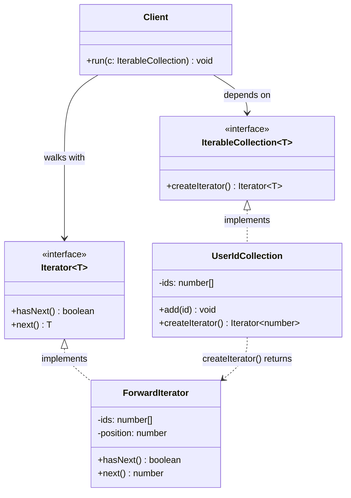

# Iterator Pattern — Class Diagram

Shows the four participants and their relationships. The `Client` depends only on the
two interfaces (`IterableCollection`, `Iterator`) — never on the concrete collection or
iterator. `UserIdCollection` *creates* a `ForwardIterator` but exposes it only as an
`Iterator`, so its private storage never leaks.

**How to read it**
- `<|..` (dashed, hollow triangle) = *implements interface*. `UserIdCollection` implements `IterableCollection`; `ForwardIterator` implements `Iterator`.
- `..>` (dashed arrow) = *creates / returns*. `UserIdCollection.createIterator()` builds a `ForwardIterator` but hands it back typed only as `Iterator`.
- `-->` = *depends on*. The `Client` points only at the two interfaces — it has **no arrow to `UserIdCollection` or `ForwardIterator`**. That is the whole point: the private `ids` array never escapes, and the client can walk any collection uniformly.
- Position lives on `ForwardIterator`, not on the collection — so two iterators over one collection never interfere.
