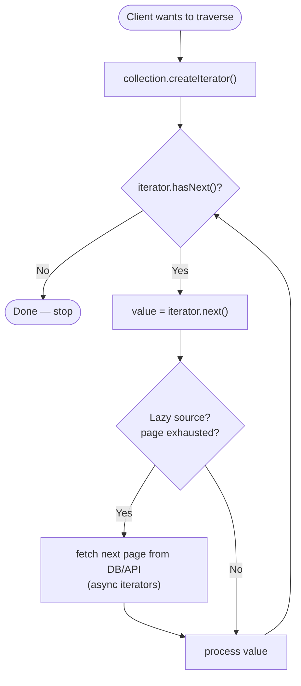

# Iterator Pattern — Flow Diagram

Step-by-step control flow of a traversal, including the lazy branch where a "next"
element must be fetched from a paginated source right now instead of being read from an
in-memory array.

**Key idea:** the consumer only ever loops on `hasNext()` / `next()`. Whether the next
element is sitting in an array or must be fetched over the network *right now* (the lazy
branch) is completely hidden inside the iterator. Swapping an in-memory collection for a
paginated API changes nothing in the loop — the same `hasNext()` / `next()` shape drives
both, which is exactly why one `for...of` (or `for await...of`) works uniformly across
arrays, trees, generators, and streaming cursors.
