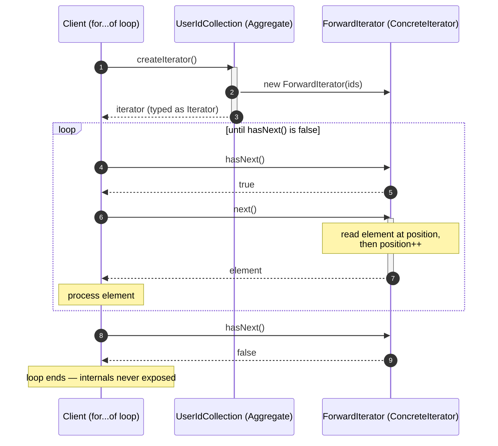

# Iterator Pattern — Sequence Diagram

Shows the runtime message exchange for one traversal: the client gets an iterator once,
then repeatedly asks `hasNext()` / `next()`. Only the iterator mutates the position; the
collection is consulted once to create the cursor and never opened up afterward.

**How to read it**
- The collection is asked for an iterator **once** (step 1). It constructs the matching `ForwardIterator`, handing it a reference to the private data, and returns it typed only as `Iterator`.
- Inside the loop the client talks **only to the iterator** — `hasNext()` to check, `next()` to advance. The collection is never touched again.
- Only the iterator mutates the position (the note: read element, then `position++`). The client never manages an index itself.
- When `hasNext()` finally returns `false` the loop ends. For a second independent walk the client would ask the collection for a *fresh* iterator, which keeps its own separate position.
