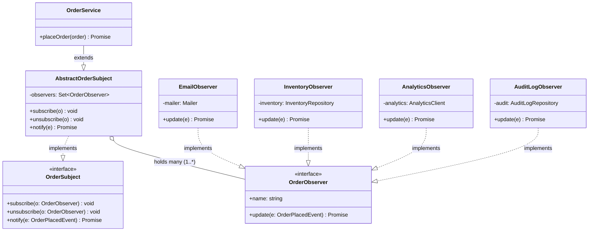
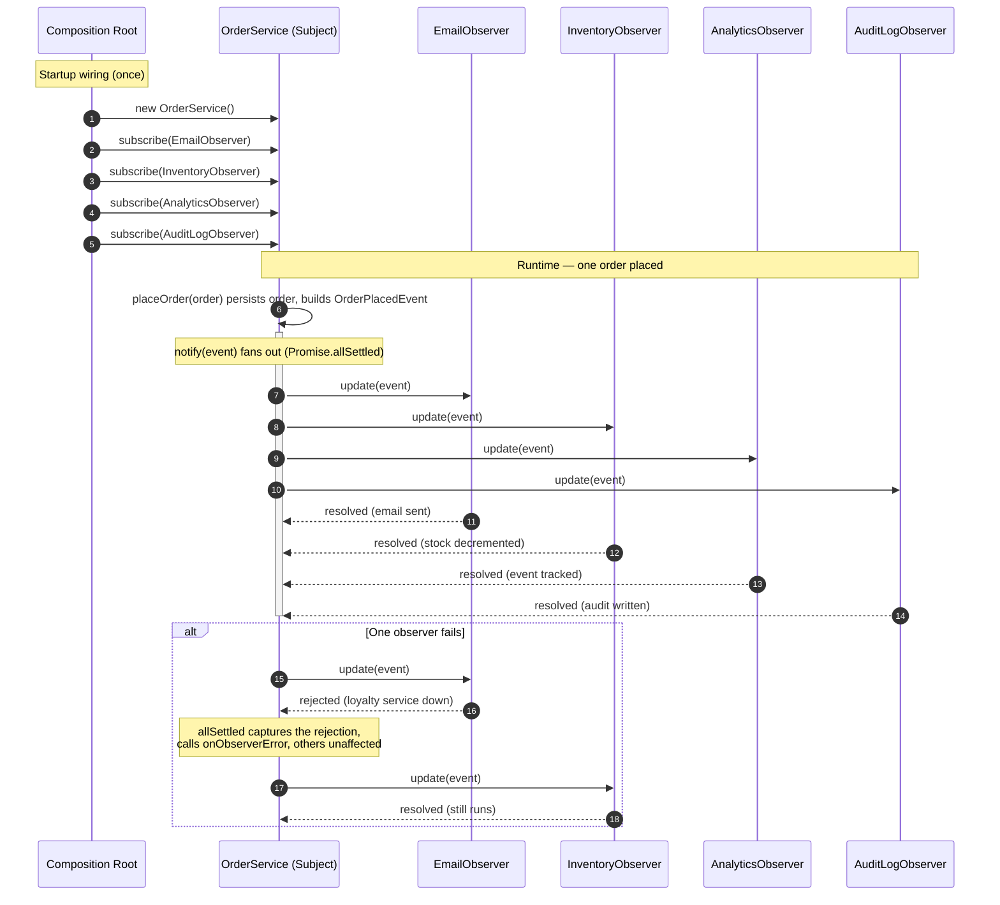
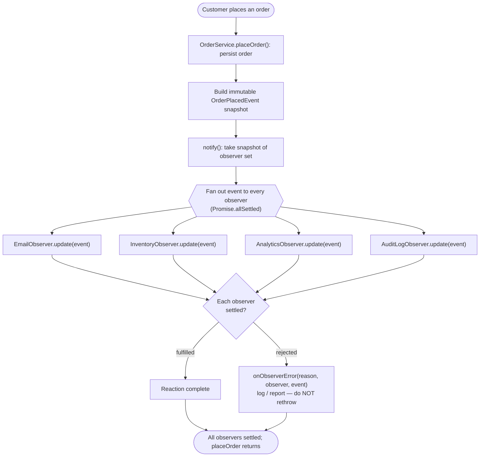

# Observer Pattern

## Intent

Define a one-to-many dependency between objects so that when one object (the Subject) changes state, all its dependents (Observers) are notified and updated automatically — without the Subject knowing who those dependents concretely are.

## Real Life Analogy

Think about a **newspaper (or YouTube channel) subscription**.

The newspaper publisher does not keep a personal relationship with each reader. It does not phone every household one by one. Instead, readers **subscribe**. When a new edition is printed, every current subscriber automatically receives a copy at their door. New people can subscribe at any time; existing readers can cancel (unsubscribe) and simply stop receiving papers. The publisher never needs to be rewritten because a new subscriber joined — it just keeps a list and delivers to whoever is on it.

Crucially, the publisher does not care *what each subscriber does* with the paper. One reader does the crossword, another clips coupons, a third lines a bird cage. Their reactions are their own business. The publisher's only job is: "something new happened — notify everyone on the list."

The Observer Pattern is exactly this. The **Subject** is the publisher. The **Observers** are the subscribers. State changes are new editions. Subscribing/unsubscribing manages the delivery list. And the publisher stays blissfully unaware of what each subscriber does with the news.

## Problem

### What engineering problem exists?

In real backend systems, **one meaningful event usually triggers many unrelated reactions**. Consider an e-commerce `OrderService`. When an order is placed, the system must:

- Send a confirmation email to the customer.
- Decrement inventory for each purchased SKU.
- Emit an analytics event for the data team.
- Write an audit-log record for compliance.
- (Next quarter) award loyalty points.
- (Later) notify the warehouse's fulfilment queue.

The naive approach is to put all of this inside `placeOrder()`:

```ts
async placeOrder(order) {
  await this.db.save(order);
  await this.mailer.send(...);        // email concern
  await this.inventory.decrement(...); // inventory concern
  await this.analytics.track(...);     // analytics concern
  await this.audit.append(...);        // audit concern
  // ...and it keeps growing forever
}
```

> **Term: Coupling.** Coupling measures how much one piece of code depends on the concrete details of another. High coupling means a change in one place forces changes in many others. Low coupling is a core goal of good design.

### Why is this problem difficult?

- **The Subject accumulates responsibilities it should not own.** `OrderService` now depends on the mailer, the inventory repo, the analytics SDK, and the audit store. It violates the **Single Responsibility Principle** — it has many reasons to change (email template tweak, new analytics field, etc.).
- **Every new reaction edits the same method.** Adding loyalty points means opening `placeOrder()` again — the exact code that already works and is well-tested. This violates the **Open/Closed Principle** (code should be open to extension, closed to modification).
- **The reactions are entangled.** They run in one method, share one try/catch, and one failure can sink the whole operation. If the analytics call throws, does the customer's email silently not send?
- **It cannot scale organizationally.** The email team, the analytics team, and the compliance team all have to edit the same file, stepping on each other in code review and merge conflicts.

### What happens if we ignore it?

- **A "god method"** that grows without bound and becomes the single most dangerous file to touch.
- **Fragile deploys.** A change to analytics risks breaking checkout, because they live in the same code path.
- **Hidden failure coupling.** One optional side-effect (analytics) taking down a critical one (order confirmation).
- **No reuse.** The same "on order placed, do X" logic gets copy-pasted into other flows (order via API, order via admin panel, order via import job), and the copies drift apart.

## Why Not Other Solutions?

**"Just call everything inline inside `placeOrder()`."**
This is the god-method above. It couples the subject to every side-effect, violates SRP and OCP, and makes each reaction impossible to test or deploy independently. Every new listener is a modification to critical, working code.

**"Pass an array of callback functions into the service."**
Better — but raw callbacks have no contract (no shared interface), no stable identity (so you cannot reliably *unsubscribe* a specific anonymous function), and no name for diagnostics ("which callback threw?"). The Observer formalizes callbacks into named, typed objects you can add, remove, and reason about.

**"Use hard-coded conditionals / feature flags: `if (emailEnabled) sendEmail()`."**
This keeps all the knowledge inside the subject and just gates it. The subject still imports and depends on every collaborator. The conditional grows with every feature. You have added complexity without removing coupling.

**"Poll for changes: have each interested component periodically ask 'did an order happen?'"**
Polling wastes CPU and database queries, adds latency (you react only as often as you poll), and does not scale — ten pollers hammering the DB every second is a self-inflicted load problem. Observer is *push*: you are told the instant something changes, zero polling.

**"Reach straight for a message broker (Kafka/RabbitMQ/Redis Pub/Sub) for everything."**
A broker is the right tool when reactions must be **out-of-process, durable, retryable, or cross-service** (see the Pub/Sub discussion below). But for **in-process reactions in a single service**, a broker adds infrastructure to run, operate, and monitor; serialization overhead; and eventual-consistency semantics you may not want for logic that should happen synchronously within one transaction/request. Observer is the lightweight, in-memory answer; Pub/Sub is its distributed big sibling. Choosing the broker prematurely is over-engineering.

**Tradeoff summary:** Inline code and conditionals keep coupling; raw callbacks lose contracts and identity; polling wastes resources; a broker is heavyweight for in-process needs. Observer gives you decoupled, typed, add/remove-able, push-based reactions with no extra infrastructure.

## Solution

The core idea: **invert the direction of knowledge.** Instead of the subject reaching out to each concrete collaborator, the collaborators **register themselves** with the subject, and the subject broadcasts to whoever registered.

You define an **Observer interface** with a single method — conventionally `update(...)`. Anything that wants to react implements it. The **Subject** keeps a list of observers and exposes `subscribe`, `unsubscribe`, and `notify`. When the subject's state changes, it walks its list and calls `update(...)` on each observer, handing them a description of what happened.

The thinking behind it:

1. **Depend on an abstraction, not on concretions.** The subject holds `Observer[]`, never `EmailObserver` or `AnalyticsObserver`. It literally cannot name them. That is what decouples them.
2. **Push responsibility outward.** Each observer owns exactly one reaction and knows how to do it. The subject owns only "broadcast that something happened."
3. **Make the observer set dynamic.** Observers can be added and removed at runtime. Adding a feature = writing one new observer class and subscribing it — the subject's code never changes (Open/Closed).
4. **Isolate failures.** Because each observer is a separate object with its own `update`, the subject can invoke them defensively: one throwing observer does not stop the others.

You do **not** hard-code the reactions. You do **not** let the subject import each collaborator. You add a thin registry and a broadcast loop, and let interested parties opt in.

> **Term: Push vs Pull model.**
> In the **push** model, the subject *sends the changed data* to observers as arguments to `update(data)`. Simple, and observers get exactly what they need. Risk: the subject must guess what data every observer wants.
> In the **pull** model, the subject only signals "I changed" via `update(this)`, and each observer *pulls* whatever it needs back out of the subject. More flexible for observers, but couples them to the subject's shape and can cause extra reads. Most backend systems use **push** with a well-designed event object — which is what our example does.

## Architecture

There are five participants (the two interfaces plus their concrete forms, and the client that reacts):

1. **Subject (interface):** Declares `subscribe(observer)`, `unsubscribe(observer)`, and `notify(event)`. It is the contract for "something observable." In our code this is `OrderSubject`.

2. **Observer (interface):** Declares `update(event)` — the single method the subject will call. This is the *only* thing the subject knows about its dependents. In our code this is `OrderObserver`.

3. **ConcreteSubject:** Holds the real state and business logic. When its state changes, it builds an event and calls `notify`. In our code this is `OrderService` (which reuses subscription mechanics from an `AbstractOrderSubject` base). It maintains the observer registry and decides *when* to notify.

4. **ConcreteObserver(s):** Implement `update`. Each encapsulates one reaction to the event. In our code: `EmailObserver`, `InventoryObserver`, `AnalyticsObserver`, `AuditLogObserver`. Each depends only on its own injected collaborator (a mailer, a repository, etc.).

5. **Client / Composition Root:** Creates the subject and the observers, and wires them together via `subscribe(...)`. This is the only place that knows the full cast. Adding a new observer touches only here plus the new class.

Responsibilities in one line each:
- **Subject interface:** defines how to subscribe/unsubscribe/notify.
- **Observer interface:** defines how an observer is told about a change.
- **ConcreteSubject:** owns state; decides when and what to broadcast.
- **ConcreteObserver:** owns one reaction to the broadcast.
- **Composition Root:** wires who listens to whom.

## Execution Flow

1. At application startup (composition root / DI container), the **ConcreteSubject** (`OrderService`) is created.
2. Each **ConcreteObserver** is created with its own injected dependencies (mailer, inventory repo, analytics client, audit repo).
3. Each observer is registered via `subject.subscribe(observer)`. The subject stores them in its internal set — it only sees them as `OrderObserver`.
4. Later, at runtime, a business action occurs: `orderService.placeOrder(order)`.
5. The subject performs its own core work (persist the order).
6. The subject builds an **immutable event object** (`OrderPlacedEvent`) describing exactly what happened.
7. The subject calls its internal `notify(event)`.
8. `notify` takes a **snapshot** of the current observer set (so that subscribe/unsubscribe during notification is safe).
9. For every observer in the snapshot, the subject calls `observer.update(event)`, passing the event (push model). In our async version these run concurrently via `Promise.allSettled`.
10. Each observer independently does its reaction (send email, decrement stock, track analytics, write audit).
11. If an observer throws/rejects, the subject catches it and routes it to an error handler; the **other observers still complete** (error isolation).
12. Once all observers have settled, `notify` returns and `placeOrder` completes — still with no knowledge of who reacted.

## Class Diagram



See [images/class-diagram.md](images/class-diagram.md) for a full "how to read it" note. The single most important thing: there is **no arrow from `OrderService` to any concrete observer**. The subject cannot name its observers — that absence is the decoupling.

## Sequence Diagram



See [images/sequence-diagram.md](images/sequence-diagram.md). The `alt` block is the important part: error isolation means a rejected observer is reported, not fatal.

## Flow Diagram



See [images/flow-diagram.md](images/flow-diagram.md).

## Implementation

The implementation strategy in TypeScript:

1. **Define the Observer interface first.** Keep it to a single `update(event)` method plus a `name` for diagnostics. Make `update` return `Promise<void>` because real reactions are I/O-bound.

2. **Design a rich, immutable event object.** Rather than passing loose primitives, pass one `readonly` event (`OrderPlacedEvent`) so every observer receives a consistent, tamper-proof snapshot. This is the push model done well.

3. **Extract the subscription mechanics into a reusable base (`AbstractOrderSubject`).** Every subject needs the same registry logic (a `Set` for duplicate-free O(1) add/remove), snapshot-based iteration, and safe fan-out. Put it once in a base class; concrete subjects just add state and decide *when* to notify.

4. **Notify defensively.** Use `Promise.allSettled` (not `Promise.all`) so one rejecting observer does not abandon the rest. Route each rejection to an injectable error handler.

5. **Inject observers' dependencies via the constructor.** `EmailObserver` takes a `Mailer`; it never `new`s one. This keeps observers unit-testable and mirrors how NestJS providers work.

6. **Wire everything at the composition root.** The subject never constructs its observers; the root does, then calls `subscribe`.

We demonstrate this with a realistic `OrderService` that notifies four observers, plus a deliberately flaky observer to prove error isolation, and an unsubscribe to prove the lapsed-listener leak is preventable.

## Code Walkthrough

See [code.ts](code.ts) for the full runnable implementation. Here is what each part does and why it exists.

**`OrderPlacedEvent` (the event payload).**
An immutable (`readonly`) snapshot of what happened: the order and a timestamp. It exists so the subject can *push* a consistent description to every observer. Immutability matters: if one observer could mutate the event, it would corrupt what later observers see. This is the data that travels through `update`.

**`OrderObserver` (Observer interface).**
The contract every reaction implements: a `name` (for "which observer failed?" diagnostics) and `update(event): Promise<void>`. It exists so the subject can hold and call its dependents **without knowing their concrete types**. This one interface is the seam that decouples subject from reactions.

**`OrderSubject` (Subject interface).**
Declares `subscribe`, `unsubscribe`, and `notify`. It defines what it means to be observable, so multiple subject implementations can share the same shape.

**`AbstractOrderSubject` (reusable ConcreteSubject base).**
Holds the observer registry as a `Set<OrderObserver>` (O(1) add/remove, and it silently prevents the double-subscription bug where an observer fires twice). Its `notify` does three production-critical things: (1) iterates a **snapshot** `[...observers]` so subscribe/unsubscribe during notification is safe; (2) uses **`Promise.allSettled`** so observers run concurrently and one failure never blocks the others; (3) routes each rejection to an injectable `onObserverError` handler. This class exists so that every concrete subject gets correct, battle-tested broadcast mechanics for free.

**`OrderService` (ConcreteSubject).**
Extends `AbstractOrderSubject` and adds the business method `placeOrder`. It persists the order, builds the event, and calls `notify`. Read what it does *not* do: it never imports `EmailObserver`, `Mailer`, analytics, or audit. It only knows "some observers exist." That is the payoff — this class never changes when you add a new reaction.

**`Mailer`, `InventoryRepository`, `AnalyticsClient`, `AuditLogRepository` (collaborators).**
Interfaces for the real I/O each observer performs. They are injected into observers so observers can be tested with fakes and so the pattern demonstrates dependency inversion.

**`EmailObserver`, `InventoryObserver`, `AnalyticsObserver`, `AuditLogObserver` (ConcreteObservers).**
Each implements `update`, does exactly one reaction, and depends only on its own injected collaborator. None knows the others exist. Adding `LoyaltyObserver` tomorrow means writing one class like these and subscribing it — nothing else moves. This is the Open/Closed Principle made concrete.

**Composition Root (`buildOrderService`) and `main`.**
The root creates the subject, creates each observer with its dependency, and subscribes them — the single place that knows the whole cast. `main` then places orders: one with all observers healthy, one after adding a **flaky observer that always throws** (showing the other four still run), and one after **unsubscribing** it (showing how the lapsed-listener leak is avoided). Running the file prints the fan-out, the isolated failure, and the clean removal.

## Advantages

- **Loose coupling.** The subject depends only on the `Observer` interface, not on concrete observers. Subject and observers can be developed, tested, and deployed independently.
- **Open/Closed Principle.** Add a new reaction by writing a new observer and subscribing it — the subject's code is never modified.
- **Single Responsibility Principle.** Each observer owns exactly one reaction; the subject owns only "broadcast the change."
- **Dynamic relationships.** Observers can be added or removed at runtime (feature flags, per-tenant behavior, hot-reconfiguration).
- **Reusable broadcast.** The same event drives many independent reactions, eliminating copy-pasted "on X, also do Y" code across entry points.
- **Testability.** You can unit-test each observer with a fake collaborator, and unit-test the subject with fake observers, in isolation.

## Disadvantages

- **Indirection makes flow harder to trace.** Reading `placeOrder` no longer tells you everything that happens; you must also know who subscribed. Debugging "why did an email get sent?" now spans multiple files.
- **Ordering is not guaranteed** (especially with concurrent async notification). If reactions have hidden dependencies on each other's order, Observer will bite you.
- **Memory leaks (the "lapsed listener" problem).** The subject holds strong references to observers. Forget to unsubscribe a short-lived observer and it — plus everything it retains — can never be garbage-collected.
- **Cascading / update-storm risk.** If an observer's reaction changes another subject that notifies more observers, a single event can fan out into a storm of updates, or even loop.
- **Error handling is subtle.** Without care, one throwing observer aborts the rest (`Promise.all`) or silently swallows failures. You must consciously choose the failure policy.
- **Hidden temporal coupling.** Whether notification is sync or async, and whether it runs inside or outside the DB transaction, has real consequences that are easy to get wrong.

## Tradeoffs

**What we gain:** decoupling, extensibility (Open/Closed), single-responsibility reactions, runtime-dynamic subscriptions, reuse of one event across many reactions, and independent testability.

**What we lose:** straight-line readability (the full behavior is no longer in one method), guaranteed ordering, and simplicity. We take on the responsibility of managing subscriptions (to avoid leaks), choosing a notification model (sync vs async, fail-fast vs fail-safe), and guarding against cascades. The pattern trades *local clarity* for *global flexibility* — a good trade when reactions are numerous, optional, or owned by different teams; a bad trade when there is exactly one fixed reaction.

## Complexity

**Code Complexity:** Low to moderate. The mechanics (a set, subscribe/unsubscribe, a notify loop) are simple. Complexity appears in the *policies*: sync vs async, error isolation, ordering, and cascade prevention.

**Maintenance Complexity:** Low for adding/removing reactions (localized to one new class). Higher for *understanding* runtime behavior, because control flow is implicit — you must consult the subscription wiring to know what actually happens.

**Scalability:** Excellent organizationally — many teams can own many observers without touching the subject. Runtime: in-process notification is O(number of observers) per event and stays in memory. For very high fan-out or cross-service needs, graduate to a broker (Pub/Sub).

**Flexibility:** High. Observers are added, removed, reordered, and reconfigured at runtime; behavior can vary per environment or tenant purely through which observers are subscribed.

**Testability:** High. Interfaces on both sides make faking trivial. You can assert "the subject notified N observers" and "this observer reacted correctly" separately.

## Performance Considerations

**Memory:** The dominant concern is the **lapsed-listener leak** — the subject's strong references keep dead observers alive. Always unsubscribe short-lived observers (or use a `WeakRef`/`WeakMap`-based registry where identity semantics allow). The observer set itself is tiny.

**CPU:** Notification is a loop over observers; the cost is the sum of the observers' reactions, not the loop. If reactions are cheap and synchronous, fan-out is negligible. Beware **update storms** where one notification triggers cascades of further notifications — that is where CPU blows up.

**Network:** Observer itself adds no network calls. But observers often *do* I/O (email, HTTP, DB). Running them concurrently (`allSettled` over promises) overlaps that latency; running them sequentially serializes it. Choose deliberately.

**Database:** If several observers each hit the database, a single event can multiply into many queries. Watch for N+1 patterns (e.g., an observer that loops over order lines issuing one query each). Consider batching inside the observer.

**Object creation:** Observers are typically created once at startup (like DI singletons), not per event. The per-event allocation is just the event object. Do not create observers per request.

**Runtime (sync vs async):** Synchronous notification blocks the caller until every observer finishes — simple, ordered, but slow if observers do I/O and dangerous if one hangs. Asynchronous notification (our example) overlaps I/O and isolates failures but loses ordering guarantees and makes "is it done yet?" harder to answer. For anything that must be durable or retryable, do not notify inline at all — publish to a broker (see below).

## Common Mistakes

- **Forgetting to unsubscribe (lapsed listener leak).** A component subscribes on creation but never unsubscribes on destruction. *Why it happens:* subscribe is visible, teardown is easy to forget. *Avoid:* pair every `subscribe` with an `unsubscribe` in the matching lifecycle hook (e.g., NestJS `onModuleDestroy`, React `useEffect` cleanup, RxJS `subscription.unsubscribe()`).

- **Letting one observer's exception break the rest.** Using a plain `for` loop or `Promise.all` means the first failure aborts the broadcast. *Why:* it is the default, naive loop. *Avoid:* wrap each `update` in try/catch (sync) or use `Promise.allSettled` (async), and route failures to an error handler.

- **Double subscription.** Subscribing the same observer twice makes it fire twice per event. *Why:* an array with no dedup, plus a subscribe call in a code path that runs more than once. *Avoid:* store observers in a `Set`, or guard against duplicates.

- **Mutating shared state inside observers.** An observer mutates the event or a shared object, changing what later observers see. *Why:* the event looks like a convenient scratchpad. *Avoid:* make the event `readonly`/immutable; observers derive their own data.

- **Assuming an order of notification.** Writing an observer that only works if another ran first. *Why:* the subscription order happens to work today. *Avoid:* keep observers independent; if you truly need ordering, model it explicitly (a pipeline / Chain of Responsibility), not implicit subscription order.

- **Cascading notifications / infinite loops.** Observer A updates a subject that notifies observer B that updates the first subject again. *Why:* subjects and observers are wired into a cycle. *Avoid:* keep the dependency graph acyclic; guard with a "notifying" flag; or move cross-object propagation to a broker with idempotent handlers.

- **Notifying inside a database transaction with I/O observers.** The email observer sends mail before the transaction commits — then the transaction rolls back and you emailed a confirmation for an order that does not exist. *Why:* it is easy to call `notify` mid-transaction. *Avoid:* notify only after commit (transactional outbox / "after commit" hooks).

## When To Use

- **One event, many independent reactions**, where the set of reactions grows over time (order placed → email + inventory + analytics + audit + loyalty).
- **You want the source of the event to stay ignorant of who reacts**, so different teams can add reactions without touching the source.
- **Reactions should be pluggable at runtime** — enabled per environment, per tenant, or via feature flags.
- **In-process, single-service event handling** where a full message broker would be overkill.
- **Domain events within a bounded context** (DDD): an aggregate raises an event and interested handlers react.
- **UI/state reactivity** (frameworks): components observe a store and re-render on change.

## When NOT To Use

- **There is exactly one fixed reaction that will never change.** Just call it directly — an interface + registry is needless indirection (YAGNI).
- **Reactions must be strictly ordered or form a pipeline** where each step transforms the input for the next. That is Chain of Responsibility or a pipeline, not Observer.
- **Reactions must be durable, retryable, or survive a crash** (payments, provisioning). In-memory observers are lost on restart — use a broker/queue with persistence and retries.
- **Reactions span multiple services or processes.** In-process Observer cannot reach another service; you need Pub/Sub over a broker (Kafka, RabbitMQ, Redis).
- **The relationships are many-to-many and stateful coordination is needed** among peers. That is a Mediator's job.
- **Latency-critical hot paths** where you cannot afford unpredictable fan-out or one slow observer stalling the caller (unless you make notification async/queued).

## Real Production Examples

- **Node.js:** The built-in **`EventEmitter`** is the Observer pattern in the standard library. `emitter.on("event", listener)` is `subscribe`; `emitter.emit("event", data)` is `notify`; `removeListener`/`off` is `unsubscribe`. Streams (`data`, `end`, `error` events), `http.Server`, and `process` events all use it. The famous "MaxListenersExceededWarning" is Node warning you about a likely lapsed-listener leak.
- **NestJS:** The `@nestjs/event-emitter` package wraps **`EventEmitter2`**. You `eventEmitter.emit('order.placed', payload)` in a service (Subject) and annotate handlers with **`@OnEvent('order.placed')`** (Observers). NestJS lifecycle hooks (`OnModuleInit`, `OnModuleDestroy`) are themselves observer callbacks the framework invokes.
- **Express:** The `req`/`res` objects are `EventEmitter`s (`res.on('finish', ...)`, `req.on('close', ...)`); middleware often subscribes to these lifecycle events.
- **Java Spring:** **`ApplicationEventPublisher.publishEvent(...)`** plus **`@EventListener`** methods is Observer at framework scale. `ApplicationListener` and the older `java.util.Observer`/`Observable` (now deprecated) are direct implementations.
- **.NET:** The language has first-class support: **`event`** keyword and delegates, and the **`IObservable<T>`/`IObserver<T>`** interfaces (the basis of Reactive Extensions, Rx.NET).
- **AWS:** **SNS (Simple Notification Service)** is Observer-as-a-service: publish to a topic, and all subscribed endpoints (SQS queues, Lambdas, HTTP) are notified. S3 event notifications and DynamoDB Streams follow the same publish/subscribe shape.
- **Azure:** **Event Grid** and **Service Bus topics/subscriptions** implement subject→many-subscribers eventing.
- **Google Cloud:** **Cloud Pub/Sub** is the managed broker version; **Eventarc** routes events to subscribers.
- **React (if applicable):** State stores like **Redux/Zustand** are subjects; components `subscribe` and re-render on change. `useEffect`'s subscribe-then-cleanup is the canonical subscribe/unsubscribe pair. React's `useSyncExternalStore` exists precisely to observe external subjects safely.
- **Databases:** PostgreSQL **`LISTEN`/`NOTIFY`** is a built-in publish/subscribe channel; **triggers** notify dependent logic on row changes; **Change Data Capture (CDC)** streams (Debezium) turn table changes into observable events.
- **AI Systems:** Streaming LLM responses are observed token-by-token (subscribe to a token stream); training loops fire callbacks/hooks (Keras `Callback`, PyTorch Lightning hooks) to observers that log metrics, checkpoint, or early-stop.

## Where I Can Use This

Five realistic ideas for your own backend projects:

1. **Domain events in a NestJS service.** Use `@nestjs/event-emitter`: emit `user.registered` from `AuthService` and add `@OnEvent` handlers for welcome email, analytics, and free-trial provisioning — each in its own provider, added without touching `AuthService`.
2. **Cache invalidation.** When a `Product` is updated, notify observers that evict the product from Redis, purge a CDN path, and bump a search index — the product service stays unaware of caches.
3. **WebSocket/live updates.** A `GameRoom` or `ChatChannel` subject notifies all connected client-observers (Socket.IO rooms are exactly this) when state changes; connect/disconnect are subscribe/unsubscribe.
4. **Audit and compliance logging.** Subscribe an `AuditObserver` to every important domain event so audit logging is cross-cutting and never forgotten in individual handlers.
5. **Job/pipeline progress reporting.** A long-running import job (subject) notifies observers on each milestone — one updates a progress bar over WebSocket, one writes metrics, one posts to Slack on failure.

## Similar Patterns

- **Publish/Subscribe (Pub/Sub):** The distributed cousin. Observer is **in-process**: the subject holds direct references to its observers and calls them. Pub/Sub inserts a **broker / message channel** (Kafka, RabbitMQ, Redis, SNS) between publisher and subscriber, so they never reference each other, can live in different services, and can be added/removed without the publisher knowing a subscriber exists at all. Pub/Sub adds durability, retries, and cross-process reach — at the cost of infrastructure and eventual consistency. Rule of thumb: **Observer for in-memory reactions in one service; Pub/Sub when reactions must cross process/service boundaries or survive crashes.**
- **Mediator:** Centralizes **many-to-many** communication among peers into one coordinator, so components talk to the mediator instead of each other. Observer is **one-to-many, one-directional** (subject → observers) and the subject broadcasts blindly; a Mediator actively *coordinates* and often contains interaction logic. Use Mediator when components must collaborate; Observer when one thing changing simply needs to inform many.
- **Chain of Responsibility:** Passes a request along an **ordered chain** until someone handles it; typically **one** handler acts and it can stop the chain. Observer broadcasts to **all** observers with no ordering intent and no stopping. Use CoR for ordered pipelines (middleware, approval flows); Observer for parallel independent reactions.
- **RxJS / Reactive Streams (Observable):** A powerful superset of Observer for **streams of values over time**. An `Observable` is a subject you subscribe to; it pushes multiple values plus completion/error signals, and adds **operators** (`map`, `filter`, `debounceTime`, `retry`) and back-pressure. Plain Observer notifies of discrete state changes; RxJS models continuous event streams with composition. Use RxJS when you need to transform, combine, throttle, or otherwise compose event streams.
- **Command:** Encapsulates a request as an object; often the *payload* an observer receives can be a command. Different intent: Command is about parameterizing/queuing actions, Observer about notifying of change.

| Pattern | Cardinality | Coupling / Mediation | Direction | Ordering | Cross-process? | Intent |
|---|---|---|---|---|---|---|
| **Observer** | One-to-many | Subject holds direct refs to observers | Subject → observers | No guarantee | No (in-process) | Notify many dependents of a state change |
| **Pub/Sub** | Many-to-many | Broker/channel fully decouples both sides | Publisher → broker → subscribers | Per-broker | Yes | Decoupled, durable, cross-service eventing |
| **Mediator** | Many-to-many | Central mediator coordinates peers | Peer ↔ mediator ↔ peer | Mediator decides | No | Centralize complex interactions |
| **Chain of Responsibility** | One request, many handlers | Handlers linked in a chain | Along the chain | Strict order | No | Pass request until one handles it |
| **RxJS Observable** | One-to-many (stream) | Subscribe to observable; operators | Source → operators → subscribers | Ordered stream | No (in-process) | Compose async streams of values |

## Interview Discussion

Experienced engineers rarely treat Observer as "the newspaper example." They discuss it as the **foundation of event-driven design** and immediately probe the *operational* concerns that separate a toy from production:

- *"Observer or Pub/Sub here?"* The senior answer is about **process boundaries and durability**: in-process, best-effort, same-transaction reactions → Observer; cross-service, must-not-be-lost, retryable reactions → a broker. Being able to draw that line is the real signal.
- *"How do you prevent memory leaks?"* Talk about the **lapsed-listener problem**, pairing subscribe with unsubscribe in lifecycle hooks, and weak references. Node's `MaxListenersExceededWarning` is the war story.
- *"One observer throws — what happens to the others?"* Discuss `Promise.all` vs `Promise.allSettled`, per-observer try/catch, and an error-handling policy. "One flaky analytics call must not break order confirmation" is the concrete framing.
- *"Sync or async notification? Inside or outside the transaction?"* This is where people show maturity: the **transactional outbox** pattern, "notify after commit," and why sending an email mid-transaction is a bug.
- *"How do you avoid update storms / cycles?"* Acyclic dependency graphs, idempotent handlers, and guards.
- *"Push vs pull?"* Explain the tradeoff and why a well-designed immutable event (push) is usually best.

Common follow-ups: *"How would you make this survive a restart?"* (persist events / outbox), *"How do you test it?"* (fake observers assert notification; fake collaborators assert reactions), *"How does NestJS's `@OnEvent` relate?"* (it is Observer with the framework as the subject registry).

Common misconceptions:
- "Observer and Pub/Sub are the same thing." They share intent but differ on mediation, coupling, durability, and process boundaries.
- "`notify` guarantees the order observers run in." It does not, especially async — never rely on it.
- "Observer means events go on a queue." No — plain Observer is in-memory method calls; queues appear only when you graduate to a broker.
- "More observers is always fine." Fan-out, ordering assumptions, and cascades all have costs.

## Summary

- Observer defines a **one-to-many** dependency: when the Subject's state changes, all Observers are notified automatically.
- The Subject knows observers **only through an interface** (`update`), so it is decoupled from concrete reactions.
- Participants: **Subject** (registry + notify), **Observer** (interface with `update`), **ConcreteSubject** (state + triggers notify), **ConcreteObserver** (one reaction).
- Add reactions by writing a new observer and subscribing it — the subject never changes (Open/Closed).
- Production concerns dominate: **unsubscribe** to avoid leaks, **`allSettled`/try-catch** for error isolation, **choose sync vs async**, **notify after commit**, and **avoid cascades**.
- Node's `EventEmitter`, NestJS `@OnEvent`/`EventEmitter2`, Spring `@EventListener`, and Redux stores are Observer in real systems.
- Observer is **in-process**; when reactions must cross services or be durable, graduate to **Pub/Sub over a broker**. **RxJS** is Observer generalized to composable streams.

## Key Takeaways

1. Observer = one Subject, many Observers, notified automatically on state change.
2. The Subject depends only on the Observer *interface* — that is the decoupling.
3. Add a reaction = new observer + one `subscribe` line; never edit the subject (Open/Closed, SRP).
4. Prefer the **push** model with an **immutable event** object.
5. Always pair `subscribe` with `unsubscribe` — forgotten observers cause the lapsed-listener memory leak.
6. Isolate failures: `Promise.allSettled` (async) or per-observer try/catch (sync) so one bad observer never breaks the rest.
7. Notification order is **not** guaranteed — keep observers independent; use Chain of Responsibility for ordered pipelines.
8. Notify **after** the transaction commits to avoid acting on changes that roll back.
9. In-process → Observer; cross-service/durable → **Pub/Sub over a broker** (Kafka, SNS, Redis).
10. Node `EventEmitter`, NestJS `@OnEvent`, and RxJS `Observable` are the same idea you already use daily.

---

## Further Reading

**Books**
- *Design Patterns: Elements of Reusable Object-Oriented Software* — Gamma, Helm, Johnson, Vlissides (the "Gang of Four"); the original Observer definition.
- *Head First Design Patterns* — Freeman & Robson (the Observer chapter — the weather-station example — is the best beginner intro).
- *Patterns of Enterprise Application Architecture* — Martin Fowler (domain events, observers in enterprise apps).
- *Enterprise Integration Patterns* — Hohpe & Woolf (Publish-Subscribe Channel and the messaging counterparts of Observer).
- *Implementing Domain-Driven Design* — Vaughn Vernon (domain events and handlers).

**Open Source Projects / GitHub Repositories**
- Node.js `events` module (`EventEmitter`) — https://github.com/nodejs/node/blob/main/lib/events.js
- NestJS event-emitter (`EventEmitter2`, `@OnEvent`) — https://github.com/nestjs/event-emitter
- RxJS (Reactive Extensions for JS) — https://github.com/ReactiveX/rxjs
- EventEmitter2 — https://github.com/EventEmitter2/EventEmitter2

**Official Documentation**
- Node.js `events` / `EventEmitter` — https://nodejs.org/api/events.html
- NestJS Events — https://docs.nestjs.com/techniques/events
- Refactoring.Guru — Observer — https://refactoring.guru/design-patterns/observer
- RxJS — Observables — https://rxjs.dev/guide/observable
- PostgreSQL `LISTEN` / `NOTIFY` — https://www.postgresql.org/docs/current/sql-notify.html

**Blog Articles**
- Martin Fowler — "Event Sourcing" and "Domain Event" — https://martinfowler.com/eaaDev/DomainEvent.html
- Microservices.io — "Transactional Outbox" (how to notify reliably after commit) — https://microservices.io/patterns/data/transactional-outbox.html
- Refactoring.Guru — Observer in TypeScript — https://refactoring.guru/design-patterns/observer/typescript/example
