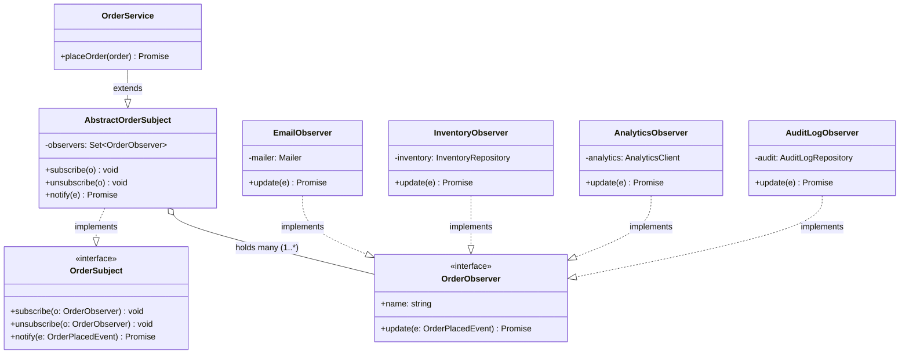

# Observer Pattern — Class Diagram

Shows the five roles. The `OrderService` (ConcreteSubject) knows its observers
ONLY through the `OrderObserver` interface — it has no reference to any concrete
observer type. Each concrete observer implements `OrderObserver` and depends on
its own injected collaborator (mailer, repository, etc.).

**How to read it**
- `<<interface>>` = a contract, no implementation.
- `..|>` (dashed, hollow triangle) = *implements an interface*.
- `--|>` (solid, hollow triangle) = *extends a class* (`OrderService` reuses the
  subscribe/notify machinery from `AbstractOrderSubject`).
- `o--` (hollow diamond) = *aggregation*: the subject **holds a collection of**
  observers. The `1..*` means one subject, many observers — the defining
  one-to-many dependency of this pattern.
- Notice there is **no arrow from `OrderService` to any concrete observer**. That
  absence is the whole point: the subject is decoupled from who listens.
