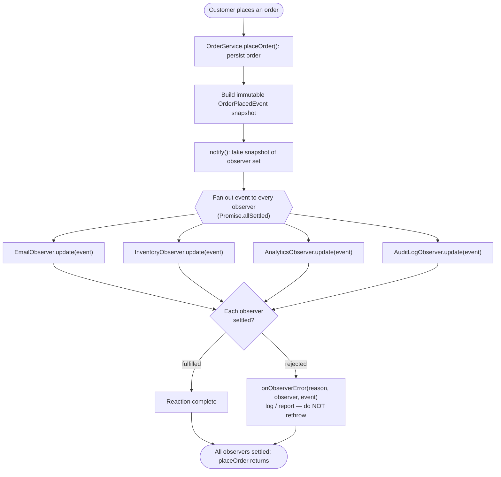

# Observer Pattern — Flow Diagram

Step-by-step control flow of a single `placeOrder` → `notify` fan-out, including
the per-observer success/failure branch.

**Key idea:** the subject broadcasts the same event to every observer and waits
for all of them to *settle*, never *fail-fast*. A rejected observer is routed to
`onObserverError` and does not abort the others. Adding a new reaction means
adding a new branch here (a new observer) — the `placeOrder` logic above the
fan-out never changes.
