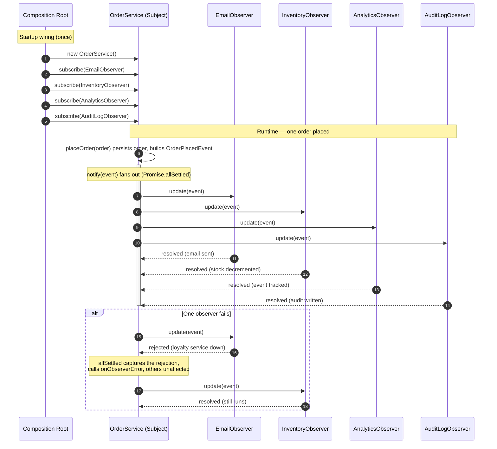

# Observer Pattern — Sequence Diagram

Shows the runtime message exchange for one `placeOrder` call, including the
composition-root wiring and the error-isolation path when one observer throws.

**How to read it**
- The **Composition Root** creates the subject and calls `subscribe(...)` once at
  startup — the subject never constructs its own observers.
- At runtime `placeOrder` builds an immutable event and calls `notify`, which
  fans the event out to every observer (the PUSH model — data is handed to them).
- Because the example uses `Promise.allSettled`, all observers are invoked and each
  outcome is recorded independently.
- The `alt` block shows **error isolation**: a rejected observer is caught and
  reported via `onObserverError`; the remaining observers still run. One broken
  listener never breaks the broadcast.
