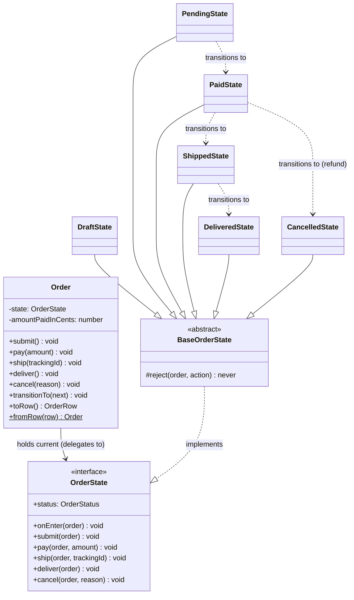
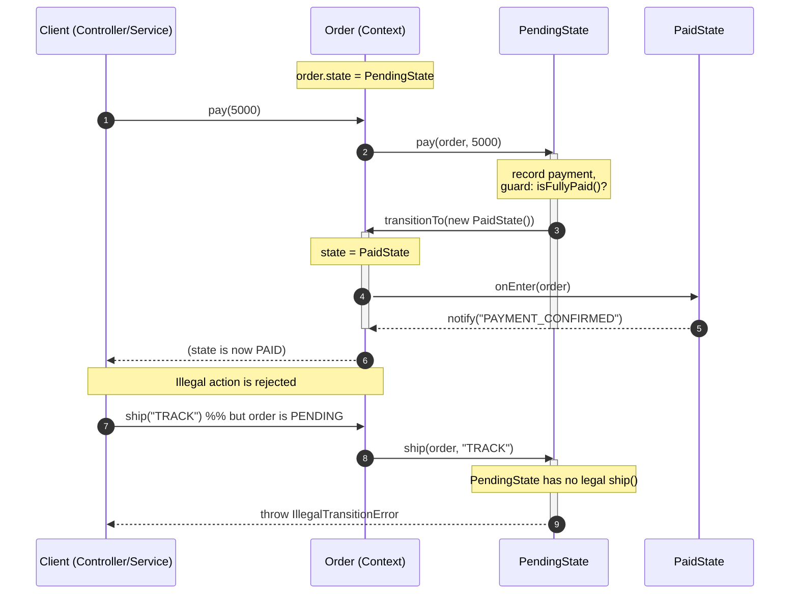
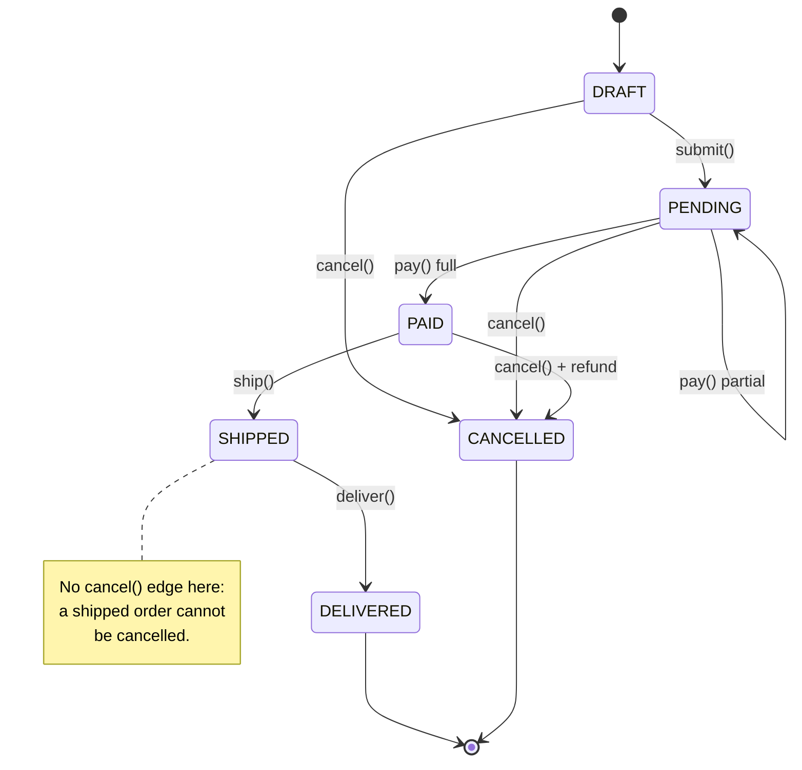
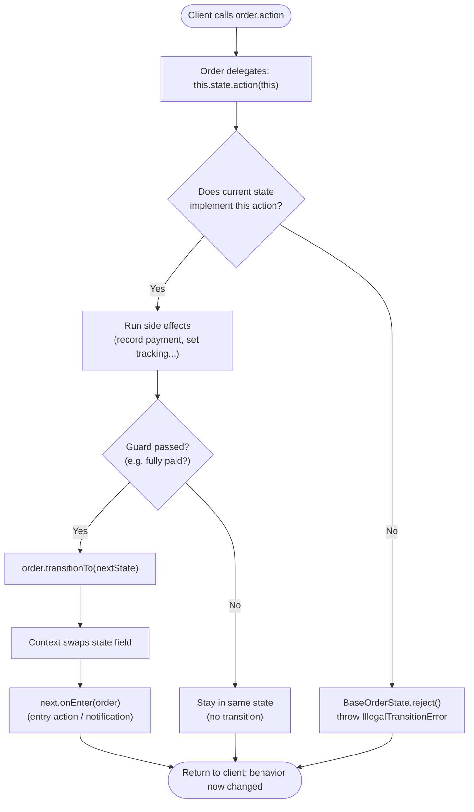

# State Pattern

## Intent

Allow an object to alter its behavior when its internal state changes, so that the object appears to change its class — by moving each state's behavior and its allowed transitions into its own class instead of scattering `if`/`switch` on a status flag across every method.

## Real Life Analogy

Think of a traffic light. It is a single physical object, but what it *does* depends entirely on which state it is in.

- When it is **Red**, the only thing it will do next is turn **Green**. It refuses to jump straight to Yellow.
- When it is **Green**, the only legal next move is **Yellow**.
- When it is **Yellow**, the only legal next move is **Red**.

The light does not consult a giant rulebook every time — the current colour *itself* knows what comes next. Red "knows" it becomes Green; Green "knows" it becomes Yellow. If you asked a Red light to "become Yellow now," it would reject that request because it is not a legal move from Red.

The State Pattern is exactly this. Your object (the traffic light) holds a reference to a small object representing its current state (Red / Green / Yellow). Each state object contains the behavior for that state *and* decides which state comes next. When the state changes, the object's behavior changes with it — even though the object itself never changed its type.

## Problem

### What engineering problem exists?

Many backend objects behave differently depending on a lifecycle status they carry. The classic example is an **Order** in an e-commerce system:

- An order that is `PENDING` can be **paid** or **cancelled**, but cannot be **shipped**.
- An order that is `PAID` can be **shipped** or **cancelled (with a refund)**.
- An order that is `SHIPPED` can be **delivered**, but can no longer be **cancelled**.
- An order that is `DELIVERED` or `CANCELLED` is finished — nothing more can happen to it.

The same is true of a **subscription** (trialing → active → past_due → cancelled), a **document approval workflow** (draft → in_review → approved / rejected), a **CI/CD job** (queued → running → succeeded / failed), or a **TCP connection** (LISTEN → SYN_RECEIVED → ESTABLISHED → CLOSE_WAIT …).

> **Term: State machine.** A model where a system is in exactly one of a finite number of *states* at any time, and moves between them via *transitions* triggered by *events/actions*. Only certain transitions are legal from each state. "Finite State Machine" (FSM) is the formal name.

The naive implementation puts a `status` field on the object and then, inside *every* method, branches on it:

```ts
class Order {
  status: 'PENDING' | 'PAID' | 'SHIPPED' | 'DELIVERED' | 'CANCELLED';

  pay(amount: number) {
    if (this.status === 'PENDING') { /* ...pay... */ this.status = 'PAID'; }
    else if (this.status === 'PAID') { throw new Error('already paid'); }
    else if (this.status === 'SHIPPED') { throw new Error('...'); }
    // ...one branch per status...
  }

  ship() {
    if (this.status === 'PAID') { /* ...ship... */ this.status = 'SHIPPED'; }
    else if (this.status === 'PENDING') { throw new Error('not paid'); }
    // ...the SAME set of branches, repeated...
  }

  deliver() { /* ...the same status switch, AGAIN... */ }
  cancel() { /* ...and AGAIN... */ }
}
```

### Why is this problem difficult?

- **The status logic is duplicated across every method.** The list of states appears in `pay`, `ship`, `deliver`, and `cancel`. Add one new state (`RETURNED`) and you must find and edit *every* method. Miss one and you have a bug.
- **The transition rules are invisible.** "Which states can be cancelled?" is not written anywhere as a single fact — you have to read all methods and reconstruct it in your head.
- **Conditionals grow quadratically.** With *S* states and *A* actions you get up to *S × A* branches, all interleaved in one class. This is the textbook symptom the State pattern exists to cure.
- **Illegal transitions slip through.** With hand-written branches it is easy to forget a case, so an unpaid order gets shipped, or a delivered order gets cancelled — real money-losing bugs.

### What happens if we ignore it?

- **A "god" class.** The `Order` class swells to hundreds of lines of tangled conditionals that every developer is afraid to touch.
- **Shotgun surgery.** One new state or one changed rule forces edits in many methods at once.
- **Untestable logic.** You cannot test "the behavior of a PAID order" in isolation — it is smeared across the whole class.
- **Silent corruption.** Missing guards let the object reach impossible states, and the bug surfaces far downstream (a shipment label printed for an unpaid order).

## Why Not Other Solutions?

**"Just use an `enum` + a `switch` in each method."**
This is the naive baseline above. It works for 2–3 states and 1–2 actions, but the branching is duplicated in every method, the transition map is implicit, and every change touches many places. It violates the Open/Closed Principle: adding a state means *modifying* existing methods rather than *adding* a class.

**"Use a big transition table (a `Map` of `[state, action] -> nextState`)."**
A pure lookup table is a real, valid FSM technique and is great when transitions carry *no behavior* — just "from A on X go to B." But orders are not that simple: paying must record money, shipping must attach a tracking number, cancelling a *paid* order must issue a refund. A table stores the *next state* but has nowhere clean to put the *side effects* and *guards* of each transition. You end up bolting a second switch onto the table to run the behavior — back to square one. State-as-objects keeps the transition *and* its behavior together.

**"Use the Strategy pattern."**
Strategy and State are structurally almost identical (an object delegates to a swappable inner object). But Strategy is about the *client* choosing one interchangeable algorithm; the strategies are independent and never swap themselves out. State is about an object *cycling through* states over its lifetime, where each state *knows about and triggers* the next. Using Strategy here gives you the mechanism but not the intent: nothing owns the transition graph. (Full comparison below.)

**"Model it with inheritance — an `OrderPending`, `OrderPaid` subclass."**
You cannot change an object's class at runtime in TypeScript. An order *is one object* whose behavior must change over time; subclassing would force you to create a new object on every transition and copy all the data across. State-as-a-field lets one stable object swap its behavior in place.

**Tradeoff summary:** every alternative either duplicates the state logic (enum+switch), separates behavior from transitions (pure table), models the wrong intent (Strategy), or cannot change behavior in place (inheritance). The State pattern co-locates each state's behavior *and* its legal transitions in one class, and lets the object swap that class at runtime.

## Solution

The core idea: **represent each state as its own object, give them all a common interface, and let the main object (the Context) delegate every action to whichever state object it currently holds.**

You define a **State interface** listing every action a client can attempt (`pay`, `ship`, `deliver`, `cancel`). You then write **one ConcreteState class per state** (`PendingState`, `PaidState`, `ShippedState`, …). Each concrete state implements *only the actions that are legal in that state* and, inside those methods, tells the Context to transition to the next state. Any action that is *not* legal in that state rejects it (throws an `IllegalTransitionError`).

The **Context** (the `Order`) holds a reference to the current state object. Its public methods (`order.pay()`, `order.ship()`) contain **no conditionals** — they simply forward the call to the current state: `this.state.pay(this)`. Because the current state object *is* the source of behavior, changing the state field changes the object's behavior instantly.

The thinking behind it:

1. **Replace conditionals with polymorphism.** The `if (status === X)` ladder becomes "call the method on the current state object." The runtime type of that object decides the behavior — that is what polymorphism is for.
2. **Co-locate behavior and transitions.** Everything true about a `PAID` order — what it can do, and where it can go next — lives in `PaidState` and nowhere else.
3. **Make illegal states unrepresentable in code.** A state simply does not implement the actions it forbids (or inherits a rejecting default), so illegal transitions fail loudly and consistently.
4. **Add states without editing existing ones.** A new state is a new class; existing states are untouched (Open/Closed Principle).

You do **not** put a status switch in the Context. You do **not** let the client decide transitions. Each state owns its own slice of the machine.

## Architecture

There are three participants:

1. **Context** (`Order`): the object whose behavior varies. It holds a private reference to a **State** object, exposes the public API the client calls (`pay`, `ship`, …), and delegates each call to the current state. It also owns the shared data the states operate on (totals, tracking id) and exposes a `transitionTo(newState)` method that the states use to change it. The Context never decides *what* is legal — it only delegates and holds data.

2. **State** (interface, `OrderState`): declares the set of methods that represent all actions a client can attempt, plus (optionally) an `onEnter` hook for entry actions. Every concrete state must satisfy this interface, which is what lets the Context treat them uniformly.

3. **ConcreteState** (`DraftState`, `PendingState`, `PaidState`, `ShippedState`, `DeliveredState`, `CancelledState`): each implements the behavior for exactly one state. In the methods it permits, it performs the action's side effects and calls `context.transitionTo(nextState)`. In the methods it forbids, it rejects (throws). Crucially, **a concrete state decides which state comes next** — the transition logic lives in the states, not the Context.

Responsibilities in one line each:
- **Context:** holds current state + shared data, delegates actions, performs the state swap.
- **State (interface):** defines the actions every state must respond to.
- **ConcreteState:** implements one state's behavior and its outgoing transitions.

> **Design note — who owns transitions?** There are two schools. (a) *States own transitions* (used here): each state calls `context.transitionTo(...)`. This keeps related rules together and is the GoF default. (b) *The Context owns transitions* via a table, and states only return "what should happen." Use (a) when transitions carry behavior; use (b) when the graph is large and behavior-free. This module uses (a).

## Execution Flow

1. At creation, the Context (`Order`) is initialized with a starting state object — here `new DraftState()` — stored in a private `state` field.
2. The client calls a public action on the Context, e.g. `order.pay(5000)`.
3. The Context does **not** inspect any status flag. It simply delegates: `this.state.pay(this, 5000)`.
4. The current state object receives the call. It checks whether this action is legal in this state (implicitly — if it implements the method, it is legal; if not, the base class rejects it).
5. If legal, the state performs the action's side effects (record the payment) and evaluates any guard (is the order fully paid?).
6. If a transition should occur, the state calls `context.transitionTo(new PaidState())`.
7. `transitionTo` logs the change, replaces the Context's `state` field with the new state object, and fires the new state's `onEnter(context)` entry action (e.g. send a "payment confirmed" notification).
8. Control returns to the client. The order now *behaves* as a `PAID` order: a subsequent `order.ship(...)` will be delegated to `PaidState` and succeed.
9. If the client attempts an illegal action (e.g. `order.ship()` while `PENDING`), step 4 falls through to the base state's default, which throws `IllegalTransitionError` — the action is rejected instead of silently corrupting the order.
10. When the object must be saved, the Context serializes its current state to a string (`toRow().status`) for the database. Later it is rebuilt with `Order.fromRow(row)`, which maps that string back to the correct state object so the machine resumes exactly where it left off.

## Class Diagram



## Sequence Diagram



## Flow Diagram

The natural way to view a State machine is as a `stateDiagram-v2`: nodes are states, arrows are the legal transitions (labelled with the triggering action).



And the control flow of a single delegated action:



## Implementation

The implementation strategy in TypeScript:

1. **Define the State interface first** (`OrderState`) — list *every* action a client can attempt across the whole lifecycle, plus a `status` identifier and an optional `onEnter` hook. Every state must be able to respond to every action (even if that response is "reject").

2. **Write an abstract base state** (`BaseOrderState`) that implements *every* action as a rejection by default. This is the single most useful trick in the pattern: each concrete state then overrides *only* the actions it allows, so the classes stay tiny and "illegal by default" is guaranteed. Forgetting to handle an action can no longer silently succeed.

3. **Write one ConcreteState per state.** In each permitted action, perform the side effects, evaluate guards, and call `order.transitionTo(nextState)`. States decide their own successors — that is where the transition graph lives.

4. **Keep the Context free of conditionals.** `Order` only delegates (`this.state.pay(this, amount)`), holds shared data, and provides `transitionTo`, which centralizes the swap and *guarantees* the new state's entry action runs.

5. **Inject dependencies into the Context, not the states.** Notifier, clock, and logger are injected once into `Order`; states reach them through the order. This keeps states free of `new`, so they are trivially unit-testable and stateless (one instance can serve many orders).

6. **Persist state as a string; rehydrate into an object.** The DB stores `status: 'PAID'`. A factory (`OrderStateFactory.forStatus`) maps that string back to `new PaidState()` when the row is loaded. Critically, rehydration must **not** re-run entry actions (you do not want to re-send "payment confirmed" every time you load the row).

We demonstrate this with a realistic e-commerce Order lifecycle including partial payments (which stay in `PENDING`), a refund on cancelling a `PAID` order, rejection of illegal transitions, and a persist/rehydrate round-trip.

## Code Walkthrough

See [code.ts](code.ts) for the full runnable implementation. Here is what each part does and why it exists.

**`Notifier`, `Clock`, `Logger`, `OrderDependencies` (injected ports).**
These interfaces are the dependencies states need for side effects (send notifications, read "now", log). They are injected into the `Order` once. They exist so states never hard-code infrastructure — in tests you pass fakes and assert exactly which notifications fired. This is Dependency Inversion in action.

**`IllegalTransitionError` (domain error).**
A typed error thrown when an action is not allowed in the current state. It carries the `from` state and the attempted `action`, so callers (and logs) get a precise, catchable failure instead of a generic `Error`. It exists to make "you can't do that here" a first-class, testable outcome.

**`OrderStatus` (state identifier union).**
A closed string union (`'DRAFT' | 'PENDING' | ...`). This is the value stored in the `orders.status` DB column and returned by `getStatus()`. It exists so persistence and diagnostics have a stable, serializable name for each state object.

**`OrderState` (State interface).**
Declares every action (`submit`, `pay`, `ship`, `deliver`, `cancel`), the `status` identity, and the `onEnter` entry hook. It exists so the `Order` can treat all states uniformly and delegate without knowing the concrete type.

**`Order` (Context).**
Holds the current `state` object and the shared data (total, amount paid, tracking id). Its public methods each do exactly one thing — delegate to the current state (`this.state.pay(this, amount)`) — so there is **not one conditional** on status in this class. `transitionTo(next)` is the only place the state field is reassigned; it logs the change and *guarantees* the new state's `onEnter` fires, so entry actions can never be forgotten by an individual state. `toRow()` / `fromRow()` implement persistence. This class exists to be the stable object whose behavior changes as its state swaps underneath it.

**`OrderStateFactory` (rehydration).**
Maps a persisted `OrderStatus` string back to a fresh state object. It exists as the single, exhaustive place that knows "which class corresponds to which stored status," so loading from the DB reconstructs the right behavior. The `never` exhaustiveness check makes the compiler force you to handle any newly added state.

**`BaseOrderState` (abstract default).**
Implements every action as `reject(...)`, which logs and throws `IllegalTransitionError`. Concrete states extend it and override only their legal actions. It exists to make "reject by default" automatic — the safety guarantee of the whole design.

**`DraftState`, `PendingState`, `PaidState`, `ShippedState`, `DeliveredState`, `CancelledState` (ConcreteStates).**
Each overrides only the actions legal in that state and decides the next state:
- `DraftState` allows `submit` (→ `PendingState`) and `cancel`.
- `PendingState` allows `pay` — on a *partial* payment it records the money and **stays** `PENDING` (the rule lives in the state, invisible to the client); on full payment it transitions to `PaidState`. It also allows `cancel`.
- `PaidState` allows `ship` (→ `ShippedState`) and `cancel` (which additionally issues a refund on the way out — the refund side effect belongs to the transition *out of* PAID, so it lives here).
- `ShippedState` allows only `deliver`. It deliberately does **not** implement `cancel`, so cancelling a shipped order is rejected by the base class — enforcing the "can't cancel after shipping" rule structurally.
- `DeliveredState` and `CancelledState` are terminal: they override nothing but `onEnter`, so every action is rejected.

Each state's `onEnter` sends the appropriate notification (`AWAITING_PAYMENT`, `PAYMENT_CONFIRMED`, `OUT_FOR_DELIVERY`, etc.), demonstrating entry actions.

**Interactions.**
The client calls `order.pay(5000)`. `Order` delegates to `PendingState.pay`, which records the payment; if fully paid it calls `order.transitionTo(new PaidState())`; `transitionTo` swaps the field and fires `PaidState.onEnter`, which notifies. A later `order.ship(...)` is now delegated to `PaidState` and succeeds. The persist/rehydrate demo saves a `PAID` order to a row, rebuilds it in a "fresh process," and continues correctly — proving the pattern survives the request/response boundary of a real backend.

## Advantages

- **Eliminates sprawling conditionals.** The `if (status === ...)` ladders in every method are replaced by polymorphic delegation. Each behavior lives in exactly one place.
- **Single Responsibility per state.** Everything about a `PAID` order — what it allows and where it can go — is in `PaidState` and nowhere else.
- **Open/Closed for new states.** Adding `RETURNED` or `ON_HOLD` is a new class plus one factory line; existing states are untouched.
- **Illegal transitions are structurally rejected.** "Reject by default" via the base class means forbidden actions fail loudly and consistently, protecting data integrity.
- **Transitions are explicit and discoverable.** The state graph is visible by reading the states (and mirrors the `stateDiagram-v2` one-to-one).
- **Highly testable.** You can unit-test one state in isolation ("PendingState.ship throws", "PaidState.cancel refunds") without constructing the whole lifecycle.
- **Entry/exit actions have a home.** Side effects tied to *entering* a state (notifications) live in `onEnter`; side effects tied to *leaving* one (refund on cancel) live in that transition.

## Disadvantages

- **More classes and files.** A machine with six states is six classes plus an interface and a base — heavier than one enum for a trivial two-state case.
- **Indirection.** Reading the code means jumping between state classes to trace a full lifecycle, versus one linear switch. New readers need to understand the pattern first.
- **State explosion.** Complex machines with many states and sub-states can proliferate classes; nested/hierarchical states or a dedicated FSM library (XState) may be warranted.
- **Shared data lives in the Context.** States operate on the Context's data via accessors; if that surface grows large, the coupling between states and Context can become awkward.
- **Transition logic is distributed.** Because each state owns its outgoing edges, "the whole graph" is not in one file (unless you also maintain a diagram). Some teams prefer a central table for exactly this reason.
- **Persistence adds real complexity.** You must map states to/from strings and be careful not to re-fire entry actions on rehydration — a subtle, easy-to-get-wrong detail.

## Tradeoffs

**What we gain:** clean, conditional-free behavior; strong integrity guarantees on transitions; localized, testable, extensible per-state logic; an explicit lifecycle model that mirrors how the business actually describes the object.

**What we lose:** simplicity and directness for small cases. We introduce an interface, a base class, and one class per state, plus indirection and a persistence-mapping layer. For a status with two values and one action, this is over-engineering — a boolean and an `if` are better. The pattern pays off precisely when the number of states × actions is large enough that the conditional approach becomes unmaintainable, or when transition integrity is important (money, workflows, protocols).

## Complexity

**Code Complexity:** Moderate. The pattern is more classes up front, but each class is small and simple. Per-method cyclomatic complexity drops sharply because the branching is replaced by polymorphism.

**Maintenance Complexity:** Low once understood. Changes are localized: a new rule for `PAID` orders touches only `PaidState`; a new state is a new file. No shotgun surgery.

**Scalability:** Excellent for *code* scalability — the design absorbs new states and actions gracefully. For *runtime* scalability, states are typically stateless and can be shared/singletons; nothing here bottlenecks throughput.

**Flexibility:** High. States are swappable, composable, and independently testable. The transition graph can be reshaped by editing individual states.

**Testability:** High. Each state is a unit. You can assert both legal transitions (correct next state + side effect) and illegal ones (throws) in tiny focused tests, and mock the injected ports to verify entry actions.

## Performance Considerations

**Memory:** State objects are tiny (often stateless). Best practice is to share singleton instances of stateless states rather than allocating a new one per transition; the example allocates per transition for clarity, but in a hot path you would cache them.

**CPU:** One extra virtual method call per action versus an inline `switch`. Negligible in any I/O-bound backend; the network/DB dominates by orders of magnitude.

**Network:** The pattern itself makes no network calls, but *entry actions* often do (sending a notification on entering `PENDING`). Be deliberate: entry actions with side effects must be idempotent or transactional, because a retry or a re-entry could fire them twice.

**Database:** The load-bearing concern. The current state is persisted as a string column (`orders.status`). Concurrent transitions on the same row are a real hazard — two requests both loading a `PAID` order and both trying to `ship` it. Guard with optimistic locking (a `version` column) or `SELECT ... FOR UPDATE`, so the second transition sees the updated state and is rejected. Illegal-transition guards in code do **not** protect you across processes without this.

**Object creation:** New state objects are cheap, but avoid churning them in tight loops; use shared instances if profiling shows pressure.

**Runtime:** Effectively identical to the conditional approach. The pattern is chosen for maintainability and correctness, not speed.

## Common Mistakes

- **Putting the transition logic in the Context.** Beginners keep a `switch` in `Order.pay()` that decides the next state, using state objects only as data. *Why it happens:* it feels safer to keep control central. *Avoid:* let each state decide its own successors via `context.transitionTo(...)`; the Context only delegates.

- **Making the Context expose fat setters.** If states mutate the Context through generic `setStatus`/`setField`, they can drive it into impossible combinations. *Avoid:* expose narrow, intent-revealing mutators (`recordPayment`, `setTracking`) and the single `transitionTo`.

- **Re-running entry actions on rehydration.** Loading a `PAID` order from the DB and firing `onEnter` re-sends the "payment confirmed" email every page load. *Why:* reusing the transition path for loading. *Avoid:* rehydrate by setting the state field directly (as `fromRow` does) without calling `onEnter`; only *transitions* fire entry actions.

- **Confusing State with Strategy.** They look identical, so people use one thinking of the other. *Avoid:* ask "does the object cycle through these over its lifetime, with each choosing the next (State), or does the client pick one interchangeable algorithm that never changes itself (Strategy)?"

- **Forgetting concurrency at the DB level.** In-memory guards feel bulletproof but two processes can both transition the same persisted row. *Avoid:* optimistic locking / row locks around the load-transition-save cycle.

- **Letting states `new` their own dependencies.** `new Notifier()` inside a state makes it untestable and non-configurable. *Avoid:* inject dependencies into the Context and reach them through it.

- **Not having a "reject by default" base.** Implementing every action in every state by hand invites a missed guard. *Avoid:* the abstract base that rejects all actions, overriding only the legal ones.

## When To Use

- An object's behavior must change based on a **lifecycle status**, and different statuses allow different actions (orders, subscriptions, tickets, documents, jobs, shipments).
- You have **large or duplicated conditionals** on a status field spread across many methods.
- **Transition rules matter** and illegal transitions must be prevented (payments, approvals, regulated workflows).
- The set of states and transitions is **well-defined and finite** (a genuine state machine).
- You need to **model, document, and test** the lifecycle explicitly, and it maps cleanly to a diagram the business understands.

## When NOT To Use

- **Few states, few actions.** Two or three states with one action — a boolean or a small `switch` is simpler and clearer. Applying State here is over-engineering.
- **State never changes behavior.** If the status is just a label with no behavioral difference, you do not need behavioral polymorphism.
- **Transitions carry no behavior at all.** A pure "from A on X → B" graph with zero side effects is better as a transition *table* than as classes.
- **The machine is huge and hierarchical.** With many nested states, guards, parallel regions, and history, hand-rolling State becomes unwieldy — reach for a formal FSM/statechart library (e.g. **XState**) instead.
- **The lifecycle is not truly finite/known.** If states are open-ended or user-defined at runtime, a data-driven engine beats hard-coded classes.

## Real Production Examples

- **Node.js:** TCP/streams are state machines internally — a `Readable` stream moves through flowing/paused/ended states, and a socket through connecting/open/closing/closed, each changing what operations are valid.
- **NestJS:** Long-running workflow/order services frequently model entities with a State machine; the `@nestjs/cqrs` sagas and guards often gate transitions. NestJS lifecycle hooks themselves reflect a state progression (`onModuleInit` → `onApplicationBootstrap` → `onModuleDestroy`).
- **Express:** The `req`/`res` objects behave differently depending on their state (headers sent vs not) — writing after `res.end()` throws, an implicit state guard.
- **Java Spring:** **Spring Statemachine** is a first-class State-pattern framework for exactly this. Spring Batch jobs move through defined states; Spring's bean lifecycle is a state progression.
- **.NET:** Workflow engines and `Stateless` (a popular .NET state-machine library) implement this pattern; `HttpWebRequest` and socket classes are internal state machines.
- **AWS:** **Step Functions** is a managed state machine (Amazon States Language) — the canonical cloud embodiment of this pattern for orchestrating workflows. Order/fulfilment pipelines are commonly modelled there.
- **Azure:** **Durable Functions** orchestrations model long-running workflows as state; **Logic Apps** are visual state machines.
- **Google Cloud:** **Workflows** and Cloud Tasks pipelines model multi-step processes as states with defined transitions.
- **React (if applicable):** **XState** is widely used on the frontend to model component/UI states (idle/loading/success/error) explicitly instead of tangled boolean flags — the same pattern, statechart flavour.
- **Databases:** Order/payment tables carry a `status` column that is the persisted form of exactly this machine; DB constraints/triggers sometimes enforce legal transitions. Saga orchestration for distributed transactions is a state machine.
- **AI Systems:** Agent frameworks model an agent loop as states (planning → tool_call → observe → respond); conversation/session managers track dialogue state; RAG pipelines move a request through retrieval/generation/validation states.

## Where I Can Use This

Five realistic ideas for your own backend projects:

1. **Order/checkout lifecycle** (the example here): `DRAFT → PENDING → PAID → SHIPPED → DELIVERED / CANCELLED`, with each state enforcing legal actions and firing notifications on entry.
2. **Subscription billing:** `TRIALING → ACTIVE → PAST_DUE → CANCELLED / EXPIRED`, where `PAST_DUE` allows a retry/pay action that `ACTIVE` does not, and dunning emails fire on entering `PAST_DUE`.
3. **Document / approval workflow:** `DRAFT → SUBMITTED → IN_REVIEW → APPROVED / REJECTED / CHANGES_REQUESTED`, where only reviewers can act in `IN_REVIEW` and the author regains edit rights only in `CHANGES_REQUESTED`.
4. **Async job / task runner:** `QUEUED → RUNNING → SUCCEEDED / FAILED → (RETRYING)`, where `cancel` is legal only while `QUEUED` or `RUNNING`, and retries are bounded by state.
5. **Support ticket system:** `OPEN → IN_PROGRESS → WAITING_ON_CUSTOMER → RESOLVED → CLOSED`, with SLA timers started/stopped as entry/exit actions of the relevant states.

## Similar Patterns

- **Strategy:** Structurally near-identical (an object delegates to a swappable inner object implementing a common interface), but the *intent* differs sharply. In Strategy, the **client** picks one interchangeable algorithm; the strategies are independent, unaware of each other, and never swap themselves out. In State, the object **cycles through** states over its lifetime, and each state **knows about and triggers** the transition to another state. Strategy is about *choosing behavior*; State is about *lifecycle*. This is the single most important comparison to get right.
- **Command:** Encapsulates a *request/action* as an object (supporting undo, queuing, logging). State encapsulates a *mode of being* and its transitions. They compose well: a Command can trigger a state transition.
- **Naive enum + switch:** The baseline State replaces. An enum with `switch` statements is fine for tiny machines but duplicates the state logic across methods and violates OCP as the machine grows.
- **Observer:** Often paired with State — entry/exit actions frequently *notify* observers (e.g. "order shipped"). Observer handles the fan-out; State decides *when*.
- **Memento:** Can snapshot a Context's state for undo/rollback; complementary to State, not an alternative.

| Pattern         | Intent                                   | Who selects the behavior?        | Do the parts know about each other? | Changes over object's lifetime? |
|-----------------|------------------------------------------|----------------------------------|-------------------------------------|---------------------------------|
| **State**       | Vary behavior by internal state          | The states themselves (transition) | Yes — states trigger transitions to others | Yes — object cycles through states |
| **Strategy**    | Swap interchangeable algorithms          | The client / config              | No — strategies are independent     | Usually no — chosen once        |
| **Command**     | Encapsulate an action as an object       | The invoker                      | No                                  | N/A (per-request objects)       |
| **enum+switch** | Branch on a status flag                  | Each method's conditional        | N/A                                 | Yes, but logic is duplicated    |
| **Observer**    | Notify dependents of changes             | The subject                      | Subject knows observers             | N/A                             |

## Interview Discussion

Experienced engineers rarely treat State as a toy vending-machine exercise. They discuss it as **how you model a lifecycle safely in a real system with a database and concurrency**. The interesting conversation is not "what are the participants" but "where do transitions live, how do you persist and rehydrate the machine, and how do you stop two requests from making an illegal transition at once."

Common follow-up questions:
- *"State vs Strategy — they look the same, so what's the difference?"* Intent: State is a lifecycle where states trigger transitions to each other; Strategy is a client-chosen, self-contained algorithm. (Have the crisp answer ready — it is the most asked follow-up.)
- *"Who owns the transitions — the states or the context?"* Both are valid; states-own-transitions (GoF default) keeps behavior with its transition; a central table suits large behavior-free graphs.
- *"How do you persist a State machine?"* Store the state as a string/enum column; rehydrate via a factory that maps the string back to the state object; never re-fire entry actions on load.
- *"How do you handle concurrent transitions?"* Optimistic locking (version column) or row locks; in-memory guards are not enough across processes.
- *"When would you reach for XState / Spring Statemachine / Step Functions instead of hand-rolling it?"* When the machine is large/hierarchical, needs visualization, history states, parallel regions, or must be orchestrated across services.
- *"Where do entry/exit actions go, and how do you keep them safe?"* Entry actions in `onEnter`/exit actions in the outgoing transition; make side effects idempotent because of retries.

Common misconceptions:
- "State and Strategy are the same pattern." Structurally similar, semantically different — the intent is the whole point.
- "The Context should decide transitions." That recreates the god-object switch; the states should own their edges (in the classic form).
- "It's just an enum with extra steps." Only if transitions have no behavior; once side effects, guards, and integrity matter, the enum approach collapses.
- "You always need a State pattern for a status field." No — for two states and one action it is over-engineering.

## Summary

- The State pattern lets an object change its behavior when its internal state changes, so it appears to change its class.
- It replaces status-based `if`/`switch` scattered across methods with one class per state, each holding that state's behavior *and* its legal transitions.
- Three participants: **Context** (holds current state, delegates, owns data), **State** (interface of actions), **ConcreteState** (behavior + outgoing transitions for one state).
- Prefer an abstract base state that **rejects every action by default**; concrete states override only what they allow — making illegal transitions fail loudly.
- **States decide their own next state** (classic form); the Context only delegates and performs the swap (which also fires entry actions).
- In a real backend you **persist the state as a string** and **rehydrate it into an object** via a factory — without re-firing entry actions — and you guard concurrent transitions at the **database** level.
- It is the same shape as **Strategy** but a different intent: lifecycle-with-transitions vs client-chosen algorithm.

## Key Takeaways

1. State = an object whose behavior changes with its internal state, via one class per state instead of conditionals.
2. Context delegates every action to its current state object; it holds no status `switch`.
3. Each ConcreteState implements only its legal actions and triggers the transition to the next state.
4. An abstract "reject-by-default" base state makes illegal transitions structurally impossible to miss.
5. Entry/exit actions belong in `onEnter` / the outgoing transition — and must be idempotent because of retries.
6. Persist state as a string, rehydrate into an object with a factory, and never re-run entry actions on load.
7. Guard concurrent transitions at the DB (optimistic locking / row locks) — in-memory guards are not enough.
8. State vs Strategy: same structure, different intent — lifecycle-with-self-transitions vs client-chosen independent algorithm.
9. Use it when states × actions makes conditionals unmaintainable or when transition integrity matters; avoid it for trivial or behavior-free status fields.
10. For large, hierarchical, or visualized machines, reach for a dedicated FSM tool (XState, Spring Statemachine, AWS Step Functions).

---

## Further Reading

**Books**
- *Design Patterns: Elements of Reusable Object-Oriented Software* — Gamma, Helm, Johnson, Vlissides (the "Gang of Four"), the original State definition.
- *Head First Design Patterns* — Freeman & Robson (excellent, approachable State chapter with the gumball-machine example).
- *Refactoring* — Martin Fowler ("Replace Conditional with Polymorphism" and "Replace Type Code with State/Strategy" are the refactorings that lead here).
- *Patterns of Enterprise Application Architecture* — Martin Fowler (state and workflow modelling in enterprise apps).
- *Game Programming Patterns* — Robert Nystrom (the "State" chapter — free online, very clear, and the hierarchical/pushdown FSM extensions).

**Open Source Projects / GitHub Repositories**
- XState — statecharts/state machines for JS/TS — https://github.com/statelyai/xstate
- Spring Statemachine — https://github.com/spring-projects/spring-statemachine
- Stateless (.NET) — https://github.com/dotnet-state-machine/stateless

**Official Documentation**
- Refactoring.Guru — State — https://refactoring.guru/design-patterns/state
- XState docs — https://stately.ai/docs
- AWS Step Functions — https://docs.aws.amazon.com/step-functions/

**Blog Articles**
- Refactoring.Guru — State in TypeScript — https://refactoring.guru/design-patterns/state/typescript/example
- Martin Fowler — "Replace Conditional with Polymorphism" — https://refactoring.com/catalog/replaceConditionalWithPolymorphism.html
- Statecharts.dev — "What is a state machine?" / "State vs Strategy" discussions — https://statecharts.dev/

**Research / Foundational**
- David Harel — "Statecharts: A Visual Formalism for Complex Systems" (1987) — the foundational paper behind hierarchical state machines and XState.
