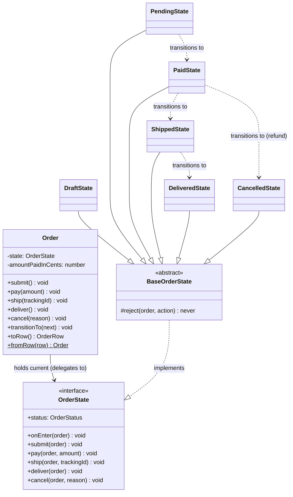

# State Pattern — Class Diagram

Shows the three participants and their relationships. The Context (`Order`) holds a
single current `OrderState` and delegates every action to it. Each ConcreteState
implements the state interface (via an abstract "reject-by-default" base) and knows
which state it transitions to next.

**How to read it**
- `..|>` (dashed, hollow triangle) = *implements interface*. `BaseOrderState` implements `OrderState`.
- `--|>` (solid, hollow triangle) = *class inheritance*. Every ConcreteState extends `BaseOrderState`, inheriting its "reject every action by default" behavior and overriding only the actions it permits.
- `-->` = *association / holds a reference*. `Order` (the Context) holds exactly one `OrderState` and forwards each call to it — there is **no** `if (status === ...)` in `Order`.
- `..>` (dashed arrow) = *transitions to*. These edges live **inside the states**, not the Context: a ConcreteState decides its own successor by calling `order.transitionTo(next)`. That is why the transition graph is discoverable by reading the state classes.
- `DeliveredState` and `CancelledState` have no outgoing transition arrows — they are terminal states that reject every action.
