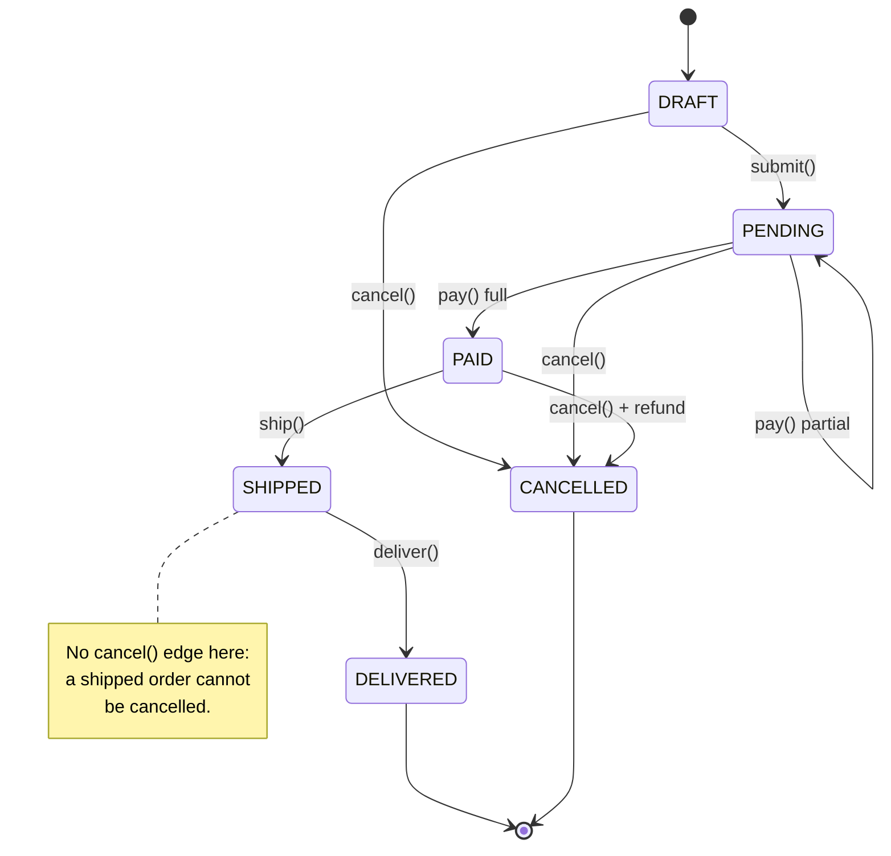
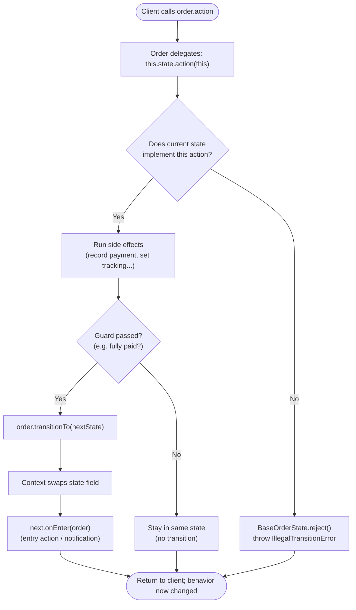

# State Pattern — Flow Diagram

The natural way to view a State machine is as a `stateDiagram-v2`: nodes are states,
arrows are the legal transitions (labelled with the triggering action). A second
`flowchart` below shows the control flow of a single delegated action.

And the control flow of a single delegated action:

**How to read it**
- **Top diagram (the state machine):** each node is a state and each labelled arrow is a *legal* transition triggered by an action. This is the single source of truth for the lifecycle — it maps one-to-one to the ConcreteState classes in `code.ts`.
- The self-loop `PENDING --> PENDING : pay() partial` encodes the "partial payment stays PENDING" rule; only a *full* payment crosses to `PAID`.
- The absence of a `cancel()` edge out of `SHIPPED` is deliberate and load-bearing: `ShippedState` simply does not implement `cancel`, so the base class rejects it. **Illegal transitions are the edges that are not drawn.**
- `[*]` marks the start (into `DRAFT`) and the terminal states (`DELIVERED`, `CANCELLED`), which accept no further actions.
- **Bottom diagram (one action's control flow):** every action goes delegate → is-it-legal? → side effects → guard → transition (swap + `onEnter`). The "No" branch on the guard is why an action can succeed without changing state (partial payment).
