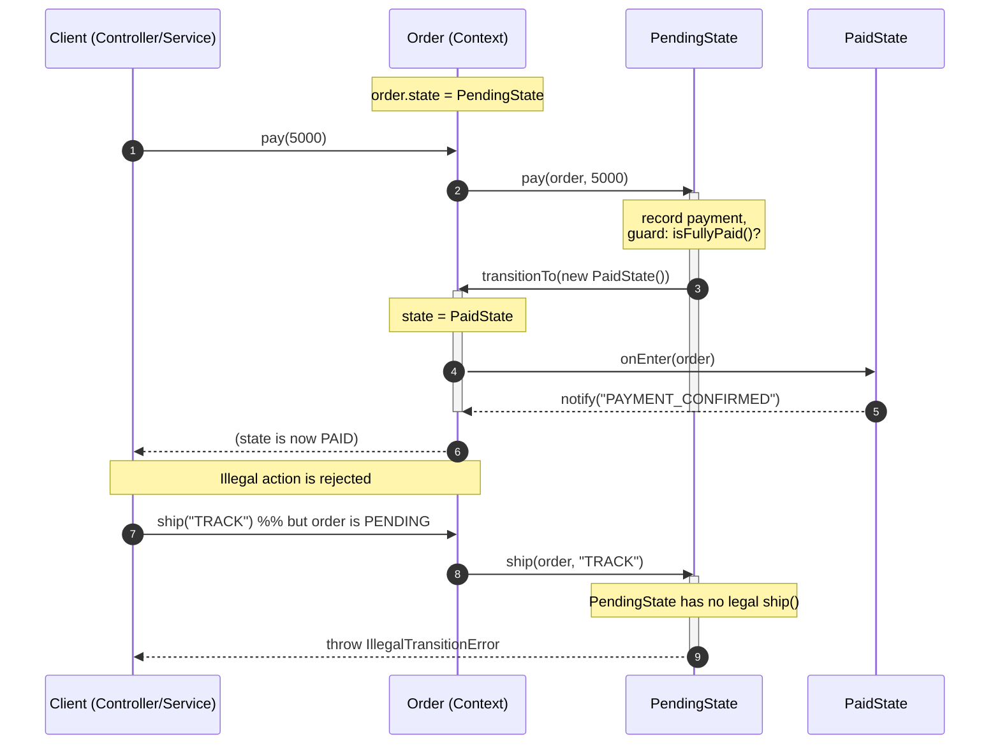

# State Pattern — Sequence Diagram

Shows the runtime message exchange for one action. The Context delegates to the
current state, the state performs side effects and triggers the transition, and the
Context swaps its state field and fires the new state's entry action. The second
block shows an illegal action being rejected.

**How to read it**
- The Client only ever talks to the **Context** (`Order`); it never references a state object directly. It calls intent methods like `pay(5000)`.
- The Context does **not** inspect a status flag — it blindly delegates: `this.state.pay(this, 5000)`. The runtime type of `state` decides the behavior (polymorphism replacing conditionals).
- The **state** owns the transition: `PendingState` runs the guard (fully paid?) and, if satisfied, calls `order.transitionTo(new PaidState())`.
- `transitionTo` is the single place the state field is swapped, and it *guarantees* the new state's `onEnter` runs — which is where entry-action side effects (notifications) live.
- The second block shows the safety guarantee: `ship()` on a `PENDING` order falls through to the base state's default and throws `IllegalTransitionError` instead of silently corrupting the order.
