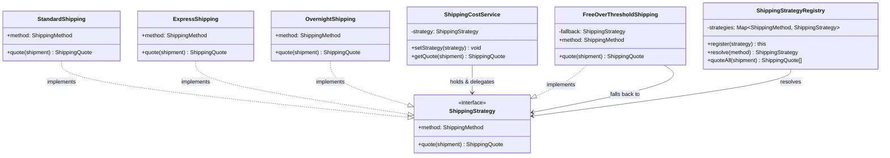
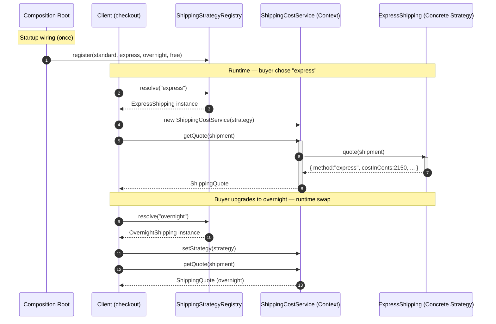
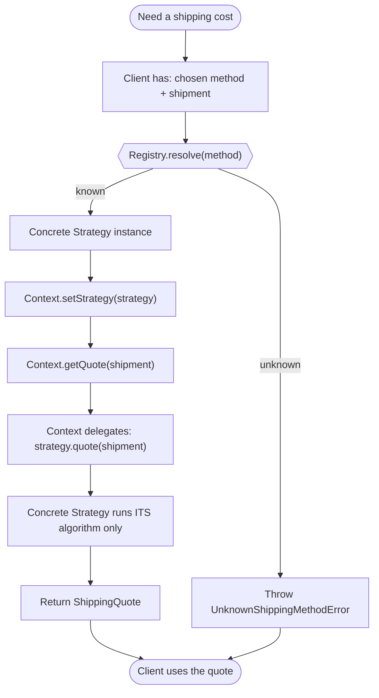

# Strategy Pattern

## Intent

Define a family of algorithms, encapsulate each one in its own object, and make them interchangeable so that the algorithm can vary independently from the code that uses it.

## Real Life Analogy

Imagine you need to get to the airport. There are several ways to do it: drive your own car, book a cab, take the metro, or ride a bus. Each option is a completely different *algorithm* for "get me to the airport" — different cost, different time, different steps — but from your point of view they are **interchangeable**: you pick one, and off you go.

You (the traveller) do not need to know *how* the metro schedules trains or *how* the cab driver routes around traffic. You just choose a mode of transport and it takes over. If it rains, you can switch from "walk" to "cab" on the spot without changing who you are or where you are going.

The Strategy Pattern is exactly this. Your code has a job to do ("calculate shipping cost", "compress this file", "rank these search results") and there are several algorithms that can do it. Instead of hard-coding one algorithm — or writing a giant `if/else` that picks between them inline — you wrap each algorithm in its own object, all sharing the same interface, and let the caller plug in whichever one it needs, even swapping it while the program runs.

## Problem

### What engineering problem exists?

In real backend systems, the same *task* frequently has many *variants* of *how* it is done, and the right variant depends on data known only at runtime:

- **Shipping cost** depends on the method the buyer chose at checkout (standard, express, overnight, free-over-threshold), and the business keeps adding new methods.
- **Discount/pricing** rules differ by customer tier, promo campaign, or region.
- **Payment fees or tax** are computed differently per country or provider.
- **Compression** should use gzip for text, but a different codec for already-compressed media.
- **Sorting/ranking** of a feed varies by "newest", "most relevant", or "trending".

The naive first version is always a conditional that selects behavior:

```ts
function calculateShipping(method: string, shipment: Shipment): number {
  if (method === "standard") { /* 20 lines of standard rules */ }
  else if (method === "express") { /* 20 lines of express rules */ }
  else if (method === "overnight") { /* 20 lines ... */ }
  else if (method === "free") { /* 20 lines ... */ }
  // ...and this grows forever
}
```

> **Term: Algorithm.** Here "algorithm" simply means *a specific way of computing a result*. Standard shipping and express shipping are two algorithms for the same task (produce a shipping cost). They take the same input and return the same shape of output, but the steps in the middle differ.

### Why is this problem difficult?

- **The conditional grows without bound.** Every new variant adds another branch. A function that started at 20 lines becomes 400 lines that nobody wants to touch.
- **Behavior and selection are tangled.** The code that *decides which algorithm* to run is glued to the code that *runs it*. You cannot reuse one algorithm elsewhere without dragging the whole `switch` along.
- **You cannot test one variant in isolation.** To test express-shipping logic you must route through the mega-function with exactly the right `method` string and the right surrounding state.
- **Runtime selection is awkward.** The choice often depends on user input or config, so you cannot bake it in at compile time — the branching must survive into production.
- **It violates the Open/Closed Principle.** Adding a variant means *editing* existing, tested, working code — the most dangerous kind of change.

> **Term: Open/Closed Principle (OCP).** Software should be *open for extension* but *closed for modification*: you should be able to add new behavior by adding new code, not by editing code that already works. Every edit to working code is a chance to break it.

### What happens if we ignore it?

- **A "God function" or "God class"** accumulates every variant of the logic, becomes the merge-conflict hotspot, and is terrifying to change.
- **Copy-paste divergence.** The same branching gets duplicated in the quote endpoint, the invoice job, and the admin tool — and the three copies slowly drift out of sync, producing three different prices for the same order.
- **Shotgun surgery.** A change to one algorithm forces you to re-read and re-test every unrelated branch in the same function.
- **Low testability and low reuse** become permanent properties of the codebase.

## Why Not Other Solutions?

**"Just use a big `if/else` or `switch` on the type."**
This is the exact problem Strategy exists to replace. It couples selection to execution, grows unboundedly, forces edits to working code for every new case, and cannot be unit-tested per variant. It is fine for two or three *stable* cases that will never grow; it rots the moment variants multiply.

**"Use inheritance — a base class with a method each subclass overrides (Template Method)."**
This works when the algorithm has a *fixed skeleton* with a few varying *steps*. But it locks the variation into the class hierarchy at *compile time* — you cannot swap behavior on an existing object at runtime, you can only pick a subclass at construction. It also burns your single inheritance slot (TypeScript/JS allow only one base class) and creates a rigid tree. Strategy uses *composition* instead: the algorithm is a separate object you can inject and replace. (See "Similar Patterns" for the full Template Method vs Strategy contrast.)

**"Use flags/enums and branch on them."**
Same disease as the `switch`, just with nicer names. The branching still lives in one place and still grows.

**"Use a lookup table of values."**
A map of *values* works only when the difference is data (a rate, a threshold). The moment the variants differ in *behavior* (different steps, different validations), you need a map of *algorithms* — which is exactly Strategy (often a map of functions or objects).

**Tradeoff summary:** conditionals and enums are simplest for a tiny, frozen set of cases. Inheritance/Template Method fits a fixed skeleton with pluggable steps but is compile-time and rigid. Strategy costs you more small classes/objects and an indirection, and buys you runtime swappability, isolated testing, reuse, and — crucially — the ability to add a variant *without touching* the code that runs it.

## Solution

The core idea: **pull each algorithm out into its own object that implements a shared interface, and let the code that needs the work hold one of those objects and delegate to it.**

Instead of a function that *contains* every variant, you have:

1. A **Strategy interface** — the single method signature every algorithm agrees to (e.g. `quote(shipment): ShippingQuote`). This is the contract that makes the algorithms interchangeable.
2. One **Concrete Strategy** per algorithm — a small object that implements the interface and contains *only* that one algorithm's logic.
3. A **Context** — the class the rest of your app talks to. It holds a reference to *a* Strategy (typed as the interface, never as a concrete one) and, when asked to do the work, simply **delegates** to that strategy. The Context has no idea which concrete algorithm it is holding.

The thinking behind it:

- **Prefer composition over inheritance.** The Context *has-a* strategy (a field it can change) rather than *is-a* particular variant (a fixed subclass). A field can be reassigned at runtime; a base class cannot.
- **Separate "what to do" from "how to choose".** Selecting the strategy (a factory, a registry, a map keyed by user input) is deliberately kept *outside* the Context. The Context only runs whatever it was given.
- **Depend on the abstraction.** The Context depends only on the Strategy interface, so any current or future algorithm that honors the interface drops in with zero changes to the Context (that is OCP in action).

You do **not** write branching inside the Context. You do **not** edit existing strategies to add a new one. You add a new class/function and register it.

## Architecture

There are three core participants, plus a selection mechanism:

1. **Strategy (interface):** Declares the one operation common to all supported algorithms — e.g. `ShippingStrategy` with `quote(shipment)`. This is the contract the Context depends on. Its responsibility is to define *what* every algorithm must be able to do, not *how*.

2. **Concrete Strategy (many):** Each implements the Strategy interface with one specific algorithm — `StandardShipping`, `ExpressShipping`, `OvernightShipping`, `FreeOverThresholdShipping`. Its responsibility is to contain *only* its own algorithm's logic, and to be self-contained (ideally stateless) so it can be reused and shared safely.

3. **Context:** Holds a reference to a Strategy and exposes a method the client calls (e.g. `ShippingCostService.getQuote`). Its responsibility is to **delegate** the work to the current strategy and to allow the strategy to be set (via constructor) or swapped (via a setter). It contains no algorithm-selection conditionals.

4. **Selection mechanism (Registry / Factory / Map):** Resolves an input key (the buyer's chosen method, a config value) into the right Concrete Strategy. Its responsibility is to keep the *choosing* logic in one dedicated place, so the growing set of options never leaks back into the Context or the business code. This is what prevents the `switch` from reappearing.

5. **Client:** The code that wires it together and triggers the work — it asks the selection mechanism for a strategy, gives it to the Context (or the Context looks it up), and calls the Context.

Responsibilities in one line each:
- **Strategy:** defines the common algorithm contract.
- **Concrete Strategy:** implements one algorithm.
- **Context:** holds a strategy and delegates to it.
- **Registry/Factory:** turns an input into the right strategy.
- **Client:** selects and triggers.

## Execution Flow

1. At application startup (composition root / DI module), you create one instance of each **Concrete Strategy** and register them in the **Registry**, keyed by their method identifier. Because strategies are stateless, these are effectively singletons.
2. A request arrives — for example, the buyer chose "express" at checkout, so the client has `method = "express"` and a `Shipment` describing the parcel.
3. The client asks the **Registry** to `resolve("express")`. The Registry looks up the map and returns the `ExpressShipping` instance (or throws a clear error if the method is unknown).
4. The client hands that strategy to the **Context** — either through the constructor (`new ShippingCostService(strategy)`) or by calling `setStrategy(strategy)` on an existing Context.
5. The client calls the Context's operation: `service.getQuote(shipment)`.
6. The **Context delegates**: it calls `this.strategy.quote(shipment)`. It does not inspect the method, does not branch — it just forwards the call.
7. The chosen **Concrete Strategy** runs its own algorithm on the shipment and returns a `ShippingQuote`.
8. The Context returns that result to the client unchanged.
9. If the buyer changes their mind and upgrades to overnight, the client calls `service.setStrategy(registry.resolve("overnight"))` and calls `getQuote` again — the behavior changes at runtime with no new conditionals and no new deployment.
10. To add a brand-new method later (say "same-day"), you write one new Concrete Strategy and register it. Steps 2–9 and every existing class stay exactly as they are.

## Class Diagram



## Sequence Diagram



## Flow Diagram



## Implementation

The implementation strategy in TypeScript:

1. **Define the Strategy interface first.** Design it around the *task*, using domain types for input and output (a `Shipment` in, a `ShippingQuote` out). Keep it to the single operation that varies. This interface is the contract that makes the algorithms interchangeable.

2. **Write each Concrete Strategy as a small class implementing the interface.** Put *only* that algorithm's logic inside. Inject any configuration (rates, thresholds) through the constructor so the same class can be reused with different numbers per market/tenant — do not hard-code magic numbers.

3. **Keep strategies stateless.** A strategy should not store per-request data in fields; it should take everything it needs as method arguments and return a result. Stateless strategies are safe to share as singletons across concurrent requests, which is important in a Node.js server handling many requests on one process.

4. **Write the Context to hold a strategy and delegate.** Provide constructor injection for the initial strategy and a `setStrategy` setter for runtime swapping. The Context must contain *no* selection conditionals.

5. **Put selection in a Registry/Factory, not in the Context.** A `Map<key, Strategy>` populated once at startup turns "which algorithm?" into a lookup and keeps the growing option set out of the business code. Throw a clear error for unknown keys.

6. **Consider functions instead of classes.** When an algorithm is stateless and needs no configuration, a plain function is a perfectly valid Strategy, and a `Record<key, fn>` map is the most idiomatic TS realization. Reach for classes when you need injected configuration, multiple related methods, or DI.

We demonstrate this with a realistic scenario: an e-commerce checkout computing shipping cost across several methods, with runtime swapping, a registry for selection, injected rate configuration, and a functions-as-strategies variant to show the idiomatic shortcut.

## Code Walkthrough

See [code.ts](code.ts) for the full runnable implementation. Here is what each part does and why it exists.

**Domain types (`Shipment`, `ShippingQuote`, `Cents`).**
These define the shared vocabulary every algorithm speaks: the same input shape in, the same output shape out. Money is represented as integer `Cents` to avoid floating-point rounding bugs — a production habit, not a detail. These types exist so that all strategies are genuinely interchangeable: identical signatures.

**`ShippingStrategy` (Strategy interface).**
The contract: a `method` identifier plus a single `quote(shipment)` operation. The Context depends only on this. It exists to guarantee that every algorithm — present or future — can be dropped in without the Context knowing which one it holds.

**`StandardShipping`, `ExpressShipping`, `OvernightShipping` (Concrete Strategies).**
Each implements `ShippingStrategy` and contains *only* its own pricing logic. Notice the rates are injected via the constructor with sensible defaults, so the *same* class can serve different markets with different numbers (Open/Closed at the configuration level). They are stateless — no per-request fields — so one shared instance safely serves all concurrent requests. The shared `zoneSurcharge` helper shows that cross-cutting rules can be factored out and reused by several strategies.

**`FreeOverThresholdShipping` (Concrete Strategy with delegation).**
This one is interesting: above the order threshold it returns free shipping; below it, it *delegates to another strategy* (its injected `fallback`) for the actual cost. This demonstrates that strategies can compose other strategies, and that a strategy is free to make its own decisions internally. It exists to model a real, common business rule cleanly.

**`ShippingStrategyRegistry` (selection mechanism).**
A `Map<ShippingMethod, ShippingStrategy>` with `register`, `resolve`, and `quoteAll`. This is where "which algorithm?" is answered. It replaces the `switch` that would otherwise live at the call site, and it throws `UnknownShippingMethodError` for unregistered keys so failures are explicit. `quoteAll` supports a checkout UI that must display every option at once. It exists to keep selection logic in one dedicated, testable place.

**`ShippingCostService` (Context).**
Holds one `ShippingStrategy`, exposes `getQuote` (which simply delegates: `this.strategy.quote(shipment)`) and `setStrategy` (runtime swap). It has zero pricing rules and zero conditionals selecting behavior. This class exists to prove the payoff: the code that *runs* the algorithm is tiny, stable, and never changes when algorithms are added.

**`shippingFunctions` (functions-as-strategies).**
A `Record<ShippingMethod, ShippingFn>` showing the idiomatic TS shortcut: when you do not need injected state or DI, a strategy is just a function in a map. Same pattern, less ceremony.

**Composition root (`buildRegistry`) and `main`.**
`buildRegistry` wires every strategy once at startup — the analog of a NestJS provider/module. `main` shows: listing all options (`quoteAll`), delegating through the Context, swapping the strategy at runtime, the free-over-threshold behavior at $40 vs $60, and the function-map variant. Selecting a method is always a map lookup; the Context never branches.

**Interactions.** The composition root registers strategies. At request time the client resolves a strategy by key, injects it into the Context, and calls the Context, which delegates to the strategy. Adding a "same-day" method means writing one new class and one `register` line — no existing class changes.

## Advantages

- **Eliminates sprawling conditionals.** The `if/else`/`switch` that selected behavior is replaced by polymorphism and a lookup. The Context stays tiny and stable.
- **Open/Closed Principle.** New algorithms arrive as new classes/functions; existing code is not touched, so it cannot be broken.
- **Runtime interchangeability.** You can swap the algorithm on a live object (`setStrategy`) based on user input, config, or feature flags — no redeploy, no branching.
- **Single Responsibility Principle.** Each strategy owns exactly one algorithm; the Context owns delegation; the registry owns selection. Concerns are separated.
- **Isolated, trivial testing.** Each strategy is a small unit you can test directly with plain inputs. The Context can be tested with a fake strategy.
- **Reuse.** A strategy is a standalone object; you can reuse it anywhere without dragging along a selection `switch`.
- **Composability.** Strategies can be configured (injected rates) and can even delegate to other strategies (the free-over-threshold fallback).

## Disadvantages

- **More classes/objects.** Each algorithm is now its own type. For two trivial, frozen variants this can feel like over-engineering.
- **The client must know the strategies exist.** Someone has to choose which strategy to use; that selection logic does not vanish — it moves to the registry/factory. If done badly it can re-grow into a `switch`.
- **Indirection.** Reading the code, you must jump from the Context to the concrete strategy to see what actually happens. Newcomers may find the flow less obvious than a single function.
- **Shared data awkwardness.** If a strategy needs a lot of the Context's internal state, you must pass it in (fat method arguments) or give the strategy a back-reference — both add coupling.
- **Communication overhead if strategies vary in the data they need.** Designing one interface that fits all algorithms can be hard when they need different inputs.

## Tradeoffs

**What we gain:** runtime swappability, isolation of each algorithm, easy per-variant testing, reuse, and adherence to SRP and OCP. Behavior becomes data you can compose and inject rather than control flow you must edit.

**What we lose:** some simplicity and directness. We introduce an interface, several small types, and a layer of indirection. We also move the selection problem rather than delete it — it now lives in a registry, which we must design well or it degenerates back into a conditional. The pattern pays off when variants are many, growing, or must be chosen at runtime; it is overkill when there are two stable cases that will never change.

## Complexity

**Code Complexity:** Low to moderate. Each piece is simple (one interface, small classes, a map). Total *line* count rises, but per-unit complexity drops sharply versus a mega-function.

**Maintenance Complexity:** Low. Changes are localized: editing one algorithm touches one class; adding one touches one new class plus a registry entry. No hunting through a giant conditional.

**Scalability:** Excellent for *organizational* scalability — many algorithms, potentially owned by different teams, each in its own file with its own tests. Runtime scalability is unaffected; a delegated call plus a map lookup is negligible.

**Flexibility:** High. Algorithms are hot-swappable behind the interface, enabling feature flags, A/B testing of algorithms, per-tenant configuration, and gradual rollout.

**Testability:** High. Strategies are pure, dependency-light units. The Context is tested with a stub strategy. No need to reproduce global state to exercise one variant.

## Performance Considerations

**Memory:** Stateless strategies are created once and shared (singletons), so memory cost is a handful of small objects for the whole process — negligible. Do *not* allocate a new strategy per request unless it must carry per-request state.

**CPU:** One extra (virtual) method call and one `Map.get` per operation. Immeasurable in a normal backend workload where I/O dominates. If a strategy is on an extreme hot path (millions of calls in a tight loop), the indirection is still tiny but measurable — profile before micro-optimizing.

**Network:** The pattern adds no network calls itself. But be aware a strategy *can* hide expensive work (a "smart pricing" strategy that calls an external service). Keep such calls explicit and document latency differences between strategies.

**Database:** Not directly relevant, but a strategy that touches the DB should not accidentally introduce N+1 queries while another strategy is cheap — the uniform interface can mask very different costs. Make cost visible in reviews.

**Object creation:** Prefer building strategies once at startup (in the composition root / DI container). Rebuilding the registry per request wastes CPU and GC. Injected configuration lets you keep them as singletons.

**Runtime:** Overhead is a constant, tiny per-call cost (delegation + lookup). The pattern is chosen for maintainability and flexibility, not speed; its runtime impact is effectively zero in I/O-bound systems.

## Common Mistakes

- **Putting a `switch` inside the Context.** Beginners keep the selection conditional in the Context (`if method === "express" ...`), defeating the purpose. *Why it happens:* it feels natural to decide near where you delegate. *Avoid:* move selection to a registry/factory; the Context must only delegate.

- **Making strategies stateful with per-request fields.** Storing request data on a shared strategy instance causes data to leak between concurrent requests (a real bug in a Node server). *Why:* it seems convenient to stash inputs. *Avoid:* pass all inputs as method arguments; keep strategies stateless and shareable.

- **A leaky Strategy interface.** Designing the interface around one algorithm's needs so others do not fit (e.g. a `weightGrams`-only signature when a flat-rate strategy ignores weight and a smart strategy needs the destination). *Why:* the interface is designed after looking at only one algorithm. *Avoid:* design the interface from the *task*, pass a rich input object, let each algorithm use what it needs.

- **Confusing Strategy with State.** They look structurally identical (a context delegating to an interface), so people use one term for the other. *Why:* near-identical UML. *Avoid:* ask "are these interchangeable algorithms the client picks (Strategy), or lifecycle states the object transitions between (State)?" (See Similar Patterns.)

- **A strategy that does too much / has business logic that belongs elsewhere.** The strategy starts orchestrating persistence, notifications, etc. *Why:* it is a convenient hook. *Avoid:* keep a strategy to its one algorithm; orchestration belongs in the service/Context or an application layer.

- **Over-applying it to two frozen cases.** Wrapping a boolean's worth of variation in three classes. *Why:* pattern enthusiasm. *Avoid:* use it when variants are many, growing, or runtime-selected; otherwise a simple conditional is fine (YAGNI).

## When To Use

- You have **several variants of one task** and the set is likely to grow (shipping methods, discount rules, tax calculators, compression codecs, ranking algorithms).
- The **algorithm must be chosen at runtime** from user input, configuration, a feature flag, or per-tenant settings.
- You want to **A/B test or gradually roll out** different algorithms behind the same call site.
- You find yourself writing (or fearing) a **large conditional that selects behavior**, and each branch is a self-contained chunk of logic.
- You want each variant to be **independently testable and reusable** without dragging along selection logic.
- Different **tenants/markets need different rules** for the same operation.

## When NOT To Use

- **Only one algorithm exists and no realistic second is coming.** Adding an interface and a strategy "just in case" is speculative generality (YAGNI).
- **Two or three stable cases that will never change.** A plain `if/else` is clearer and cheaper.
- **The variation is pure data, not behavior.** If branches differ only by a number or string, a config map of *values* suffices — no strategy objects needed.
- **The object genuinely transitions through a lifecycle** where each state changes what operations are legal and triggers the next state — that is the **State** pattern, not Strategy.
- **The algorithm has a fixed skeleton with only a couple of varying steps** and you are happy with compile-time selection via subclassing — **Template Method** may be simpler.

## Real Production Examples

- **Node.js:** `zlib` lets you pick a compression algorithm/strategy (gzip, deflate, brotli) — different algorithms behind a uniform streaming interface. `Array.prototype.sort(comparator)` is textbook Strategy: the comparator *is* an injected algorithm.
- **NestJS:** **Passport strategies** (`passport-jwt`, `passport-local`, `passport-google-oauth20`) are literally called strategies — each authenticates differently behind a common `validate()` contract, selected by name. Custom providers with a token-keyed map are the idiomatic DI way to select a strategy.
- **Express:** Body parsers and view engines are pluggable strategies chosen by configuration; `compression` middleware selects an encoding strategy per request based on `Accept-Encoding`.
- **Java Spring:** Spring Security `AuthenticationProvider`s, the `TaskExecutor` abstraction, and Spring's `Resource`/`PlatformTransactionManager` families are strategy-based. Java's `Comparator` is the canonical Strategy.
- **.NET:** `IComparer<T>`, `System.Text.Json` `JsonNamingPolicy`, and pluggable `IDistributedCache`/`IPasswordHasher` implementations selected via DI are Strategy in practice.
- **AWS:** S3 lifecycle/storage classes and load-balancer routing algorithms (round-robin, least-connections) are runtime-selectable strategies. KMS/encryption lets you choose the algorithm.
- **Azure:** Durable Functions retry policies and storage redundancy options select strategies by configuration.
- **Google Cloud:** Cloud Storage class selection and Pub/Sub delivery policies pick between interchangeable strategies.
- **Databases:** Query planners choose among join *strategies* (hash join, merge join, nested loop) at runtime based on statistics — a beautiful real-world Strategy selection. Password hashing (`bcrypt`/`argon2`/`scrypt`) is chosen by a strategy identifier stored with the hash.
- **AI Systems:** Chunking strategies for RAG, retrieval strategies (BM25 vs dense vs hybrid), and sampling/decoding strategies (greedy, top-k, nucleus) are interchangeable algorithms selected at call time.

## Where I Can Use This

Five realistic ideas for your own backend projects:

1. **Shipping/pricing engine.** A `ShippingStrategy` (or `PricingStrategy`) with a registry so a NestJS checkout can quote every method and let the buyer switch at runtime — the example in this module.
2. **Discount/promotion rules.** A `DiscountStrategy` per campaign type (percentage-off, buy-X-get-Y, tiered, first-order) selected by a promo code, so marketing can add campaigns without you editing the checkout.
3. **Password hashing / token strategies.** A `HashStrategy` for `bcrypt` today and `argon2` tomorrow, chosen by an identifier stored alongside each hash — enabling seamless migration.
4. **Export/report formatters.** An `Exporter` strategy for CSV, XLSX, and PDF selected by the requested `format` query param, each producing the same `Buffer`/stream contract.
5. **Rate-limiting or retry policies.** A `RetryStrategy` (fixed, exponential backoff, jittered) injected into your HTTP client per downstream dependency, swappable via config.

## Similar Patterns

- **State:** Structurally almost identical to Strategy — a context delegates to an interface. The **intent** differs completely. Strategy holds *interchangeable algorithms* that the *client* chooses, are independent of each other, and are typically set once. State represents the object's *lifecycle*: the object *transitions between states over its lifetime*, states are aware of and *trigger transitions to* one another, and the object — not an outside client — drives the change. Rule of thumb: if the objects don't know about each other and the client picks one, it's Strategy; if they hand off to one another as the object's condition changes, it's State.
- **Template Method:** Also varies an algorithm, but via **inheritance**: a base class defines a fixed *skeleton* and subclasses override specific *steps*. It is compile-time and reuses code through the class hierarchy. Strategy varies the **whole algorithm** via **composition** at runtime. Use Template Method when the overall shape is fixed and only steps differ; use Strategy when you want to swap the entire algorithm and choose it dynamically.
- **Command:** Encapsulates a *request/action* as an object (often to queue, log, undo, or schedule it). A Command bundles "do this operation with these arguments"; a Strategy is a "how to do this one kind of operation" that the Context invokes. Both are objects-wrapping-behavior, but Command is about *invoking/deferring an action*, Strategy is about *choosing an algorithm*.
- **Factory (Method / Abstract Factory):** Often works *with* Strategy rather than against it — a factory or registry is exactly what **creates and selects** the right Concrete Strategy from an input key. Factory answers "which object do I build?"; Strategy answers "which algorithm do I run?".
- **Adapter:** Also hides a family of implementations behind an interface, but its intent is *interface compatibility* (making incompatible code fit), not *choosing between interchangeable algorithms*.

| Pattern         | Varies via   | Chosen by        | Timing        | Objects aware of each other? | Intent                                   |
|-----------------|--------------|------------------|---------------|------------------------------|------------------------------------------|
| **Strategy**    | Composition  | Client/registry  | Runtime       | No                           | Swap interchangeable algorithms          |
| **State**       | Composition  | The object itself| Runtime       | Yes (they trigger transitions)| Model lifecycle; behavior per state      |
| **Template Method** | Inheritance | Subclass choice | Compile-time  | N/A                          | Fixed skeleton, override some steps      |
| **Command**     | Composition  | Client           | Runtime       | No                           | Encapsulate an action/request as object  |
| **Factory**     | —            | —                | Creation      | N/A                          | Create/select the object (often a Strategy)|

## Interview Discussion

Experienced engineers rarely treat Strategy as a toy with three shipping classes. They discuss it as **"replace conditional with polymorphism"** — the concrete refactoring move behind it — and as a way to make behavior *pluggable and configurable* rather than hard-coded. They connect it to the Open/Closed Principle and to dependency injection: in a NestJS/Spring app, the natural way to select a strategy is a **token-keyed provider map**, so the framework's DI container *is* your registry.

Common follow-up questions:
- *"Strategy vs State — what's the actual difference?"* Same structure, different intent: interchangeable algorithms chosen from outside (Strategy) vs lifecycle states that transition into one another (State). This is the single most-tested distinction.
- *"Strategy vs Template Method?"* Composition + runtime swap vs inheritance + fixed skeleton with overridable steps.
- *"Do strategies need to be classes?"* No — in TS/JS a function or a map of functions is idiomatic; use classes when you need injected config, DI, or multiple methods.
- *"Where does the selection logic go?"* In a factory/registry/map, never in the Context — otherwise you have just moved the `switch`.
- *"Are strategies stateless?"* They should be, so a single instance is safely shared across concurrent requests; per-request data goes in method arguments.
- *"How do you add a new algorithm?"* New class/function + one registry entry; nothing else changes — demonstrate OCP.

Common misconceptions:
- "Strategy and State are the same pattern." Structurally similar, but the intent is different and it matters.
- "You must use classes and inheritance." Strategy is *composition*; functions are fine.
- "The `switch` disappears." It moves into the selection mechanism; the goal is to keep it in one place and out of the business logic and the Context.
- "It always improves the design." For two frozen cases it is needless indirection.

## Summary

- Strategy defines a **family of interchangeable algorithms**, encapsulates each, and lets the algorithm vary independently from the client.
- It **replaces behavior-selecting conditionals** with pluggable objects/functions chosen at runtime.
- Participants: **Strategy** (interface), **Concrete Strategy** (each algorithm), **Context** (holds a strategy, delegates), plus a **Registry/Factory** for selection.
- It favors **composition over inheritance**: the Context *has-a* strategy it can swap, rather than *is-a* fixed subclass.
- Keep strategies **stateless and shareable**; inject configuration; keep **selection out of the Context**.
- In TS/JS a strategy can be a **plain function**; in NestJS/Spring a **DI token map** is the natural selector.
- Do not confuse it with **State** (lifecycle transitions) or **Template Method** (inheritance, fixed skeleton).

## Key Takeaways

1. Strategy = a family of interchangeable algorithms behind one interface, chosen at runtime.
2. It exists to kill the ever-growing `if/else`/`switch` that selects behavior.
3. Context *holds* a strategy and *delegates*; it must contain no selection conditionals.
4. Selection lives in a factory/registry/map — that is where the `switch` goes to be contained.
5. Prefer composition over inheritance: swap a field, don't pick a subclass.
6. Keep strategies stateless so one instance safely serves concurrent requests.
7. In TypeScript a strategy can be a function or a map of functions — no class required.
8. It upholds SRP and OCP: add algorithms as new units without editing what runs them.
9. Strategy vs State: interchangeable algorithms (client-chosen) vs lifecycle states (self-transitioning).
10. Strategy vs Template Method: whole-algorithm composition at runtime vs step-overriding inheritance at compile time.

---

## Further Reading

**Books**
- *Design Patterns: Elements of Reusable Object-Oriented Software* — Gamma, Helm, Johnson, Vlissides (the "Gang of Four"), the original Strategy definition.
- *Head First Design Patterns* — Freeman & Robson (opens with Strategy; the best introduction to it).
- *Refactoring: Improving the Design of Existing Code* — Martin Fowler ("Replace Conditional with Polymorphism", the refactoring that produces Strategy).
- *Clean Code* — Robert C. Martin (why polymorphism beats sprawling conditionals).
- *Agile Software Development, Principles, Patterns, and Practices* — Robert C. Martin (OCP in depth).

**Open Source Projects / GitHub Repositories**
- Passport.js strategies — a huge, real registry of interchangeable auth algorithms — https://github.com/jaredhanson/passport
- NestJS Passport integration (strategy + DI selection) — https://github.com/nestjs/passport
- Node.js `zlib` (compression strategies) — https://github.com/nodejs/node/tree/main/lib

**Official Documentation**
- Refactoring.Guru — Strategy — https://refactoring.guru/design-patterns/strategy
- NestJS Docs — Authentication / Passport strategies — https://docs.nestjs.com/security/authentication
- Node.js Docs — `zlib` — https://nodejs.org/api/zlib.html

**Blog Articles**
- Refactoring.Guru — Strategy in TypeScript — https://refactoring.guru/design-patterns/strategy/typescript/example
- Martin Fowler — "Replace Conditional with Polymorphism" (from the Refactoring catalog) — https://refactoring.com/catalog/replaceConditionalWithPolymorphism.html
- Refactoring.Guru — Strategy vs State — https://refactoring.guru/design-patterns/state (see the comparison notes)
