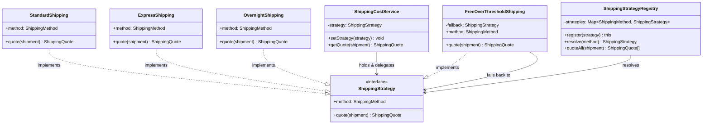

# Strategy Pattern — Class Diagram

Shows the participants and their relationships. The Context (`ShippingCostService`)
depends only on the `ShippingStrategy` interface. Each Concrete Strategy *implements*
that interface; the Registry *resolves* an input key to one of them.

**How to read it**
- `..|>` (dashed, hollow triangle) = *implements interface*. Every Concrete Strategy implements `ShippingStrategy`, which is what makes them interchangeable.
- `-->` = *association / holds a reference*. `ShippingCostService` (the Context) holds a `ShippingStrategy` and delegates to it — it never names a concrete class.
- The Context has **no arrow to any concrete strategy** — that is the whole point: it is decoupled from every algorithm and contains no selection conditionals.
- `FreeOverThresholdShipping --> ShippingStrategy` shows a strategy can *compose* another strategy (its `fallback`) for the below-threshold case.
- The `ShippingStrategyRegistry` is the selection mechanism: it turns a `method` key into the right strategy instance, keeping the growing option set out of the Context.
