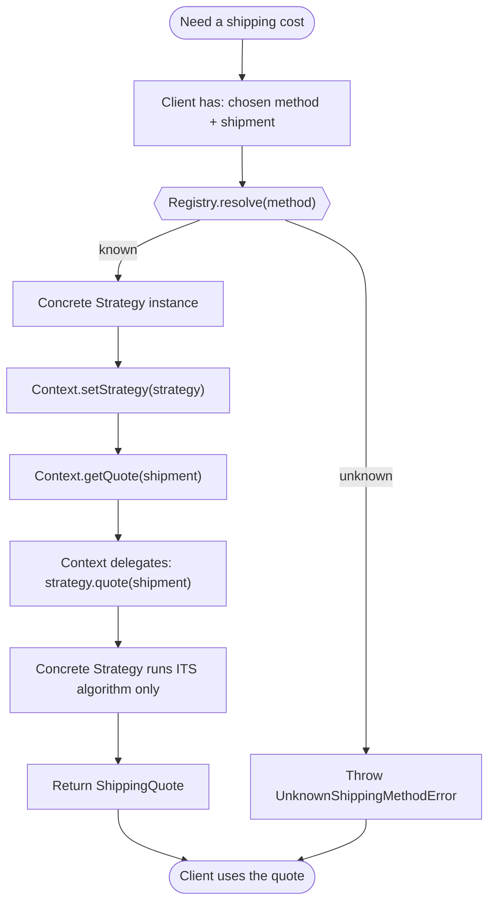

# Strategy Pattern — Flow Diagram

Step-by-step control flow of a single shipping-quote request: resolve the strategy,
inject it into the Context, then delegate. Note the unknown-method error branch.

**Key idea:** the only place a decision is made is `Registry.resolve(method)` — the
selection mechanism. Once a strategy is chosen, the Context does **no branching**: it
just delegates. Adding a new shipping method means adding one Concrete Strategy and
one registry entry; every box in this flow stays exactly as it is (Open/Closed).
