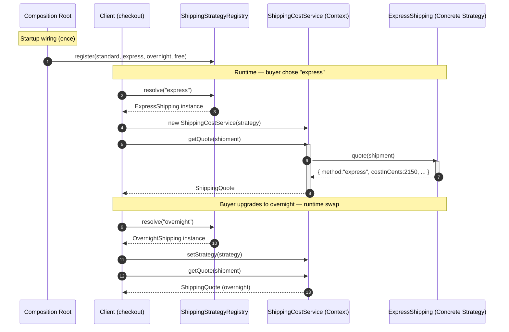

# Strategy Pattern — Sequence Diagram

Shows the runtime message exchange for one shipping quote, including the startup
wiring of the registry and a runtime strategy swap when the buyer upgrades.

**How to read it**
- The **Composition Root** registers every Concrete Strategy in the registry once at startup — the analog of a NestJS provider/module.
- At runtime the Client asks the **Registry** to `resolve` a strategy by key, then injects it into the **Context** (via constructor or `setStrategy`).
- When the Client calls `getQuote`, the Context simply **delegates** (`this.strategy.quote(shipment)`) — it never inspects the method and never branches.
- The second block shows **runtime swappability**: `setStrategy` replaces the algorithm on a live Context, so behavior changes with no new conditionals and no redeploy.
- Only the Concrete Strategy knows its own pricing rules; the Context knows only the `ShippingStrategy` interface.
