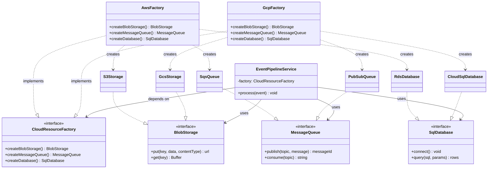
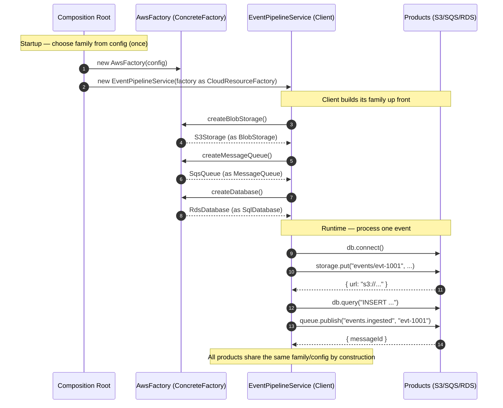
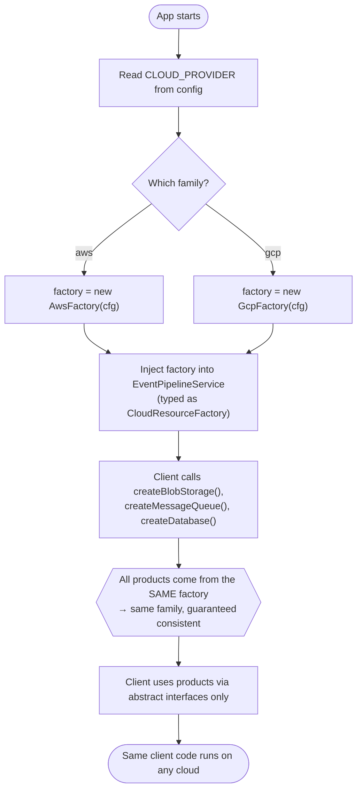

# Abstract Factory Pattern

## Intent

Provide an interface for creating **families of related or dependent objects** without specifying their concrete classes, so that swapping one factory swaps the *entire* family consistently.

## Real Life Analogy

Imagine you are furnishing a room and you have committed to a single style — say **Victorian**. Once you pick "Victorian", every piece you order must match: the chair, the sofa, the coffee table. You would never mix a Victorian sofa with an ultra-modern glass chair — it would look wrong and the pieces would not belong together.

So instead of ordering each item from a random catalog, you hire **one interior-design studio** and tell it: "furnish this room in Victorian." That studio (a *factory*) produces a whole matched set — a Victorian chair, a Victorian sofa, a Victorian table — all guaranteed to go together. If tomorrow you change your mind and hire the "Modern" studio instead, you get a completely different but *internally consistent* set. You changed **one decision** (which studio), and the entire family changed with it.

The Abstract Factory is that studio. You do not pick individual products; you pick a *family*, and the factory guarantees every product it hands you belongs to that same family.

> **Term: Family (of products).** A group of different product types (e.g. storage, queue, database) whose implementations are designed to work together — same vendor, same region, same credentials, same conventions. Mixing members from two families is a bug.

## Problem

### What engineering problem exists?

Real backend systems often need to run against **more than one interchangeable ecosystem**, where each ecosystem provides *several* related pieces that must be used together:

- Your service must run on **AWS** in one region (S3 + SQS + RDS) and on **Google Cloud** in another (GCS + Pub/Sub + Cloud SQL) — perhaps for cost, for redundancy, or because a customer's contract demands data residency on a specific cloud.
- Your app supports two **databases** — PostgreSQL and MySQL — and each needs a matching `Connection`, `QueryBuilder`, and `Migrator` that speak that database's dialect.
- A cross-platform tool must render a **UI toolkit** (Button + Checkbox + Menu) that all match one operating system's look and feel.

In every case there are **multiple product types** (storage, queue, database) and **multiple families** (AWS, GCP). Crucially, the products within a family are *not independent* — an AWS SQS client authenticates with AWS credentials and cannot talk to a GCS bucket. The pieces are dependent on each other.

> **Term: Concrete class.** The actual implementation class you instantiate with `new`, e.g. `S3Storage`. Depending on concrete classes means your code names a specific vendor. The whole point of this pattern is to let client code depend only on *interfaces* (`BlobStorage`) and never on concrete classes.

### Why is this problem difficult?

- **Consistency must be guaranteed, not hoped for.** If the code that builds a queue and the code that builds a bucket live in different places, nothing stops someone from wiring an AWS queue to a GCP bucket. That mismatch compiles fine and fails only at runtime — usually in production, usually at 3 a.m.
- **The choice of family is made once but affects many objects.** A single decision ("use AWS") must ripple into three, five, ten object constructions — and every one must agree.
- **New families appear over time.** Adding Azure later should not force you to hunt through the whole codebase editing `new S3Storage()` calls.

### What happens if we ignore it?

- **Inconsistent object combinations.** You accidentally mix families and get subtle, hard-to-reproduce failures.
- **Scattered construction logic.** `if (provider === "aws") new S3Storage()` conditionals appear in dozens of files, each a place to forget a branch when a new provider is added.
- **Shotgun surgery.** Adding or switching a provider means editing many files instead of one, and each edit risks introducing a mismatch.
- **Untestable clients.** Business logic that directly `new`s cloud SDKs cannot be unit-tested without real cloud credentials.

## Why Not Other Solutions?

**"Just use `if/else` at every construction site."**
```ts
let storage = provider === "aws" ? new S3Storage() : new GcsStorage();
// ...200 lines later, somewhere else...
let queue = provider === "aws" ? new SqsQueue() : new PubSubQueue();
```
The provider check is now duplicated everywhere. Nothing enforces that the *same* provider was chosen in both places — one stale copy and you have mixed an AWS queue with a GCP bucket. Adding Azure means finding and editing every one of these sites. This is exactly the mess the pattern removes.

**"Use a single Factory Method."**
A Factory Method creates **one** product type via subclassing (e.g. a `createStorage()` that subclasses override). It is perfect when you vary *one* product. But here we vary a *whole set* of products that must stay consistent with each other. A lone factory method gives you no guarantee that the storage, queue, and database you obtained belong to the same family. Abstract Factory is essentially *several coordinated factory methods on one object*, which is what provides the family guarantee.

**"Use the Builder pattern."**
Builder assembles **one** complex object step by step (e.g. constructing a single elaborate `HttpRequest`). It is about the *assembly process of a single product*, not about producing a *family of several products*. Different problem.

**"Use a Service Locator / global registry."**
You could register each concrete class in a global map and look them up by key. But a locator does not encode the *relationship* between products — nothing stops `locator.get("queue", "aws")` next to `locator.get("storage", "gcp")`. It also hides dependencies (they no longer appear in constructors), which hurts testability and readability.

**Tradeoff summary:** All alternatives either duplicate the family-selection decision, fail to guarantee family consistency, or hide dependencies. The Abstract Factory concentrates the family choice into one object whose *type system* enforces that everything it produces matches.

## Solution

The core idea: **define one factory object per family, where each factory knows how to build every product type in that family — and make client code depend only on the factory interface and the product interfaces.**

You define:

1. An **Abstract Factory** interface with one `create...()` method per product type (`createBlobStorage()`, `createMessageQueue()`, `createDatabase()`).
2. A set of **Abstract Product** interfaces (`BlobStorage`, `MessageQueue`, `SqlDatabase`) — the vendor-neutral contracts your app depends on.
3. A **Concrete Factory** per family (`AwsFactory`, `GcpFactory`), each returning that family's **Concrete Products** (`S3Storage`, `SqsQueue`, `RdsDatabase` vs `GcsStorage`, `PubSubQueue`, `CloudSqlDatabase`).
4. A **Client** that receives *one* factory and calls its `create...()` methods, holding the results as abstract product types.

The thinking behind it:

- **Make the family the unit of choice.** You never pick individual products; you pick a factory. That single decision guarantees consistency across every product.
- **Depend on abstractions, not concretions.** The client mentions `CloudResourceFactory` and `BlobStorage`, never `AwsFactory` or `S3Storage`.
- **Isolate the choice at the composition root.** The one place that decides "aws vs gcp" is application startup. Everything downstream is provider-agnostic.

You do **not** let the client construct products directly. You hand it a factory, and it asks the factory for what it needs.

## Architecture

Five participants:

1. **AbstractProduct (interfaces):** `BlobStorage`, `MessageQueue`, `SqlDatabase`. Each defines what a product *does* in vendor-neutral terms. The client depends only on these.

2. **ConcreteProduct (classes):** `S3Storage`, `SqsQueue`, `RdsDatabase` (AWS family) and `GcsStorage`, `PubSubQueue`, `CloudSqlDatabase` (GCP family). Each implements one AbstractProduct for one family.

3. **AbstractFactory (interface):** `CloudResourceFactory`. Declares one creation method per product type. This is the contract the client holds.

4. **ConcreteFactory (classes):** `AwsFactory`, `GcpFactory`. One per family. Each implements every creation method to return *its own family's* concrete products. This is where the family guarantee is enforced.

5. **Client:** `EventPipelineService`. Receives a `CloudResourceFactory` (injected), calls its `create...()` methods, and works with the results purely through the AbstractProduct interfaces. It has no idea which family it got.

Responsibilities in one line each:
- **AbstractProduct:** defines what each product does.
- **ConcreteProduct:** does the real work for one family.
- **AbstractFactory:** declares how to create the whole family.
- **ConcreteFactory:** builds one specific, self-consistent family.
- **Client:** uses a factory + products through abstractions only.

## Execution Flow

1. At startup (composition root), the application reads config to decide the family, e.g. `CLOUD_PROVIDER=aws`.
2. It constructs the matching **ConcreteFactory**, e.g. `new AwsFactory(config)`, passing shared config (region, credentials) into it.
3. It injects that factory into the **Client**, typed as the **AbstractFactory** interface — the client never sees `AwsFactory`.
4. The Client calls `factory.createBlobStorage()`. The AwsFactory returns an `S3Storage` (typed as `BlobStorage`).
5. The Client calls `factory.createMessageQueue()` and `factory.createDatabase()`. It gets an `SqsQueue` and `RdsDatabase` — guaranteed same family, same config.
6. The Client uses the returned products purely through their abstract interfaces (`storage.put(...)`, `queue.publish(...)`, `db.query(...)`).
7. Because all three came from *one* factory, they share the same provider, region, and credentials — they are a matched set by construction.
8. To run on GCP instead, only step 2 changes: build `new GcpFactory(config)`. The client code in steps 4–6 is untouched, and it now transparently uses GCS, Pub/Sub, and Cloud SQL.

## Class Diagram



## Sequence Diagram



## Flow Diagram



## Implementation

The implementation strategy in TypeScript:

1. **Define the Abstract Product interfaces first**, from your application's needs — `BlobStorage`, `MessageQueue`, `SqlDatabase`. Keep them vendor-neutral: no `S3`-shaped fields, no AWS error types.

2. **Define the Abstract Factory interface** with one `create...()` method per product type. This is the family contract.

3. **Implement one Concrete Factory per family.** Each returns only its own family's concrete products. Thread shared config (region, credentials) through the factory constructor so every product in the family inherits it automatically.

4. **Write the Client to depend only on the Abstract Factory and Abstract Products.** Inject the factory; never `new` a concrete product inside the client.

5. **Choose the family once, at the composition root**, driven by config, and use an exhaustiveness check so that adding a new provider without wiring it is a *compile* error.

We demonstrate this with a realistic scenario: an `EventPipelineService` that archives an event to blob storage, records it in a SQL database, and publishes it to a message queue — running unchanged on AWS or GCP. See [code.ts](code.ts) for the full runnable implementation.

## Code Walkthrough

See [code.ts](code.ts). Here is what each part does and why it exists.

**`BlobStorage`, `MessageQueue`, `SqlDatabase` (Abstract Products).**
Vendor-neutral interfaces expressed in our domain language (`put`, `publish`, `query`). They exist so the client depends on *what* a product does, never on *which vendor* provides it. Each carries a `kind` string for observability only — the client never branches on it.

**`CloudResourceFactory` (Abstract Factory).**
Declares `createBlobStorage()`, `createMessageQueue()`, `createDatabase()` — one method per product type — plus a `provider` label. This single interface is the family contract: anyone holding it can build a complete, consistent set of infrastructure without knowing which cloud they are on. It exists because it *bundles* the creation methods so they cannot be chosen independently.

**`S3Storage` / `SqsQueue` / `RdsDatabase` (AWS Concrete Products)** and **`GcsStorage` / `PubSubQueue` / `CloudSqlDatabase` (GCP Concrete Products).**
Each implements one Abstract Product for one family. In a real system their constructors would hold the actual SDK client (`S3Client`, `PubSub`, a `pg` pool). They exist to encapsulate the vendor-specific "how".

**`AwsFactory` / `GcpFactory` (Concrete Factories).**
Each implements `CloudResourceFactory` and returns *only its own family's* products, threading the shared `CloudConfig` into each one. `AwsFactory.createMessageQueue()` can only return an `SqsQueue` — it is structurally impossible for it to hand back a GCP product. This is where the family guarantee is enforced. They exist so the "aws vs gcp" decision produces a matched set every time.

**`EventPipelineService` (Client).**
Takes a `CloudResourceFactory` via constructor injection and builds its three products up front. Its `process()` method contains pure business logic — connect DB, archive payload, insert row, publish message — using only the abstract interfaces. It never mentions AWS or GCP. This class proves the payoff: switching clouds requires *zero* changes here.

**`buildFactory()` (Composition Root).**
The single place a family is chosen, driven by a `ProviderName`. The `switch` uses a `never` exhaustiveness check so that adding `"azure"` to `ProviderName` without adding a branch fails to compile. This is how the pattern scales safely.

**Interactions.**
The composition root picks a family and injects one factory. The client asks that factory for each product and uses them through abstractions. Because every product originated from the same factory, they are guaranteed to share provider, region, and credentials — you cannot accidentally pair an AWS queue with a GCP bucket. Switching clouds is a one-line change at the composition root.

## Advantages

- **Guaranteed family consistency.** Every product from one factory belongs to the same family. Mixing an AWS queue with a GCP bucket becomes structurally impossible, not merely discouraged.
- **Single point of family choice.** The "which provider" decision lives in exactly one place (the composition root), driven by config.
- **Decoupling from concrete classes.** The client depends only on interfaces, so vendor lock-in is confined to the factories and products.
- **Open/Closed Principle.** Adding a new *family* (Azure) means writing a new factory + products — you do not modify existing client code.
- **Single Responsibility Principle.** Object construction is separated from object use; the client focuses on business logic.
- **Testability.** Provide a `FakeFactory` returning in-memory products, and the client is unit-testable with no cloud, no credentials, no network.

## Disadvantages

- **Rigidity when adding a new PRODUCT TYPE.** This is the main cost. If you add a fourth product type (say `SecretManager`) to the Abstract Factory interface, you must add `createSecretManager()` to *every* concrete factory. Adding a *family* is cheap; adding a *product type* is expensive. This is the pattern's central tradeoff.
- **Many classes and interfaces.** N product types × M families concrete classes, plus interfaces and factories. The file count grows quickly.
- **Indirection.** Reading the code, you cannot see which concrete class is used without tracing back to the composition root.
- **Overkill for a single family.** If there is only ever one provider, all this structure buys nothing (YAGNI).
- **Interface must be anticipated well.** A poorly scoped factory interface (too many or too few methods) makes every family painful.

## Tradeoffs

**What we gain:** guaranteed consistency across a family, a single config-driven choice point, decoupling from concrete vendors, easy addition of new families, and highly testable clients.

**What we lose:** simplicity and directness. We add a layer of interfaces and a combinatorial set of classes. We accept that adding a new *product type* is a breaking change to the factory interface that touches every family. The pattern pays off only when (a) there are genuinely multiple families and (b) products within a family must stay consistent. If either is false, it is over-engineering.

## Complexity

**Code Complexity:** Moderate. The pattern is more elaborate than Factory Method because it coordinates several creation methods. The individual pieces are simple; the count is what grows.

**Maintenance Complexity:** Low for adding families, high for adding product types. Know which axis you expect to grow before choosing this pattern.

**Scalability:** Excellent organizationally — each family/factory can be owned by a different team and developed independently behind the shared interface. No runtime scalability impact.

**Flexibility:** High along the *family* axis (swap the whole ecosystem in one line), low along the *product-type* axis (new product type ripples to all factories).

**Testability:** High. The Abstract Factory is trivial to fake; a single in-memory fake factory makes the entire client testable without infrastructure.

## Performance Considerations

**Memory:** A factory holds a little shared config; each product holds a reference to its SDK client. Negligible. Build products once (at startup or per service) rather than per request unless they carry per-request state.

**CPU:** A few virtual method calls at construction time. Immeasurable against network/DB latency in any real backend.

**Network:** The pattern adds no network calls itself. But be deliberate about *when* products connect — e.g. call `db.connect()` once, not on every `process()`, to avoid needless round-trips.

**Database:** A common use is a per-database family (`Connection` + `QueryBuilder` + `Migrator`). Ensure factories reuse a single connection pool rather than creating a new pool per product instantiation.

**Object creation:** Factories are typically singletons in a DI container. Creating a new factory per request is wasteful; create it once at the composition root.

**Runtime:** Effectively zero overhead in steady state — the cost is entirely at construction, which happens rarely. The pattern is chosen for consistency and maintainability, not speed.

## Common Mistakes

- **Confusing it with Factory Method.** Beginners build one `create()` and think they have an Abstract Factory. *Why it happens:* the names are similar. *Avoid:* remember Abstract Factory produces a *family* (multiple product types on one factory); Factory Method produces *one* product via subclassing.

- **Letting a factory return the wrong family's product.** e.g. `AwsFactory.createMessageQueue()` accidentally returning a `PubSubQueue`. *Why:* copy-paste between factories. *Avoid:* keep each family's products in its own module and review that every method in a concrete factory returns its own family.

- **Adding product types casually.** Widening the factory interface later breaks every factory. *Why:* underestimating the rigidity cost. *Avoid:* scope the factory interface deliberately up front; if product types will churn, this may be the wrong pattern.

- **Leaking concrete/vendor types through the interfaces.** If `BlobStorage.put()` returns an `AWS.S3.PutObjectOutput`, you have not decoupled anything. *Avoid:* return only your own domain types.

- **Client constructing products directly.** `new S3Storage()` inside business logic destroys the whole benefit. *Avoid:* always obtain products from the injected factory.

- **Choosing the family in more than one place.** Duplicating the `provider` switch re-creates the mixing problem. *Avoid:* choose the family exactly once, at the composition root.

## When To Use

- You must support **multiple interchangeable ecosystems** where each provides *several related objects* that must be used together (multi-cloud, cross-database, cross-OS UI toolkits).
- **Consistency across a set of products matters** — mixing members from two families would be a bug.
- The **choice of family is made once** (config, region, tenant) and should propagate to many object constructions.
- You want to **swap the whole family** for tests (a fake in-memory family) or for a new environment without touching business logic.

## When NOT To Use

- **There is only one family** and no realistic prospect of a second — speculative generality (YAGNI).
- **You vary only one product type**, not a family — a single **Factory Method** is simpler and correct.
- **The product types churn frequently** — every new product type breaks every factory; the rigidity cost dominates.
- **The products are independent** and never need to be consistent with each other — you do not need the family guarantee, so plain factories or DI are enough.
- **You are assembling one complex object** step by step — that is **Builder**.

## Real Production Examples

- **Node.js:** Database libraries expose per-dialect families — `knex` selects a client (`pg`, `mysql2`, `sqlite3`) and from it derives a matching connection + query compiler + schema builder, all consistent with that dialect.
- **NestJS:** `@nestjs/config` and dynamic modules (`forRootAsync`) act as factories that assemble a coherent set of providers per environment; custom providers using `useFactory` build related dependencies from one place. Testing modules swap the whole provider family for fakes.
- **Express:** Less idiomatic here, but middleware stacks are often built by an environment-specific factory that returns a matched set (logger + error handler + session store) per env.
- **Java Spring:** `BeanFactory` / `ApplicationContext` is a large-scale factory; `@Configuration` classes with `@Profile` produce a consistent family of beans per profile (dev/prod). JDBC's `DriverManager` + dialect handling is family-oriented.
- **.NET:** `DbProviderFactory` is a canonical Abstract Factory — each provider (SQL Server, PostgreSQL) returns matching `DbConnection`, `DbCommand`, `DbDataAdapter` objects, guaranteed consistent.
- **AWS:** Application-level factories wrap the AWS SDK so business code depends on `CloudResourceFactory` rather than `S3Client`/`SQSClient`/`RDS`. The SDK's own credential-provider chains build matched sets of clients per profile/region.
- **Azure:** `Azure.Identity` credential families and the various `*ClientBuilder` types produce matched, consistently-authenticated clients for Blob, Queue, and Table storage.
- **Google Cloud:** The GCP client libraries per project/credentials produce a consistent set (Storage, Pub/Sub, BigQuery) sharing one auth context — mirrored by application factories that select AWS vs GCP.
- **React (if applicable):** Cross-platform toolkits (e.g. React Native vs web) select a component family (Button/Text/View) matching the platform; theming systems provide a factory that yields a matched set of themed primitives.
- **Databases:** ORMs like TypeORM/Prisma pick a driver and produce a matching connection + query builder + migration runner for that database. `Sequelize` dialects behave the same way.
- **AI Systems:** A provider factory yields a matched set of clients for one vendor (e.g. Anthropic's chat model + embeddings + tokenizer, or OpenAI's equivalents) that share auth and API conventions, so you never pair one vendor's tokenizer with another's model.

## Where I Can Use This

Five realistic ideas for your own backend projects:

1. **Multi-cloud infrastructure layer.** A `CloudResourceFactory` with `AwsFactory`/`GcpFactory` producing matched `{BlobStorage, MessageQueue, SqlDatabase}`, selected by an env var — exactly the example in `code.ts`.
2. **Cross-database support.** A `PersistenceFactory` producing a matching `{Connection, QueryBuilder, Migrator}` for PostgreSQL vs MySQL, so a self-hosted product can ship on either database.
3. **Per-tenant environment.** A `TenantFactory` that builds a tenant-consistent set of `{Logger, Cache, ObjectStore}` (e.g. enterprise tenant on dedicated infra vs shared tier), chosen once per request from tenant config.
4. **Test vs production families.** A `FakeFactory` returning in-memory `{Storage, Queue, DB}` used across your whole test suite, swapping the entire real family with one line — no Redis, no cloud.
5. **Notification ecosystems.** A `NotificationFactory` producing a matched `{EmailSender, SmsSender, PushSender}` for one provider (e.g. all AWS: SES + SNS + Pinpoint) vs another, guaranteeing consistent credentials.

## Similar Patterns

- **Factory Method:** Creates **one** product via a method subclasses override. Abstract Factory creates a **family** of products and is typically *composed of several factory methods*. Use Factory Method when one product varies; use Abstract Factory when a set must vary together.
- **Builder:** Constructs **one** complex object step by step, often with many optional parts and a final `build()`. Abstract Factory returns *several* ready-made products in one call. Builder is about *assembly of one thing*; Abstract Factory is about *families of things*.
- **Prototype:** Creates new objects by **cloning** an existing instance rather than instantiating classes. It can be combined with Abstract Factory (a factory that clones prototypes), but its intent is copying, not family consistency.
- **Facade:** Provides a **simplified interface to a complex subsystem**. It does not create families of interchangeable objects; it hides complexity. A factory *creates*, a facade *simplifies access*.

| Pattern          | Creates              | Unit of variation        | Key intent                                   | Typical shape                        |
|------------------|----------------------|--------------------------|----------------------------------------------|--------------------------------------|
| Abstract Factory | A family of products | The whole family         | Consistent set of related objects            | One factory, many `create*()` methods |
| Factory Method   | One product          | A single product type    | Defer which class to instantiate to subclass | One overridable `create()` method     |
| Builder          | One complex object   | The construction process | Step-by-step assembly of one object          | `.setX().setY().build()`             |
| Prototype        | A copy of an object  | The instance to clone    | Create by cloning, not by `new`              | `clone()`                            |
| Facade           | Nothing (delegates)  | —                        | Simplify a complex subsystem                 | One class fronting many              |

## Interview Discussion

Experienced engineers discuss Abstract Factory less as a toy and more as a **consistency and boundary tool**. The central talking point is the **two axes of change**: adding a *family* is cheap (new factory, closed for modification of existing code), but adding a *product type* is expensive (open every factory). Being able to name that asymmetry — and say "choose this pattern only when families change more often than product types" — signals real understanding.

Common follow-up questions:
- *"How is this different from Factory Method?"* One product via subclassing vs a family via one object composed of several factory methods. This is the single most important distinction to get crisp.
- *"How do you add a new provider without touching existing code?"* Add a new concrete factory + products; wire one branch at the composition root. Demonstrates OCP.
- *"What is the main drawback?"* Rigidity when adding product types — the factory interface change ripples to all families.
- *"How does it aid testing?"* One fake factory swaps the entire family for in-memory doubles.
- *"Where does the family get chosen?"* Exactly once, at the composition root, ideally config-driven with an exhaustiveness check.

Common misconceptions:
- "Abstract Factory and Factory Method are the same." They are related but distinct: family vs single product.
- "It is just a class with some `new` calls." The value is the *guarantee* that everything produced is consistent, plus the single choice point — not the `new` calls themselves.
- "More factories always means better design." Only if you actually have multiple families that must stay consistent; otherwise it is over-engineering.

## Summary

- Abstract Factory provides an interface for creating **families of related objects** without naming their concrete classes.
- Five participants: AbstractFactory, ConcreteFactory (one per family), AbstractProduct(s), ConcreteProduct(s), and Client.
- One concrete factory produces a **complete, consistent family** — you cannot accidentally mix vendors.
- It is essentially **several coordinated factory methods** on one object; that coordination is what guarantees consistency.
- Adding a **family is cheap**; adding a **product type is expensive** (touches every factory) — this asymmetry is the core tradeoff.
- Choose the family **once, at the composition root**, driven by config.
- Ideal for multi-cloud, cross-database, and test-vs-prod ecosystems.

## Key Takeaways

1. Abstract Factory = pick a *family*, get a matched set of related products, guaranteed consistent.
2. It differs from Factory Method by producing a *family* (many product types), not a single product.
3. The family guarantee makes mixing vendors (AWS queue + GCP bucket) structurally impossible.
4. Clients depend only on the factory and product *interfaces*, never on concrete classes.
5. Adding a new family is Open/Closed-friendly: new factory + products, no client changes.
6. The main downside is rigidity: a new product type forces changes in every factory.
7. Choose the family exactly once, at the composition root, ideally config-driven with an exhaustiveness check.
8. A single fake factory makes the whole client testable without real infrastructure.
9. Do not confuse it with Builder (assembling one object) or Facade (simplifying a subsystem).
10. Use it only when there are genuinely multiple families that must stay internally consistent.

---

## Further Reading

**Books**
- *Design Patterns: Elements of Reusable Object-Oriented Software* — Gamma, Helm, Johnson, Vlissides (the "Gang of Four"), the original Abstract Factory definition.
- *Head First Design Patterns* — Freeman & Robson (approachable; contrasts Abstract Factory with Factory Method directly).
- *Patterns of Enterprise Application Architecture* — Martin Fowler.
- *Dependency Injection Principles, Practices, and Patterns* — Seemann & van Deursen (composition root, wiring families).

**Open Source Projects / GitHub Repositories**
- knex.js — per-dialect client families (connection + query compiler + schema builder) — https://github.com/knex/knex
- TypeORM driver directory (per-database product families) — https://github.com/typeorm/typeorm
- NestGeneric factory/dynamic-module patterns in NestJS — https://github.com/nestjs/nest

**Official Documentation**
- Refactoring.Guru — Abstract Factory — https://refactoring.guru/design-patterns/abstract-factory
- Microsoft .NET — `DbProviderFactory` — https://learn.microsoft.com/en-us/dotnet/api/system.data.common.dbproviderfactory
- NestJS Docs — Custom providers / dynamic modules — https://docs.nestjs.com/fundamentals/custom-providers

**Blog Articles**
- Refactoring.Guru — Abstract Factory in TypeScript — https://refactoring.guru/design-patterns/abstract-factory/typescript/example
- Martin Fowler — "Inversion of Control Containers and the Dependency Injection pattern" — https://martinfowler.com/articles/injection.html
