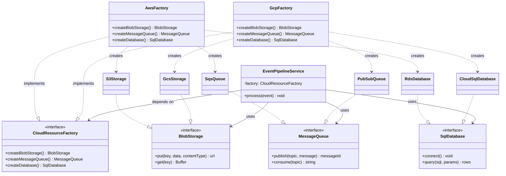

# Abstract Factory Pattern — Class Diagram

Shows the five participants and their relationships. The Client depends only on the
Abstract Factory interface and the Abstract Product interfaces. Each Concrete Factory
*implements* the Abstract Factory and *creates* only its own family's Concrete Products.

**How to read it**
- `..|>` (dashed, hollow triangle) = *implements interface*. Both factories implement `CloudResourceFactory`; each concrete product implements one abstract product.
- `..>` (dashed arrow) = *creates / depends on*. Each factory creates only its own family's products — `AwsFactory` never points at a GCP product. That is what makes mixing families structurally impossible.
- `-->` = *association / holds a reference*. The Client (`EventPipelineService`) holds the factory and uses products **only through the abstract interfaces** — it has no arrow to any concrete class, so it never knows which cloud it runs on.
