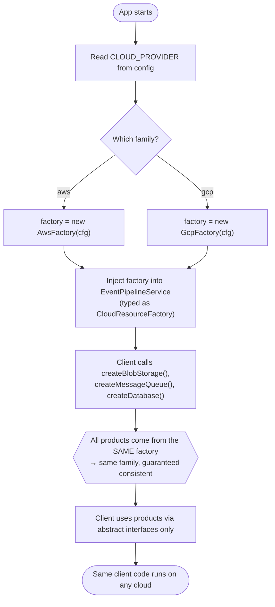

# Abstract Factory Pattern — Flow Diagram

Step-by-step control flow from application startup: read config, pick a family once,
inject the factory, and let the client build and use a guaranteed-consistent family.

**Key idea:** the only branch on provider (`Which family?`) happens once, at the
composition root. Everything after `Inject` is provider-agnostic — the client never
sees `aws`/`gcp` again. Adding a new family (Azure) adds one branch here plus a new
factory and products; the client code below the branch never changes.
