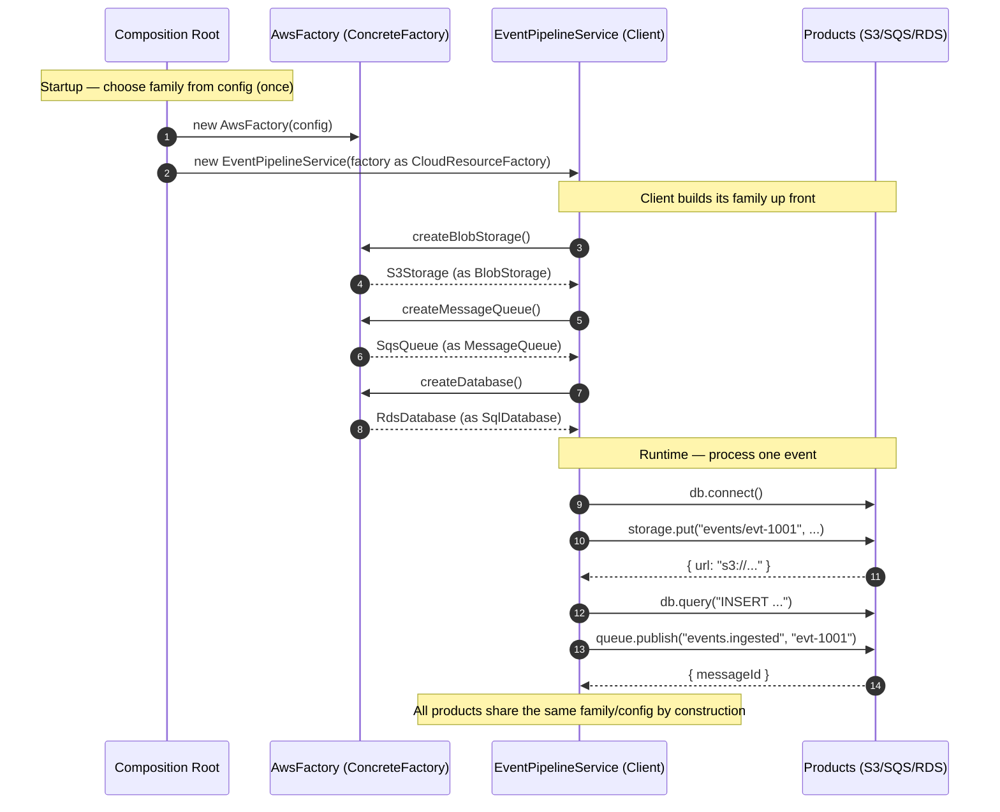

# Abstract Factory Pattern — Sequence Diagram

Shows the runtime message exchange for one event, including the composition-root
wiring where the family is chosen once and the client builds its whole family up front.

**How to read it**
- The **Composition Root** chooses the family once, builds the matching Concrete Factory, and injects it into the Client *as the abstract `CloudResourceFactory` type* — the client never sees `AwsFactory`.
- The Client asks the factory for each product and receives them typed as abstract products (`BlobStorage`, `MessageQueue`, `SqlDatabase`) — it never `new`s a concrete class.
- Because all three products came from the *same* factory, they share provider, region, and credentials by construction — you cannot pair an AWS queue with a GCP bucket.
- To run on GCP, only the first step changes (`new GcpFactory(config)`); every message from the Client onward is identical.
