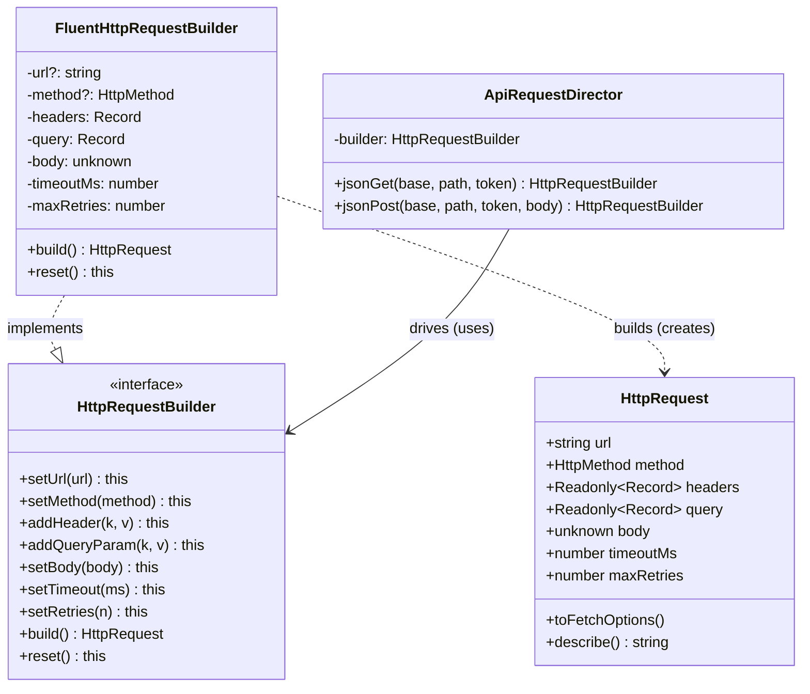
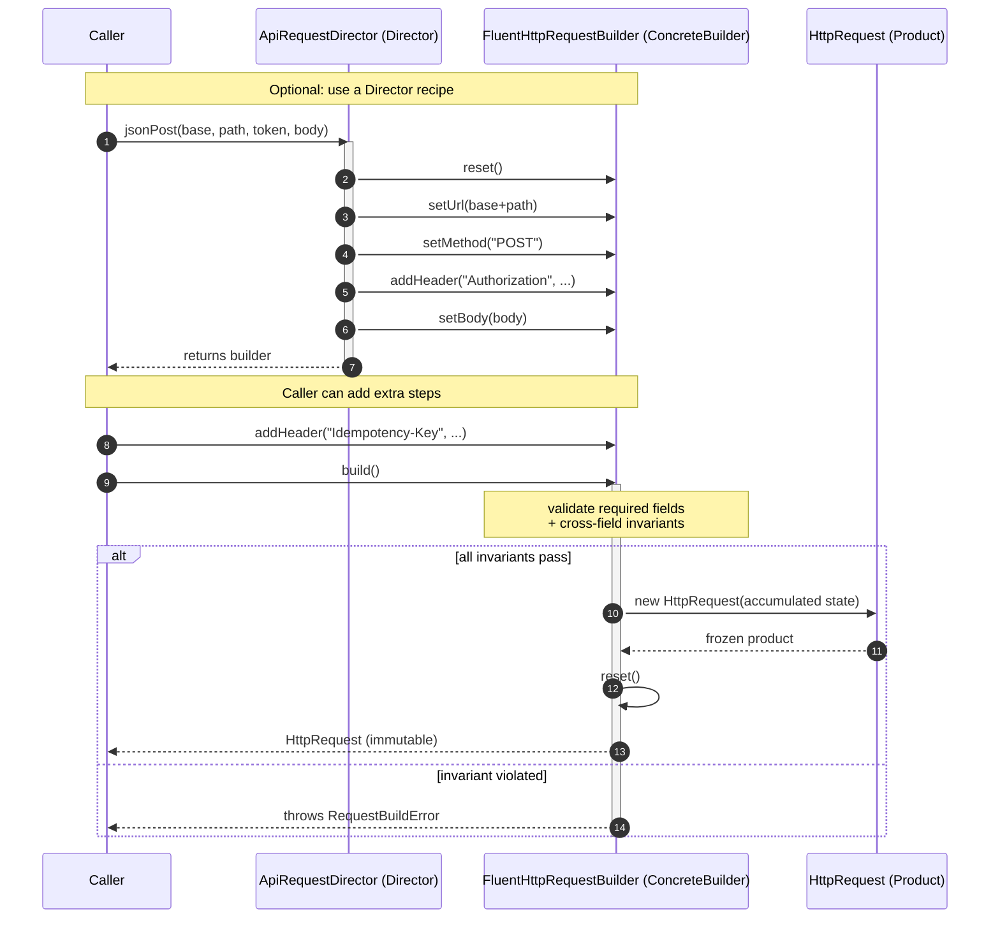
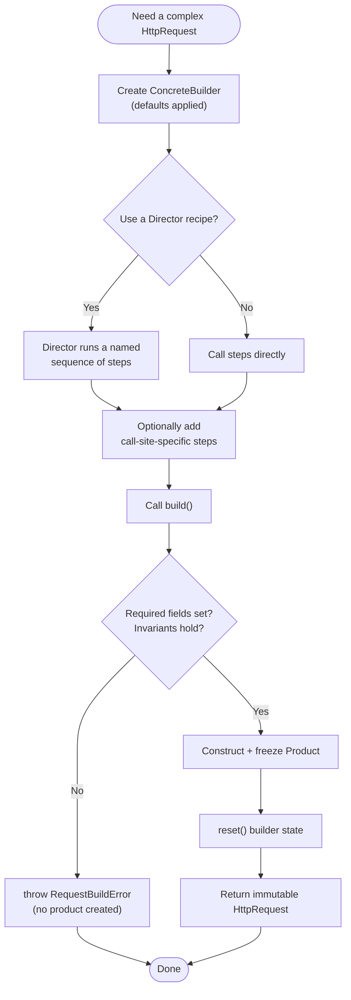

# Builder Pattern

## Intent

Separate the construction of a complex object from its representation, so that the same step-by-step construction process can produce different, fully-validated objects.

## Real Life Analogy

Think about ordering a custom sandwich at a Subway counter.

You do not walk up and shout one giant sentence: *"Give me a footlong-italian-herbs-turkey-swiss-lettuce-tomato-no-onion-extra-mayo-toasted."* Nobody could parse that, and if you got one ingredient in the wrong slot the whole order is wrong.

Instead you build it **step by step**. First the bread. Then the protein. Then cheese. Then vegetables. Then sauces. Each step is a small, clear choice, and you can skip the steps you do not care about. The person behind the counter (the "builder") keeps track of your half-made sandwich as you go, and only at the very end do they wrap it and hand it over — a finished product.

Two extra details matter:
- There is a **fixed recipe** for popular combos ("the usual Italian BMT"). That recipe is a *Director*: it knows the standard order of steps so you do not have to recite them.
- The counter will **refuse an impossible order** — you cannot get "extra cheese" on a sandwich you never chose bread for. That is validation happening before the product is handed to you.

The Builder Pattern is exactly this sandwich counter, but for constructing objects in code: build a complex thing one clear step at a time, optionally follow a named recipe, and only produce the finished object once everything is valid.

## Problem

### What engineering problem exists?

In real backend systems you constantly create objects that have **many fields, most of them optional, and some of them interdependent**. Common examples:

- An **outbound HTTP request**: a URL and method are required, but headers, query params, body, timeout, retry policy, and auth are all optional — and some combinations are illegal (a `GET` must not carry a JSON body).
- A **database query**: `SELECT` columns are required, but `WHERE`, `JOIN`, `ORDER BY`, `GROUP BY`, `LIMIT`, and `OFFSET` are optional and can appear in many combinations. This is why every serious ORM ships a *query builder*.
- A **configuration object** for a service, a connection pool, or a report — dozens of tunable knobs, sensible defaults for most, and a handful that must be present.

The naive way to create such an object is a constructor. But a constructor with many optional parameters becomes what is called a **telescoping constructor**.

> **Term: Telescoping constructor.** A constructor (or a family of overloaded constructors) with a long list of parameters, most of which are optional. Call sites end up looking like `new HttpRequest(url, "GET", null, null, null, 30000, 3, undefined)`. Nobody reading that line can tell what `null, null, null` or `true` mean without opening the class definition and counting argument positions.

### Why is this problem difficult?

- **Unreadable call sites.** `new Report(true, false, null, 5, "USD", null, true)` is a sequence of mystery values. Positional arguments carry no names, so meaning is lost.
- **Fragile to change.** Insert one new parameter in the middle and every call site silently shifts by one position. TypeScript may catch a type mismatch, but two adjacent `boolean` flags swapped by accident compile fine and ship a bug.
- **No place to validate.** A constructor either accepts the arguments or it does not. There is no natural place to say "these values are individually fine but *together* they are illegal" (e.g. `body` present on a `GET`).
- **Required vs optional is invisible.** With a bag of optional parameters, the compiler cannot force you to supply the two that are truly mandatory.
- **Many representations, one recipe.** Sometimes you need the *same construction steps* to yield slightly different products (a request for staging vs production defaults). A single constructor cannot express "same recipe, different result."

### What happens if we ignore it?

- **Bugs from argument-order mistakes** that the type system cannot catch.
- **Constructors that keep growing** until they have 12 parameters and three overloads, and adding a 13th field means touching every caller.
- **Invalid objects escaping into the system** because validation was scattered across callers instead of centralised.
- **Copy-pasted setup code** — the same eight lines to configure a "standard authenticated JSON request" duplicated across dozens of services, drifting apart over time.

## Why Not Other Solutions?

**"Just use a constructor with many parameters."**
This is the telescoping constructor. It is unreadable, order-sensitive, offers no step-by-step validation, and cannot distinguish required from optional cleanly. It gets worse with every field added.

**"Use constructor overloads / multiple constructors."**
TypeScript supports overload *signatures* but only one implementation, and you still end up branching on `undefined` inside. You get a combinatorial explosion of overloads for every subset of optional fields, and it still cannot validate cross-field rules cleanly.

**"Just pass a single options object: `new HttpRequest({ url, method, headers, ... })`."**
This is a real improvement and is often *good enough* — named fields fix readability and order-sensitivity. But an options object alone gives you three things Builder does not:
- **No step-by-step / incremental construction.** You must assemble the entire object literal in one expression. You cannot conditionally add a header in a loop, or apply a shared "recipe" and then tweak two fields, without awkward spreads and temporary variables.
- **Weak validation guarantees.** The object literal is handed to the constructor fully formed; the constructor can validate, but callers can also construct an invalid literal and pass it around *before* it reaches you. There is no gate that guarantees "you cannot even obtain the product without passing validation."
- **No enforced required fields with defaults for the rest.** You can approximate this with the type system, but complex conditional requirements (field A is required only when B is set) are hard to express in a plain type.

The Builder keeps the options-object readability *and* adds incremental construction, a single validation gate (`build()`), reusable recipes (Director), and a guarantee that the finished product is always valid and immutable.

**"Make all fields public and set them after construction: `const r = new HttpRequest(); r.url = ...; r.method = ...`."**
Now the object spends time in a half-built, invalid state. Any code that reads it between the first and last assignment sees garbage. There is no validation gate and no immutability — the object can be mutated by anyone at any time.

**Tradeoff summary:** Constructors and overloads fail on readability and validation. A bare options object fixes readability but not incremental construction, validation-gating, or recipes. Public setters sacrifice validity and immutability. The Builder is the option that gives you readable, incremental, validated, reusable construction of an immutable product — at the cost of writing one extra class.

## Solution

The core idea: **move the construction logic out of the object itself and into a separate builder, which accumulates the pieces one step at a time and produces the finished object only when you ask for it.**

The product (the thing being built) becomes simple and immutable — it just holds finished data. All the messiness of "which fields, in what order, with what defaults, obeying what rules" moves into the builder.

The thinking behind it:

1. **Construction is a process, not a single event.** A complex object is assembled from many decisions. Modelling that as a sequence of small, named steps (`setUrl`, `addHeader`, `setBody`) is far clearer than one giant expression.
2. **Validate once, at the boundary.** Instead of scattering "is this valid?" checks across the codebase, put every invariant in one method — `build()`. If `build()` returns, the product is guaranteed valid. If it cannot, it throws. No invalid product can ever exist.
3. **Separate the recipe from the mechanics.** *How* to set a header (the mechanics) belongs in the builder. *Which* steps make up a "standard authenticated request" (the recipe) can optionally live in a Director, so that recipe is written once and reused.
4. **Return the same builder from each step (fluent interface).** This lets callers chain steps into a readable pipeline that reads almost like a sentence.

You do **not** expose the product's constructor to callers. You do **not** let the product exist in a half-built state. Callers talk only to the builder, and the builder hands back a finished, frozen product.

> **Term: Fluent interface.** A style where each method returns the object it was called on (`return this`), so calls can be chained: `builder.setUrl(u).setMethod("GET").build()`. It reads top-to-bottom like prose and is the idiomatic way to write a builder in TypeScript.

> **Term: Invariant.** A rule that must always hold true for an object to be valid — e.g. "a GET request has no body", "timeout is positive". The builder enforces invariants in `build()`.

## Architecture

There are four participants. Only three are always present; the Director is optional.

1. **Product:** The complex object being constructed — in our example, `HttpRequest`. It should be **immutable** once built (frozen), so that logging, retrying, or caching a request can never accidentally mutate it. The product is deliberately "dumb": it holds data and offers read-only behaviour, but knows nothing about how it was assembled.

2. **Builder (interface):** Declares the construction steps common to all concrete builders — `setUrl`, `setMethod`, `addHeader`, `build`, etc. Programming against this interface means a Director can drive *any* concrete builder, and you can swap builder implementations (e.g. one that produces a `fetch` config vs one that produces an `axios` config) without changing the caller.

3. **ConcreteBuilder:** Implements the Builder interface. It **holds the intermediate state** (the half-built request) as private fields, applies defaults, offers a `reset()`, and — crucially — implements `build()`, which **validates all invariants and returns the finished Product**. This is where all construction knowledge lives.

4. **Director (OPTIONAL):** Encapsulates a **recipe** — a specific, reusable ordering and combination of build steps (e.g. `jsonPost(...)` = set method POST + JSON headers + auth + timeout). It depends only on the Builder *interface*. The Director exists purely to avoid duplicating a common step-sequence across the codebase. You can always skip it and call the builder directly.

Responsibilities in one line each:
- **Product:** holds finished, validated, immutable data.
- **Builder (interface):** defines the vocabulary of construction steps.
- **ConcreteBuilder:** keeps state, applies defaults, validates in `build()`, returns the Product.
- **Director:** knows a reusable recipe of steps; drives the builder; never validates.

## Execution Flow

1. At the call site you create a **ConcreteBuilder** (or receive one via dependency injection). It starts with all fields at their defaults.
2. **Optionally**, you create a **Director** and hand it the builder. The Director will run a named recipe of steps for you.
3. You (or the Director) call build steps one at a time — `setUrl(...)`, `setMethod(...)`, `addHeader(...)`. Each step stores a value in the builder's internal state and returns `this` for chaining.
4. Optional steps are simply skipped; the builder keeps whatever defaults it started with.
5. If a Director was used, it returns the builder after running its recipe, so you can still add extra, call-site-specific steps.
6. You call **`build()`**.
7. Inside `build()`, the ConcreteBuilder checks all **required fields** (e.g. url and method must be set) and all **cross-field invariants** (e.g. a GET must not have a body). If any check fails, it throws a `RequestBuildError` — no product is produced.
8. If validation passes, the builder constructs the **Product**, passing the accumulated state into the product's (private-by-convention) constructor.
9. The product is **frozen** (made immutable) and returned to the caller.
10. The builder typically **`reset()`s** its internal state, so the same builder instance can be reused to build the next product without leaking state from the previous one.

## Class Diagram

## Sequence Diagram

## Flow Diagram

## Implementation

The implementation strategy in TypeScript:

1. **Design the Product first, and make it immutable.** Decide exactly what a finished `HttpRequest` contains. Give it `readonly` fields, `Object.freeze` the nested objects and the instance itself, and keep its constructor "for builder use only" (in TypeScript we cannot make a constructor truly package-private, so we document the intent and never call `new HttpRequest(...)` from business code).

2. **Define the Builder interface.** List every construction step. Make each step return `this` so callers get a fluent chain. Include `build()` and `reset()`.

3. **Write the ConcreteBuilder.** Hold each field as private mutable state with a sensible default. Each setter stores its value and returns `this`. Small conveniences are fine here (e.g. setting a JSON body auto-adds a `content-type` header) — that is construction logic and belongs in the builder.

4. **Put all validation in `build()`.** Check required fields, then cross-field invariants. Throw a descriptive domain error on failure. Only after all checks pass do you construct the product. This is the single most important discipline of the pattern: `build()` is the one gate through which every product must pass.

5. **Freeze and return; then reset.** Return the frozen product and reset the builder so the instance can be reused safely.

6. **Add a Director only if a recipe repeats.** If several call sites assemble "the same kind of request," extract that step-sequence into a Director method. If there is no repetition, do not add a Director — it would be needless indirection.

We demonstrate this with a realistic scenario: an internal HTTP client used across backend microservices, where requests have required and optional fields and illegal combinations, plus a Director that captures the two most common request recipes.

## Code Walkthrough

See [code.ts](code.ts) for the full runnable implementation. Here is what each part does and why it exists.

**`HttpRequest` (Product).**
The complex object we produce. Every field is `readonly`, nested objects are `Object.freeze`d, and the whole instance is frozen in the constructor. This immutability is deliberate: a request may be logged, retried, or put in a cache, and we never want a later step to mutate what was already dispatched. It exposes `toFetchOptions()` (turning the product into a `fetch`-style config — one *representation*) and `describe()` for logging. The constructor takes a single params object *from the builder only*; business code never calls it directly. This class exists to be the finished, trustworthy result — it knows nothing about how it was assembled.

**`HttpRequestBuilder` (Builder interface).**
Declares the construction vocabulary: `setUrl`, `setMethod`, `addHeader`, `addQueryParam`, `setBody`, `setTimeout`, `setRetries`, `build`, `reset`. Every step returns `this` to enable fluent chaining. This interface exists so the Director (and any caller) can depend on the *steps*, not on one concrete builder — you could ship a second builder that produces an `axios` config instead of a `fetch` config, and nothing else would change.

**`FluentHttpRequestBuilder` (ConcreteBuilder).**
The heart of the pattern. It holds the half-built state as private fields with defaults (`timeoutMs = 30_000`, `maxRetries = 0`). Setters store values and return `this`. `setBody()` shows a legitimate construction convenience: it auto-adds a JSON `content-type` unless one is already set. `build()` is where the value lives: it validates required fields (url present and absolute, method present) and cross-field invariants (no body on non-body methods, positive timeout, non-negative retries), throwing `RequestBuildError` on any violation. Only after all checks pass does it construct the frozen `HttpRequest`, then it auto-`reset()`s so the instance is safe to reuse. This class exists to concentrate *all* construction and validation knowledge in one place.

**`RequestBuildError` (domain error).**
A dedicated error type thrown by `build()` when accumulated state is invalid. It exists so callers can distinguish "you built the request wrong" from other runtime errors and handle it precisely.

**`ApiRequestDirector` (Director — optional).**
Encapsulates two reusable recipes: `jsonGet(...)` and `jsonPost(...)`. Each recipe `reset()`s the builder and runs a fixed sequence of steps that represents a common request shape in our system (authenticated JSON call with appropriate timeout and retry policy). Notice it depends on the `HttpRequestBuilder` *interface*, and it deliberately does **not** call `build()` — it returns the builder so the caller can add extra, situation-specific steps (like an `Idempotency-Key` header) before finishing. This class exists purely to eliminate duplicated setup across services; if that duplication did not exist, we would not add it.

**Interactions.**
In the demo `main()`: (a) direct fluent use builds a search request with no Director; (b) the Director builds a create-user POST, then the caller appends an idempotency header before `build()`; (c) an illegal `GET`-with-body is rejected by `build()` before any product exists. The caller never constructs `HttpRequest` directly, never sees a half-built request, and always receives an immutable, validated product.

## Advantages

- **Readable, self-documenting construction.** `setUrl(...).setMethod("GET").addQueryParam(...)` says exactly what it does; `new X(u, "GET", null, null, ...)` does not.
- **Handles many optional fields gracefully.** Skip the steps you do not need; defaults cover the rest. No `null` placeholders.
- **Single validation gate.** All invariants live in `build()`. If it returns, the product is valid — guaranteed, everywhere.
- **Guaranteed-valid, immutable products.** No object ever exists in a half-built or invalid state, and the finished product cannot be mutated afterwards.
- **Reusable recipes via the Director.** Common construction sequences are written once and reused, eliminating copy-pasted setup.
- **Same process, different representations.** The same steps can drive different concrete builders that emit different outputs (fetch config, axios config, a curl string).
- **Order-independence for the caller.** Because fields are named steps, adding a new optional field does not break existing call sites.
- **Supports the Single Responsibility Principle.** The product holds data; the builder holds construction logic. Two concerns, two classes.

## Disadvantages

- **More code.** You write a product, a builder interface, a concrete builder, and maybe a director — for something a constructor or options object could do in one line.
- **Overkill for simple objects.** If an object has two required fields and nothing optional, a builder is ceremony with no payoff.
- **Verbosity at the call site.** Several chained calls instead of one constructor call. Fine for complex objects, noisy for trivial ones.
- **State-leak risk if `reset()` is forgotten.** A reused builder that is not reset between builds can carry stale fields into the next product — a subtle, real bug.
- **Mutable builder is not thread/async safe.** The builder holds mutable state; sharing one builder instance across concurrent build sequences (e.g. one shared builder handling many requests at once) causes interleaving bugs. Use one builder per construction, or make the builder produce a fresh state each time.
- **Two things to keep in sync.** Add a field to the product and you must also add a step to the builder (and possibly a validation rule).

## Tradeoffs

**What we gain:** readability, safe handling of many optional/interdependent fields, a single validation gate that guarantees valid immutable products, reusable recipes, and the flexibility to produce different representations from one construction process.

**What we lose:** simplicity and brevity. We introduce at least one extra class and more lines of code, accept the discipline of resetting builder state, and take on the risk of misusing a mutable builder concurrently. For a simple object, all of this is pure overhead — the pattern pays off only when construction is genuinely complex (many optional fields, interdependencies, validation, or repeated recipes). If your object does not have those properties, a plain options-object constructor is the better engineering choice.

## Complexity

**Code Complexity:** Moderate. More classes and lines than a constructor, but each piece is simple. Complexity is concentrated (and therefore contained) in `build()`.

**Maintenance Complexity:** Low to moderate. Adding an optional field is a localized change (one setter, maybe one validation rule). The risk is drift between product fields and builder steps — keep them together.

**Scalability:** For *code* scalability the pattern shines: adding options and recipes does not force changes at existing call sites. Runtime scalability is unaffected — a builder is cheap object allocation.

**Flexibility:** High. Multiple concrete builders can produce different representations from the same steps; Directors capture multiple recipes; new options slot in without breaking callers.

**Testability:** High. `build()` is a pure-ish function of accumulated state — easy to unit-test both the happy path and every validation branch. The product is immutable, so tests can assert on it without worrying about later mutation.

## Performance Considerations

**Memory:** A builder holds intermediate state and allocates a handful of objects (the state maps, the final product). For most backend workloads this is negligible. In an extreme hot path constructing millions of objects per second, the extra allocations (builder + product + frozen copies) are measurable — pool or bypass the builder there.

**CPU:** A few extra method calls per construction and the validation checks in `build()`. `Object.freeze` has a small cost. Immeasurable in I/O-bound backend services; only relevant in tight numeric loops.

**Network:** The pattern adds no network calls. It is often *used to construct* network requests, and centralising that construction (with correct timeouts/retries baked into a Director) tends to improve network reliability, not harm it.

**Database:** Query builders (Knex, TypeORM, Prisma's fluent query API) are the Builder pattern applied to SQL. The performance concern is not the builder itself but the SQL it emits — a builder makes it easy to accidentally build an unindexed `WHERE` or an N+1 pattern. The builder is neutral; review the generated query.

**Object creation:** This *is* the object-creation pattern. Each `build()` produces one product plus frozen copies of its nested objects. Prefer one builder instance per construction sequence; do not share a mutable builder across concurrent constructions.

**Runtime:** Overhead is a small constant per built object. The pattern is chosen for correctness and readability, not speed; its runtime cost is effectively zero for typical backend request/query/config construction.

## Common Mistakes

- **Forgetting to `reset()` between builds.** A reused builder carries stale state into the next product. *Why it happens:* the builder looks stateless from the call site. *Avoid:* auto-`reset()` at the end of `build()` (as in our code), or create a fresh builder per construction.

- **Validating in the setters instead of in `build()`.** If you validate each step in isolation you cannot check cross-field rules (a field may only be illegal *in combination* with another that has not been set yet). *Why it happens:* it feels natural to validate as you go. *Avoid:* let setters be permissive; put all invariants in `build()`, the one point where the full picture exists.

- **Leaving the product mutable.** If the product has public writable fields, all the validation in `build()` can be undone afterwards. *Why it happens:* immutability takes extra effort in TS. *Avoid:* `readonly` fields + `Object.freeze`.

- **Sharing one mutable builder across concurrent requests.** In an async server, two overlapping construction sequences on the same builder interleave and corrupt each other. *Why it happens:* treating the builder like a stateless singleton. *Avoid:* one builder per construction, or inject a factory that returns a fresh builder.

- **Adding a Director when there is no repeated recipe.** A Director with a single caller is pure indirection. *Why it happens:* "the book showed a Director." *Avoid:* add a Director only when the *same* step-sequence appears in multiple places.

- **Confusing Builder with Factory.** A Factory decides *which* object to create and returns it in one call; a Builder assembles *one* complex object step by step. *Why it happens:* both are creational. *Avoid:* ask "is construction a multi-step process with optional parts and validation?" If yes, Builder; if it is a single decision, Factory.

- **Making the product's constructor public and using it everywhere anyway.** Then the builder's validation gate is bypassed. *Why it happens:* convenience. *Avoid:* funnel all construction through the builder; treat the product constructor as builder-only.

## When To Use

- Constructing an object with **many optional parameters**, where a constructor would telescope (HTTP requests, SQL queries, service/report/config objects).
- When there are **cross-field invariants** that must be validated *together* before the object is considered valid.
- When you need the **same construction process to yield different representations** (e.g. one set of steps that can emit a `fetch` config or an `axios` config).
- When a **specific construction recipe is repeated** across the codebase and you want to write it once (Director).
- When you want the finished object to be **immutable and guaranteed valid** — no half-built or invalid states ever escaping.
- Building **fluent DSLs** (query builders, test-data builders, configuration builders) where chained, readable construction is the whole point.

## When NOT To Use

- **Simple objects with few, mostly-required fields.** A constructor or a plain options object is clearer and shorter.
- **When a named options object already gives you everything you need** — readability, defaults, and one-shot construction — and there are no incremental-construction, recipe, or step-validation requirements.
- **When the object is naturally immutable and tiny** (a value object like `Money(amount, currency)`) — Builder is overkill.
- **In ultra-hot allocation paths** where the extra objects created per build measurably hurt (rare in I/O-bound backends).
- **When you would add a Director but there is only one caller** — that is speculative indirection (YAGNI).

## Real Production Examples

- **Node.js:** `URL`/`URLSearchParams` accumulate query parameters step by step. The `stream.pipeline` and HTTP agent option assembly are builder-flavoured. Many CLI libraries (`yargs`, `commander`) use fluent builders to assemble command definitions.
- **NestJS:** The application bootstrap is a builder — `NestFactory.create(AppModule)` returns an app you then configure fluently: `app.useGlobalPipes(...).enableCors().setGlobalPrefix(...)`. The **Swagger `DocumentBuilder`** (`new DocumentBuilder().setTitle(...).setVersion(...).addBearerAuth().build()`) is a textbook Builder shipped in the framework.
- **Express:** The `app` and `router` objects are assembled fluently (`app.use(...).get(...).listen(...)`), a builder-like configuration style.
- **Java Spring:** `UriComponentsBuilder`, `MockMvcRequestBuilders`, and Spring Security's `HttpSecurity` (`http.authorizeRequests().antMatchers(...).and().formLogin()...`) are all Builders. Java's own `StringBuilder` and `Stream.Builder` are canonical examples; Lombok's `@Builder` generates one automatically.
- **.NET:** `StringBuilder`, `HttpClientBuilder`, and especially `WebApplicationBuilder` / `HostBuilder` (`Host.CreateDefaultBuilder().ConfigureServices(...).Build()`) — the entire ASP.NET Core startup is a Builder.
- **AWS:** The AWS SDK v3 uses command/config objects, and the CDK constructs infrastructure with fluent builder-style APIs. Request/config objects for many services are assembled incrementally.
- **Azure:** The Azure SDK client builders (e.g. `BlobServiceClientBuilder().endpoint(...).credential(...).buildClient()`) are explicit Builders.
- **Google Cloud:** Client library option/settings builders (`...Settings.newBuilder().setEndpoint(...).build()`) across the Java client libraries.
- **React (if applicable):** Less common, but test-data builders and fluent form/schema builders (e.g. Zod's chained schema definition `z.string().min(1).email()`) follow the same fluent-construction idea.
- **Databases:** This is the pattern's home turf. **Knex** query builder (`knex('users').select('*').where('age','>',18).orderBy('name').limit(10)`), **TypeORM**'s `createQueryBuilder()`, **Prisma**'s fluent query API, and the MongoDB Node driver's aggregation pipeline builder are all Builder pattern applied to query construction.
- **AI Systems:** SDKs that assemble a model request (messages, tools, sampling params, system prompt) via chained/fluent config objects use builder-style construction to manage the many optional parameters of an LLM call.

## Where I Can Use This

Five realistic ideas for your own backend projects:

1. **HTTP client wrapper.** Exactly the `code.ts` example — a fluent request builder with a Director for your service's standard authenticated-JSON recipes, shared across all your NestJS microservices.
2. **SQL/report query builder.** A fluent builder that assembles complex analytical queries (filters, joins, grouping, pagination) with validation (e.g. "cannot `ORDER BY` a column not selected"), emitting parameterised SQL for PostgreSQL.
3. **Notification builder.** `NotificationBuilder.to(user).channel("email").template("welcome").withVar("name", n).schedule(at).build()` — many optional fields, cross-field rules (SMS has a length cap), one validation gate.
4. **Test-data builder.** `aUser().withRole("admin").withEmail(...).build()` for your test suite — readable fixtures, sensible defaults, no telescoping constructors in tests.
5. **Config / connection-pool builder.** A fluent builder for a service's runtime configuration or a database/Redis pool config, with defaults and validation of interdependent knobs (e.g. `max` must be >= `min`).

## Similar Patterns

- **Factory Method / Abstract Factory:** A factory creates an object in a **single call** and decides *which concrete type* to instantiate; the caller does not participate in construction. A Builder constructs **one complex object step by step**, and the caller drives the steps. Use a Factory when the decision is "which object?"; use a Builder when the challenge is "how to assemble this one object with many parts and rules?" They compose well — a factory can return a fully-configured builder.
- **Prototype:** Creates a new object by **cloning an existing instance** rather than assembling it from parts. Useful when construction is expensive and you have a good template to copy. Builder assembles from scratch; Prototype copies. A Builder can *use* a prototype as its starting default.
- **Fluent Interface:** Not a GoF pattern but a *technique* (`return this` for chaining). Builders almost always expose a fluent interface, but a fluent interface is not necessarily a Builder — plenty of fluent APIs mutate and return existing objects rather than producing a new immutable product at the end.
- **Director vs no-Director:** Within Builder itself, the Director is an optional participant. Use it to capture a repeated recipe; omit it when construction varies every time.

| Pattern         | Creates via            | Steps driven by | Produces                  | Use when                                             |
|-----------------|------------------------|-----------------|---------------------------|------------------------------------------------------|
| **Builder**     | Step-by-step assembly  | Caller/Director | One complex object        | Many optional/interdependent fields + validation     |
| Factory Method  | Single method call     | The factory     | One object (chosen type)  | Which concrete type to create is the main decision   |
| Abstract Factory| Family of factory calls| The factory     | Families of related objects| Need consistent families across a whole product line |
| Prototype       | Cloning a template     | Clone + tweak   | A copy of an instance     | Construction is costly; a good template exists        |
| Fluent Interface| N/A (a technique)      | Caller chaining | Whatever the API returns  | You want chained, readable calls (often *inside* Builder) |

## Interview Discussion

Experienced engineers discuss Builder less as "the GoF diagram" and more as **the answer to constructor and options-object pain**. The most substantive discussion is the honest comparison: *when does a plain options object suffice, and when do you actually need a Builder?* A strong answer names the three things a Builder adds over an options object — incremental/conditional construction, a single validation gate that makes invalid products unrepresentable, and reusable recipes — and admits that for many objects the options object is the right, simpler choice.

Common follow-up questions:
- *"Builder vs Factory — what's the real difference?"* Factory answers *which* object and creates it in one shot; Builder answers *how* to assemble one complex object step by step.
- *"Where does validation belong — setters or `build()`?"* In `build()`, because cross-field invariants can only be checked once all fields are present.
- *"Is the Director necessary?"* No — it is optional, used only to capture a repeated recipe. In TypeScript codebases it is often omitted.
- *"How do you make the product safe?"* Immutability (`readonly` + `Object.freeze`) so the validated product cannot be mutated afterwards.
- *"How do you handle required fields?"* Enforce them in `build()`; the type system alone struggles with "required only under some conditions."
- *"Is a fluent builder thread-safe?"* No — it holds mutable state. One builder per construction; do not share across concurrent async sequences.

Common misconceptions:
- "Builder and Factory are interchangeable." They are not — single-call creation vs step-by-step assembly.
- "You always need a Director." You rarely do; it is optional.
- "Fluent interface *is* the Builder pattern." Fluent chaining is a technique Builders use, not the pattern itself.
- "Builder is just for immutability." Immutability is a benefit, but the core intent is separating complex construction from representation.

## Summary

- The Builder separates the construction of a complex object from its representation, so the same step-by-step process can produce different, validated objects.
- It solves the **telescoping constructor** problem and goes beyond a plain options object by adding incremental construction, a single validation gate, and reusable recipes.
- Four participants: **Product** (immutable result), **Builder interface** (the steps), **ConcreteBuilder** (state + `build()` validation), **Director** (optional recipe).
- In TypeScript the idiom is a **fluent interface** (`return this`) with all **invariants validated in `build()`** and the product frozen for immutability.
- Real query builders (Knex, TypeORM), NestJS's `DocumentBuilder`, and .NET's `WebApplicationBuilder` are production Builders.
- Use it when construction is genuinely complex; skip it (use an options object) when it is not.

## Key Takeaways

1. Builder = assemble one complex object step by step, then produce a finished, validated, immutable product.
2. It kills the telescoping constructor and the "bag of optional args" problem.
3. Over a plain options object it adds: incremental construction, a single validation gate, and reusable recipes.
4. Put **all validation in `build()`** — that is the one gate every product must pass, so invalid products cannot exist.
5. Make the **product immutable** (`readonly` + `Object.freeze`) so validation cannot be undone.
6. The **fluent interface** (`return this`) is the idiomatic TypeScript form.
7. The **Director is optional** — add it only to capture a repeated recipe.
8. **Reset** builder state between builds (auto-reset in `build()`); never share a mutable builder across concurrent constructions.
9. Builder is *not* Factory: step-by-step assembly vs single-call creation of a chosen type.
10. Query builders, HTTP request builders, and framework app-builders are the pattern in daily production use.

---

## Further Reading

**Books**
- *Design Patterns: Elements of Reusable Object-Oriented Software* — Gamma, Helm, Johnson, Vlissides (the "Gang of Four"), the original Builder definition.
- *Effective Java* — Joshua Bloch. Item "Consider a builder when faced with many constructor parameters" is the canonical modern argument for Builder.
- *Head First Design Patterns* — Freeman & Robson (approachable treatment of creational patterns).
- *Refactoring* — Martin Fowler (introduce-builder style refactorings; fluent interfaces).
- *Patterns of Enterprise Application Architecture* — Martin Fowler.

**Open Source Projects / GitHub Repositories**
- Knex.js query builder — https://github.com/knex/knex
- TypeORM `QueryBuilder` — https://github.com/typeorm/typeorm
- NestJS Swagger `DocumentBuilder` — https://github.com/nestjs/swagger

**Official Documentation**
- Refactoring.Guru — Builder — https://refactoring.guru/design-patterns/builder
- Refactoring.Guru — Builder in TypeScript — https://refactoring.guru/design-patterns/builder/typescript/example
- NestJS OpenAPI (DocumentBuilder) — https://docs.nestjs.com/openapi/introduction
- Knex query builder docs — https://knexjs.org/guide/query-builder.html

**Blog Articles**
- Martin Fowler — "FluentInterface" — https://martinfowler.com/bliki/FluentInterface.html
- Refactoring.Guru — Builder vs Factory discussion — https://refactoring.guru/design-patterns/factory-comparison
