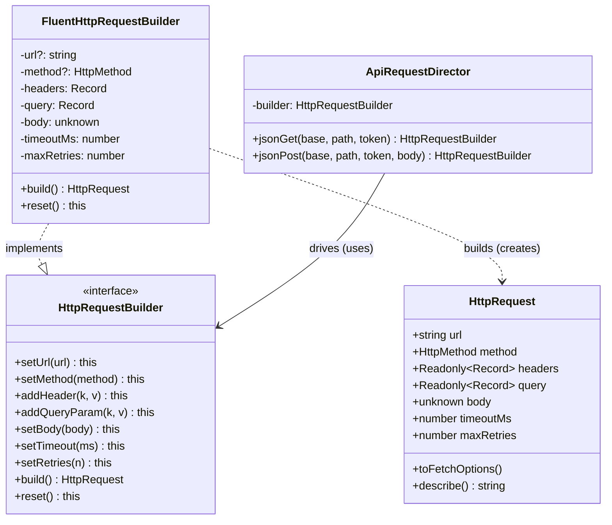

# Builder Pattern — Class Diagram

Shows the four participants and their relationships. Only three are always present;
the Director is optional. The ConcreteBuilder holds the intermediate state and is the
only participant that knows how to assemble (and validate) the Product.

**How to read it**
- `..|>` (dashed, hollow triangle) = *implements interface*. `FluentHttpRequestBuilder` implements the `HttpRequestBuilder` step vocabulary.
- `..>` (dashed arrow) = *creates / builds*. The concrete builder is the only thing that constructs the `HttpRequest` product — callers never call `new HttpRequest(...)`.
- `-->` = *association / holds a reference*. The `ApiRequestDirector` holds a builder and drives it, but depends only on the **interface**, so it can drive any concrete builder.
- The Product (`HttpRequest`) has **no arrow back to the builder** — it is deliberately "dumb": it holds finished, immutable data and knows nothing about how it was assembled.
