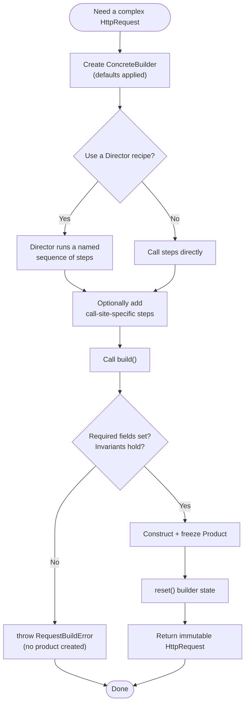

# Builder Pattern — Flow Diagram

Step-by-step control flow of constructing one `HttpRequest`, from creating the builder
through the `build()` validation gate to returning an immutable product (or throwing).

**Key idea:** every path funnels through `build()`, the one validation gate. Required
fields and cross-field invariants are checked *together* there — the only point where
the full picture of the object exists. If any check fails, no product is created; if all
pass, the product is frozen and returned, and the builder resets so it can be reused safely.
