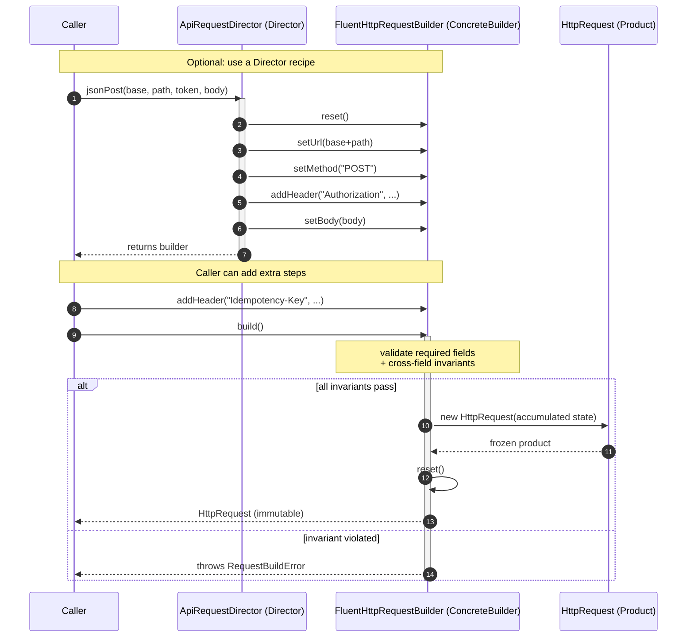

# Builder Pattern — Sequence Diagram

Shows the runtime message exchange for constructing one request: the optional Director
recipe, extra caller-specific steps, and both the valid and invalid paths through `build()`.

**How to read it**
- The **Director** is optional: it `reset()`s the builder and runs a fixed sequence of steps, then hands the builder back — it deliberately does **not** call `build()`.
- After the recipe, the **Caller** can still add situation-specific steps (here an `Idempotency-Key` header) before finishing.
- `build()` is the single gate: it validates all required fields and cross-field invariants **before** any product exists.
- The `alt` block shows the two outcomes: on success the builder constructs a **frozen, immutable** `HttpRequest` and auto-`reset()`s itself; on any violation it throws `RequestBuildError` and no product is ever created.
