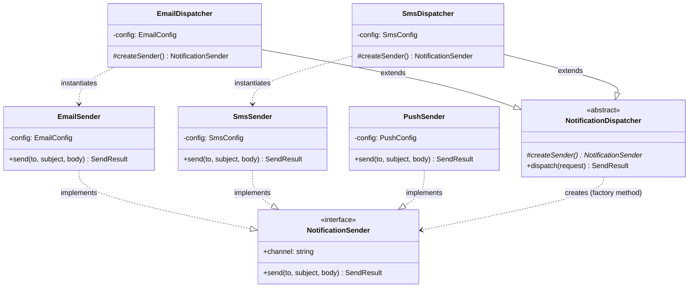
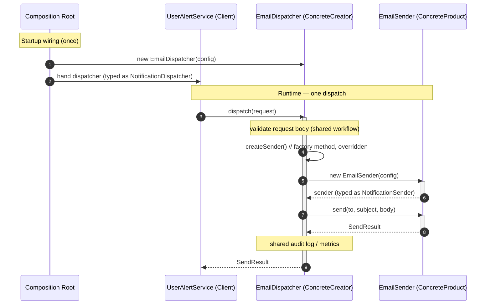
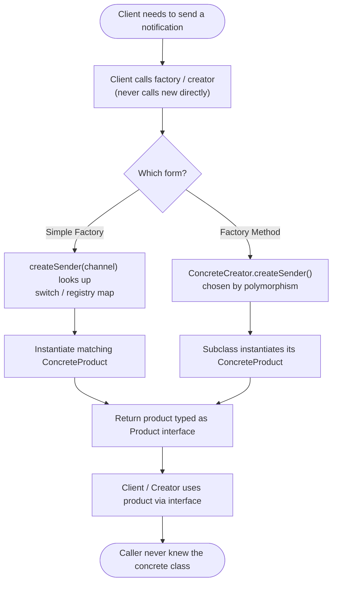

# Factory Method Pattern

## Intent

Define an interface for creating an object, but let a subclass (or a dedicated factory) decide which concrete class to instantiate — so the code that *uses* the object never depends on the code that *builds* it.

## Real Life Analogy

Think about ordering a coffee at a café. You walk up and say "one cappuccino, please." You do **not** walk behind the counter, grind the beans, steam the milk, and assemble the drink yourself. You state *what you want* through a simple, uniform interface (the menu), and the *barista decides how to build it* — which machine, which beans, which steps.

Now imagine the café has several branches. The downtown branch uses an espresso machine; the airport kiosk uses pods; the drive-through uses a bulk brewer. To you, the customer, nothing changes: you still say "one cappuccino," and you still receive a cup that behaves like a cappuccino (you can drink it, it has the right taste). The *creation logic* differs per branch, but it is hidden behind the counter.

The Factory Method Pattern is exactly this counter. Your code (the customer) asks for a product by a simple request. A "creator" (the branch/barista) hides the messy decision of *which concrete thing to build and how*. You depend on the menu (an interface), never on the machine (a concrete class).

## Problem

### What engineering problem exists?

In real backend systems, you constantly need to create objects whose *exact concrete type is not known until runtime*, or that you want to be able to add to later without rewriting existing code. Examples:

- A notification service that must send over Email, SMS, or Push depending on user preference.
- A document exporter that produces PDF, CSV, or XLSX depending on the request.
- A payment layer that instantiates a Stripe, Razorpay, or PayPal client depending on the customer's region.
- A parser that builds a JSON, XML, or CSV parser based on the incoming file's content type.

The naive way to build these objects is to write `new EmailSender()` directly wherever you need one. That single line — the `new` keyword followed by a concrete class name — is the source of the problem.

> **Term: Concrete class.** A class you can directly instantiate with `new`, e.g. `EmailSender`. Its opposite is an **interface** or **abstract class** — a contract describing *what* methods exist, with no direct instantiation. "Coupling to a concrete class" means your code mentions the specific class name and therefore breaks or must change if that class changes or is replaced.

> **Term: Coupling.** How much one piece of code depends on the internal details of another. **Tight coupling** = hard to change one without touching the other. **Loose coupling** = they interact only through a stable contract (interface), so either side can change freely.

### Why is this problem difficult?

- **`new ConcreteClass()` welds the caller to that exact class.** The moment `OrderService` says `new EmailSender()`, `OrderService` *depends on* `EmailSender` — its constructor signature, its module, its config. You cannot unit-test `OrderService` without dragging in a real `EmailSender`.
- **The decision logic multiplies and scatters.** If ten different files each decide "email vs SMS vs push," you have ten copies of the same `if/switch`. Add a "Slack" channel and you must find and edit all ten — and every edit is a chance to introduce a bug.
- **Adding a type forces edits to working code.** Every new product type means reopening and modifying code that already works and is tested. This violates the Open/Closed Principle (see below) and risks regressions.

### What happens if we ignore it?

- **A growing `switch` (or `if/else`) tumor.** Object-creation logic becomes a sprawling conditional that grows with every new type, tangled together with business logic.
- **Shotgun surgery.** One conceptual change ("we now support push notifications") forces scattered edits across many files.
- **Untestable business logic.** Code that does `new StripeClient()` internally cannot be tested without real network/credentials, because you cannot substitute a fake.
- **Rigid, fragile design.** The system resists change exactly where it should be most flexible: the set of supported types.

## Why Not Other Solutions?

**"Just call `new ConcreteClass()` where I need it."**
This is the default and the problem itself. It couples every caller to a specific class, duplicates any selection logic, and makes substitution (for tests or new vendors) impossible without editing callers.

**"Put one big `switch (type)` in the business method."**
This centralizes the decision (better than scattering it) but tangles creation with business logic, and the method must be reopened and edited for every new type. It is a step toward — but not yet — a clean factory. Extracting that switch into its own function is precisely the **Simple Factory** (below).

**"Use a giant configuration object / service locator that returns `any`."**
A service locator that hands back untyped objects trades compile-time safety for runtime surprises. You lose the type system's help and push errors to production.

**"Just use dependency injection and inject the finished object."**
This is often the *right* answer — and Factory Method is complementary, not opposed, to DI (see Interview Discussion). But DI answers "who gives me the object," not "how is the object *chosen and built* when the choice depends on runtime data" (e.g. per-request the channel differs). When creation depends on runtime input, you still need a factory *inside* or *alongside* the DI wiring.

**Tradeoff summary:** All the naive alternatives either couple callers to concrete classes, duplicate selection logic, or force edits to working code when a new type appears. The Factory pattern isolates object creation into one place that callers depend on only through an interface.

## Solution

The core idea: **separate the code that decides *which* object to create and *how* to create it from the code that *uses* the object.**

There are three related shapes you will meet in practice. Knowing the difference is the single most valuable thing in this module, because engineers constantly conflate them.

**1. Simple Factory (not a formal GoF pattern, but the most common form).**
A single function or class with a `switch`/map that takes a key and returns the right concrete product typed as the interface. The client asks `createSender("email")` and receives a `NotificationSender`. It never sees `EmailSender`. This is the 80% case in real backends.

**2. Factory Method (the actual GoF pattern this module is named for).**
A **Creator** class contains a workflow and declares an *abstract factory method* (e.g. `createSender()`). It never calls `new ConcreteProduct()` itself — it calls `this.createSender()`. **Subclasses** (ConcreteCreators) override that method to decide the concrete product. The decision is made by *which subclass you use*, resolved through polymorphism rather than a conditional.

**3. Abstract Factory (a sibling pattern — mentioned, deferred to its own module).**
Creates *families* of related products (e.g. a whole UI toolkit: button + checkbox + menu, all "dark theme"). Factory Method creates *one* product; Abstract Factory groups several factory methods to create a coordinated set.

The thinking behind all three:

1. **Depend on abstractions, not concretions.** Clients hold a `NotificationSender` (interface), never an `EmailSender` (class).
2. **Isolate the "new".** All knowledge of *which concrete class and how to build it* lives in one place — a factory function, a registry, or a ConcreteCreator.
3. **Make extension cheap.** Adding a product should mean *adding* code (a new class, a new registry entry, a new subclass), not *editing* existing, tested code.

## Architecture

The classic Factory Method has four participants:

1. **Product (interface):** The contract every created object honors, e.g. `NotificationSender` with `send(to, subject, body)`. Clients depend on this and nothing more.

2. **ConcreteProduct(s):** The actual implementations — `EmailSender`, `SmsSender`, `PushSender`. Each does the real work in its own way, hidden behind the Product interface.

3. **Creator:** The class that declares the **factory method** (e.g. `protected abstract createSender(): NotificationSender`). Crucially, the Creator usually also contains real business logic (a workflow) that *uses* the product it creates. It calls its own factory method instead of `new`. It may provide a default implementation.

4. **ConcreteCreator(s):** Subclasses that **override** the factory method to return a specific ConcreteProduct — `EmailDispatcher.createSender()` returns an `EmailSender`. Choosing a ConcreteCreator *is* choosing the product.

For the **Simple Factory** variant, the participants collapse: a single `createSender(key)` function (the factory) plus the Product interface and ConcreteProducts. There is no Creator hierarchy — the `switch`/map does the deciding.

Responsibilities in one line each:
- **Product:** defines what every created object can do.
- **ConcreteProduct:** does the real work, one specific way.
- **Creator:** runs the workflow, defers *creation* to the factory method.
- **ConcreteCreator:** decides which ConcreteProduct to build.

## Execution Flow

Using the **Factory Method** (Creator/subclass) form with our notification example:

1. At the composition root, you construct a specific **ConcreteCreator** — e.g. `new EmailDispatcher(emailConfig)` — and hand it to the client, typed as the base `NotificationDispatcher`.
2. The client calls a workflow method on the Creator, e.g. `dispatcher.dispatch(request)`.
3. Inside `dispatch`, the Creator does shared work (validate the request body).
4. When it needs the product, the Creator calls **its own factory method**: `this.createSender()`. It does **not** call `new`.
5. Because the runtime object is an `EmailDispatcher`, the overridden `createSender()` runs and returns a `new EmailSender(config)` — but typed as `NotificationSender`.
6. The Creator continues its workflow using the returned product: `sender.send(...)`.
7. Shared post-processing (audit log, metrics) runs in the Creator, identical for every channel.
8. The result flows back to the client, which never learned whether an email, SMS, or push was actually built.

Using the **Simple Factory** form:

1. The client (or composition root) calls `createSender("email", config)`.
2. The factory's `switch` matches `"email"` and executes `new EmailSender(config.email)`.
3. It returns the instance typed as `NotificationSender`.
4. The client uses it via the interface and never sees `EmailSender`.

## Class Diagram

`#createSender()*` marks the abstract factory method (the `*` = abstract, `#` = protected). Note the Creator points at the **Product interface**, while each ConcreteCreator points at a **ConcreteProduct** it instantiates.

## Sequence Diagram

## Flow Diagram

## Implementation

The implementation strategy in TypeScript:

1. **Define the Product interface first.** Design it around what the *client* needs (`send(to, subject, body)`), not around any single implementation's quirks. Keep it small.

2. **Write the ConcreteProducts.** Each `implements` the Product interface and takes its dependencies (SMTP config, API keys) via constructor injection so it stays testable.

3. **Pick a factory shape based on how the type is chosen:**
   - If the choice is a runtime *value* (a string from config or a request field) and the set is small/stable → **Simple Factory** (a function with a `switch`).
   - If you want extension without editing the factory → **Registry Factory** (a `Map` of creator functions; register new products from outside).
   - If each variant carries a *whole workflow* that differs and you naturally have polymorphic creators → **Factory Method** (abstract Creator + ConcreteCreator subclasses).

4. **Return the interface type, never the concrete type.** `function createSender(...): NotificationSender` — never `: EmailSender`. This is what keeps callers decoupled.

5. **Keep the `new` in exactly one layer.** Business/domain code must not contain `new ConcreteProduct()`.

6. **Wire everything at the composition root.** The client is handed a Product (or a Creator); it never chooses or builds concrete classes itself.

Our [code.ts](code.ts) demonstrates all three shapes side by side on one realistic scenario — a multi-channel notification system — so you can compare them directly.

## Code Walkthrough

See [code.ts](code.ts) for the full runnable implementation. Here is what each part does and why it exists.

**`NotificationSender` (Product interface).**
The contract every channel honors: a `channel` label and `send(to, subject, body)` returning a `SendResult`. The entire application depends on *this*. It exists so that no business code ever needs to know whether an email, SMS, or push is behind the reference.

**`EmailSender`, `SmsSender`, `PushSender` (ConcreteProducts).**
Each implements `NotificationSender` and holds its own config via constructor injection (SMTP host, Twilio SID, FCM key). They differ wildly inside — `SmsSender` ignores the `subject`, `EmailSender` validates the `@`, `SmsSender` enforces a length cap — yet all present the identical interface. They exist to encapsulate "how this one channel actually works."

**`createSender(channel, config)` (Simple Factory).**
A single function with a `switch` that maps a `ChannelName` to the right ConcreteProduct, returning it typed as `NotificationSender`. It centralizes every `new` for the channels. The `default` branch uses a `never`-typed exhaustiveness check so that adding a channel to the `ChannelName` union without handling it here fails to compile. This is the form engineers reach for most often. Its known limitation: adding a channel means editing this function (not open/closed).

**`SenderRegistry` + `buildDefaultRegistry()` (Registry Factory).**
The open/closed upgrade. Instead of a hard-coded `switch`, it keeps a `Map<string, SenderCreator>` of creator functions. `register()` adds a channel from *outside* the class; `create()` looks one up and invokes it. Adding "Slack" is a `registry.register("slack", ...)` call — the registry code itself never changes. This is how plugin systems and DI containers build objects internally. It exists to show the escape from a growing `switch`.

**`NotificationDispatcher` (Creator) with `createSender()` (the Factory Method).**
This is the true GoF Factory Method. The abstract `createSender()` is the factory method; `dispatch()` is the *workflow* that gives the Creator a reason to exist. `dispatch()` validates input, calls `this.createSender()` (never `new`), sends, then runs shared audit/error handling. The base class is written entirely against the `NotificationSender` interface.

**`EmailDispatcher`, `SmsDispatcher` (ConcreteCreators).**
Each `extends NotificationDispatcher` and overrides `createSender()` to return its specific product. Choosing which dispatcher to construct *is* choosing the channel — no conditional required; polymorphism resolves it. They exist to demonstrate creation-by-subclass, the defining trait of Factory Method versus Simple Factory.

**`UserAlertService` (Client).**
Holds a `NotificationSender` injected through its constructor. Its `alertPasswordChanged()` calls `sender.send(...)` and never mentions a concrete class. This class proves the payoff: swapping channels requires *zero* changes to it.

**Composition root (`main`).**
The only place that names concrete classes. It builds a sender via the simple factory, another via the registry, and iterates ConcreteCreators via the factory method — showing all three feeding the same interface-only client.

## Advantages

- **Decouples clients from concrete classes.** Callers depend on the Product interface; the `new` lives in one place. This is the whole point.
- **Single Responsibility Principle.** Object-creation logic is pulled out of business logic into a dedicated factory/creator.
- **Open/Closed Principle (especially with a registry or subclasses).** You add a product by adding a class/entry, not by editing existing callers.
- **Centralized, consistent construction.** Cross-cutting concerns at creation time (defaults, validation, logging, pooling) live in one spot instead of being copy-pasted at every `new`.
- **Testability.** Clients take the interface, so tests inject a fake product with no network/DB. Factories themselves are trivial to unit-test.
- **Runtime flexibility.** The concrete type can be chosen from config, a feature flag, a request field, or an A/B test — without touching callers.

## Disadvantages

- **More indirection and classes.** For a single, never-changing type, a factory is pure ceremony — you added an interface and a function to build one thing.
- **Factory Method needs a class hierarchy.** The true GoF form requires a Creator subclass per product, which can feel heavy when the only difference between subclasses is one `new`.
- **A Simple Factory's `switch` is not open/closed.** Every new product edits the factory. (The registry variant fixes this, at the cost of losing compile-time exhaustiveness.)
- **Can hide construction cost.** Callers may not realize `createX()` opens a connection or allocates something expensive.
- **Over-application ("factory for everything").** Wrapping trivial value objects in factories adds noise without benefit.

## Tradeoffs

**What we gain:** loose coupling, a single place to change construction, testable clients, adherence to SRP and (with care) OCP, and the freedom to choose concrete types at runtime.

**What we lose:** some directness and simplicity. We add at least an interface plus a factory function, and the Factory Method form adds a class hierarchy. There is a small amount of extra indirection to trace when reading the code. The value is real only when the set of products is *more than one* or is *expected to grow*, or when construction has logic worth centralizing. For a lone, stable type, `new` is honestly better — reaching for a factory there is speculative generality (YAGNI).

## Complexity

**Code Complexity:** Low for Simple Factory (one function). Moderate for Factory Method (a Creator hierarchy). The pattern itself is small; complexity comes from the number of products, not the pattern.

**Maintenance Complexity:** Low. Changes are localized — a new product is a new class plus one registration (registry) or one subclass (factory method). A Simple Factory's `switch` is the one spot that must be reopened per product.

**Scalability:** Excellent *organizational* scalability. Many teams can add products (channels, providers, exporters) independently, each in its own file. No runtime bottleneck is introduced.

**Flexibility:** High. Concrete types are chosen behind an interface, enabling per-request selection, feature flags, provider A/B tests, and easy vendor swaps.

**Testability:** High. Clients depend on the interface and accept fakes. Factories are pure functions or small classes, tested by asserting the returned instance type/behavior for each key.

## Performance Considerations

**Memory:** A factory holds nothing but (optionally) a registry map — negligible. Whether products are created per-call or cached is your choice; prefer reusing stateless senders (singletons) over allocating one per request.

**CPU:** One extra function call and a `switch`/map lookup per creation — immeasurable next to the network/DB work the product will do.

**Network:** The factory adds no network calls itself, but be aware that a ConcreteProduct's *constructor* might (opening an SMTP or DB connection). Do that once at startup, not on every `createX()` in a hot path.

**Database:** A common use is a repository/driver factory. Ensure the factory hands back a *pooled* connection/client rather than opening a fresh connection per call.

**Object creation:** The pattern's name is about creation, so this matters: decide deliberately between "new instance every time" (needed when the product holds per-request state) and "shared singleton" (best for stateless senders). A registry can memoize instances if desired.

**Runtime:** Overhead is a constant, tiny per-creation cost. The pattern is chosen for maintainability and flexibility, not speed; its runtime impact is effectively zero in I/O-bound backends.

## Common Mistakes

- **Confusing Simple Factory with Factory Method.** Beginners call any `switch`-in-a-function "the Factory Method pattern." *Why it happens:* both hide `new`. *Avoid:* remember Factory Method uses *subclass polymorphism* to pick the product; Simple Factory uses a *conditional*. Both are useful; only one is the GoF pattern.

- **Returning the concrete type from the factory.** `function createSender(): EmailSender` leaks the concrete class and defeats the purpose. *Avoid:* always return the Product *interface*.

- **Putting business logic inside the factory.** A factory should *build*, not *decide business rules* (discounts, permissions). *Why:* it is tempting to "just add" logic where the object is born. *Avoid:* keep factories to construction; business rules stay in the domain/service layer.

- **A god-factory with a 30-case `switch` and no registry.** The conditional grows forever and becomes a merge-conflict magnet. *Avoid:* switch to a registry/map of creators once the set is open-ended.

- **Factory Method with no workflow in the Creator.** If the Creator only has `createX()` and no shared logic, you have written a Simple Factory in a costly way. *Avoid:* use Factory Method only when the Creator holds real shared behavior; otherwise use a plain factory function.

- **`new` still hiding in business code.** Extracting *some* creation to a factory while other files still `new ConcreteProduct()` gives you the costs of the pattern without the benefit. *Avoid:* enforce (via review or lint) that concrete construction lives only in the factory layer.

- **Ignoring exhaustiveness.** A `switch` without a `never` default silently mishandles new enum values. *Avoid:* add the `const _never: never = key` default so the compiler flags unhandled cases.

## When To Use

- **The concrete type is chosen at runtime** from config, a feature flag, a request field, or an environment (channel, provider, exporter, parser).
- **You expect the set of types to grow** and want to add them without editing callers (payment providers, notification channels, file-format handlers).
- **Construction has logic worth centralizing** — defaults, validation, pooling, or wiring multiple dependencies — that you do not want duplicated at every `new`.
- **You want clients testable** by injecting fakes behind an interface instead of real, heavy objects.
- **A framework/library needs an extension point** where users supply their own concrete type (the Creator declares the factory method; users subclass it).

## When NOT To Use

- **There is exactly one implementation and no realistic second.** A factory to build one class is needless indirection — just use `new` (YAGNI).
- **The object is a trivial value with no construction logic and no substitution need.** Wrapping `new Point(x, y)` in a factory adds noise.
- **You need families of related products that must be used together.** That is **Abstract Factory**, not a single Factory Method.
- **Construction requires many optional steps / a fluent step-by-step assembly.** That is the **Builder** pattern.
- **You already inject the finished object via DI and the type never varies at runtime.** Plain constructor injection is simpler than adding a factory.

## Real Production Examples

- **Node.js:** `crypto.createHash("sha256")` / `createCipheriv(...)` are factory functions returning objects typed by an interface. The `stream` module's `Readable.from(...)` builds the right stream type. `http.createServer()` is a classic factory function.
- **NestJS:** Custom providers with `useFactory` are literally the Factory pattern wired into the DI container — a function decides and builds the dependency (often from config or other injected services). Nest's `ModuleRef.create()` and dynamic modules (`forRootAsync` with `useFactory`) are factory-based.
- **Express:** `express()` itself is a factory that produces a configured application object; `express.Router()` is a factory for router instances.
- **Java Spring:** `BeanFactory` / `ApplicationContext` are the archetype — `FactoryBean<T>` lets you supply custom creation logic. `Calendar.getInstance()` and `LoggerFactory.getLogger()` are simple factories.
- **.NET:** `IHttpClientFactory` (create configured `HttpClient`s), `ILoggerFactory.CreateLogger<T>()`, and `DbProviderFactory` for database providers.
- **AWS:** SDK clients are built via factories/builders (e.g. `S3Client.builder()...build()` in the Java SDK); the JS SDK v3 constructs service clients from a config object — a factory-style entry point per service.
- **Azure / Google Cloud:** `BlobServiceClient` construction and Google's `Storage()` / `new PubSub()` client entry points act as factories that return a configured client behind a stable surface.
- **React (if applicable):** `React.createElement(type, props)` is a factory that returns an element regardless of the component type; `createContext()` returns provider/consumer objects.
- **Databases / ORMs:** TypeORM's `DataSource`/connection creation and repository factories (`dataSource.getRepository(Entity)`) build the right repository behind a common interface. Knex/Sequelize pick a dialect client via a factory keyed by the DB type.
- **AI Systems:** A provider factory that returns an `LLMClient` for Claude, OpenAI, or a local model based on a config string — the surrounding agent code depends only on `LLMClient`. LangChain's model/loader "loaders" are factories keyed by type.

## Where I Can Use This

Five realistic ideas for your own backend projects:

1. **Notification service (this module's example).** A `NotificationSender` interface with a registry factory keyed by the user's preferred channel (email/SMS/push/Slack), selected per notification.
2. **Document/report exporter.** An `Exporter` interface with `PdfExporter`, `CsvExporter`, `XlsxExporter`, chosen by the requested `format` field in an API call.
3. **Payment provider factory.** A `PaymentClient` interface with a factory that builds Stripe/Razorpay/PayPal clients based on the customer's region config (pair this with the Adapter pattern for the vendor SDKs).
4. **File-parser factory.** A `Parser` interface producing JSON/XML/CSV parsers based on the uploaded file's content type, so your ingestion pipeline stays type-agnostic.
5. **Cache/storage backend factory.** A factory returning a Redis-backed cache in production and an in-memory one in tests, keyed by `NODE_ENV`, so no test ever touches Redis.

## Similar Patterns

- **Abstract Factory:** Creates *families* of related products meant to be used together (e.g. a matched button + checkbox + dialog for one theme). Factory Method creates *one* product; Abstract Factory is essentially a bundle of factory methods. Covered in its own module.
- **Builder:** Constructs a *single complex object step by step* (many optional parts, a fluent API). Factory creates an object in *one call*; Builder assembles it across several. Use Builder when construction has many stages/options; Factory when you just need "the right object for this key."
- **Prototype:** Creates new objects by *cloning* an existing instance rather than instantiating a class. Choose Prototype when copying is cheaper than building from scratch, or when the concrete class is decided by an example object.
- **Strategy:** Swaps interchangeable *algorithms/behaviors* behind one interface. It looks like a factory when you *select* the strategy, but the intent differs: Factory is about *creating* objects; Strategy is about *choosing behavior* on an already-created context. A factory is often used *to build* the strategy.
- **Simple Factory (idiom):** A single function/class with a conditional. Not a formal GoF pattern, but the most common real-world "factory." It is a stepping stone to Factory Method (extract the switch, then let subclasses decide).

| Pattern           | Creates            | How the type is chosen        | Intent                                    | Product count |
|-------------------|--------------------|-------------------------------|-------------------------------------------|---------------|
| Simple Factory    | One object         | Conditional / map on a key    | Centralize `new`, hide concrete class     | One at a time |
| Factory Method    | One object         | Subclass polymorphism         | Let subclasses decide the concrete class  | One at a time |
| Abstract Factory  | A family of objects| Which concrete factory chosen | Build coordinated product sets            | Many, matched |
| Builder           | One complex object | Explicit step-by-step calls   | Assemble complex objects incrementally    | One (complex) |
| Prototype         | One object         | Clone an existing instance    | Copy instead of construct                 | One at a time |
| Strategy          | Nothing (selects)  | Injected/selected behavior    | Swap interchangeable algorithms           | N/A (behavior)|

## Interview Discussion

Experienced engineers rarely treat "Factory" as a single thing. The first move in any serious discussion is to **disambiguate the three shapes**: Simple Factory (a function with a switch — not GoF), Factory Method (subclass overrides creation — GoF), and Abstract Factory (families of products — GoF). Mislabeling them is the most common giveaway of shallow understanding.

The second theme is **how Factory relates to Dependency Injection.** They are complementary. DI containers *are* factories under the hood — NestJS `useFactory`, Spring's `BeanFactory`. The nuance: plain constructor injection handles "give me the one collaborator I need"; you still reach for an explicit factory when the concrete type depends on *runtime data* (per-request channel, per-tenant provider), because the container cannot know that value at wiring time. A common pattern is to inject a *factory* into a service and have the service call it per request.

The third theme is **Open/Closed in practice.** A naive Simple Factory's `switch` violates OCP (you edit it per product); the fix is a registry/map of creators so new products register themselves. Discussing this trade — compile-time exhaustiveness (switch) versus runtime extensibility (registry) — signals maturity.

Common follow-up questions:
- *"Factory Method vs Simple Factory — which is 'the pattern'?"* Factory Method (subclass-based) is the GoF pattern; Simple Factory is an idiom. Both are legitimate; pick by whether you have a real Creator workflow.
- *"How would you avoid the growing switch?"* Registry/map of creator functions, or DI container registration.
- *"In JavaScript, do you even need classes?"* Often no — a plain factory *function* returning an object literal is idiomatic JS and perfectly valid; classes are one option, not a requirement.
- *"How does this help testing?"* Clients depend on the interface, so you inject fakes; the factory is where the real-vs-fake choice is made.

Common misconceptions:
- "Any use of `new` inside a function is the Factory Method pattern." No — the GoF pattern specifically defers creation to *subclasses*.
- "Factory and Abstract Factory are the same." No — one product vs a coordinated family.
- "Factories replace DI." No — they coexist; DI often *is* a factory mechanism.

## Summary

- Factory patterns separate *choosing/building* an object from *using* it, so clients depend on an interface, not on `new ConcreteClass()`.
- Three shapes: **Simple Factory** (function + switch/map, most common, not GoF), **Factory Method** (subclass overrides creation, the GoF pattern), **Abstract Factory** (families of products).
- Participants of Factory Method: **Product**, **ConcreteProduct**, **Creator** (declares the factory method, holds the workflow), **ConcreteCreator** (overrides it).
- Always return the **Product interface**, never the concrete type.
- Escape the growing `switch` with a **registry/map of creators** for Open/Closed extensibility.
- **DI containers are factories**; explicit factories still matter when the type depends on runtime data.
- In JS/TS, a plain **factory function** is often the cleanest form — classes are optional.

## Key Takeaways

1. The core rule: clients depend on the Product interface; the `new` lives in one factory layer.
2. Distinguish Simple Factory (switch), Factory Method (subclass), Abstract Factory (families) — do not conflate them.
3. Factory Method = a Creator with a workflow that defers *which product* to a subclass via an abstract factory method.
4. Simple Factory is the 80% real-world case; return the interface and keep the switch exhaustive.
5. Replace a growing `switch` with a registry/map of creators to honor Open/Closed.
6. Keep factories to construction only — no business rules inside them.
7. Use a factory when the type is chosen at runtime or the set will grow; use plain `new` for a lone, stable type.
8. Factories make clients testable by letting you inject fakes behind the interface.
9. DI containers are factories; the two patterns cooperate rather than compete.
10. In TypeScript/JavaScript, a factory *function* is idiomatic — you do not always need a class hierarchy.

---

## Further Reading

**Books**
- *Design Patterns: Elements of Reusable Object-Oriented Software* — Gamma, Helm, Johnson, Vlissides (the "Gang of Four"); the original Factory Method and Abstract Factory definitions.
- *Head First Design Patterns* — Freeman & Robson; the Factory chapter (pizza-store example) is the clearest beginner introduction and explicitly separates Simple Factory, Factory Method, and Abstract Factory.
- *Effective Java* — Joshua Bloch; Item 1 ("Consider static factory methods instead of constructors") is essential practical reading even for non-Java engineers.
- *Dependency Injection: Principles, Practices, and Patterns* — Seemann & van Deursen; how factories and DI containers relate.
- *Refactoring* — Martin Fowler; "Replace Constructor with Factory Method/Function" refactorings.

**Open Source Projects / GitHub Repositories**
- NestJS custom providers (`useFactory`) and dynamic modules — https://github.com/nestjs/nest
- TypeORM `DataSource` / repository creation — https://github.com/typeorm/typeorm
- Node.js core `crypto`/`stream` factory functions — https://github.com/nodejs/node

**Official Documentation**
- Refactoring.Guru — Factory Method — https://refactoring.guru/design-patterns/factory-method
- Refactoring.Guru — Abstract Factory — https://refactoring.guru/design-patterns/abstract-factory
- NestJS Docs — Custom providers (`useFactory`) — https://docs.nestjs.com/fundamentals/custom-providers

**Blog Articles**
- Refactoring.Guru — Factory Method in TypeScript — https://refactoring.guru/design-patterns/factory-method/typescript/example
- Martin Fowler — "Inversion of Control Containers and the Dependency Injection pattern" — https://martinfowler.com/articles/injection.html (how factories/containers assemble objects).
