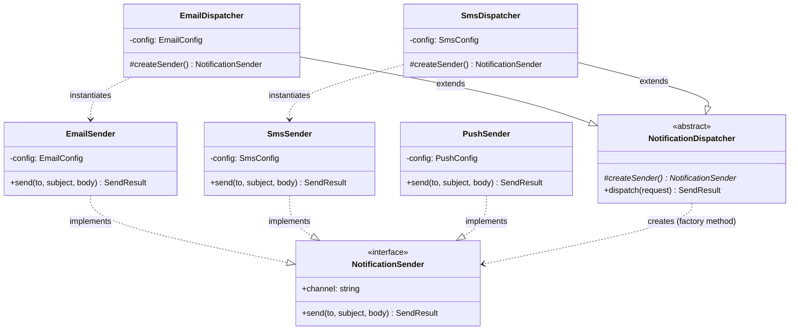

# Factory Method Pattern — Class Diagram

Shows the four participants. The Client/Creator depends only on the Product
interface (`NotificationSender`). Each ConcreteCreator *extends* the Creator and
overrides the factory method to *instantiate* one ConcreteProduct.

**How to read it**
- `#createSender()*` marks the abstract factory method (`*` = abstract, `#` = protected).
- `..|>` (dashed, hollow triangle) = *implements interface*. Each ConcreteProduct implements `NotificationSender`.
- `--|>` (solid, hollow triangle) = *extends / inheritance*. Each ConcreteCreator extends `NotificationDispatcher`.
- `..>` (dashed arrow) = *creates / instantiates*. Note the Creator points at the **Product interface**, while each ConcreteCreator points at the specific **ConcreteProduct** it builds.
- The Creator has **no arrow to any concrete product** — it depends only on the interface. That decoupling is the whole point.
