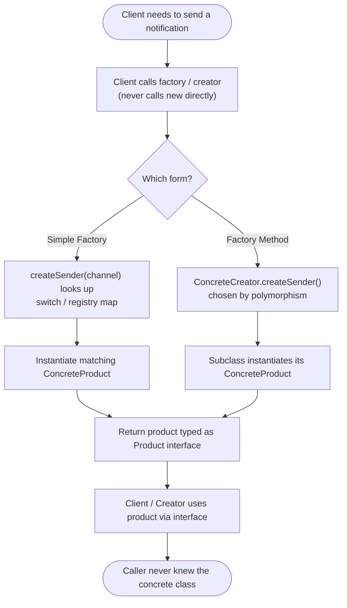

# Factory Method Pattern — Flow Diagram

Step-by-step control flow of a single creation request, showing both the Simple
Factory branch and the Factory Method (subclass) branch converging on the same
interface-typed result.

**Key idea:** whichever form you pick, the concrete `new` happens in exactly one
place and the result is always returned *typed as the Product interface*. The
Simple Factory decides via a *conditional/map on a key*; the Factory Method
decides via *subclass polymorphism*. The client on the far side is identical in
both — it uses the product through the interface and never learns the concrete class.
