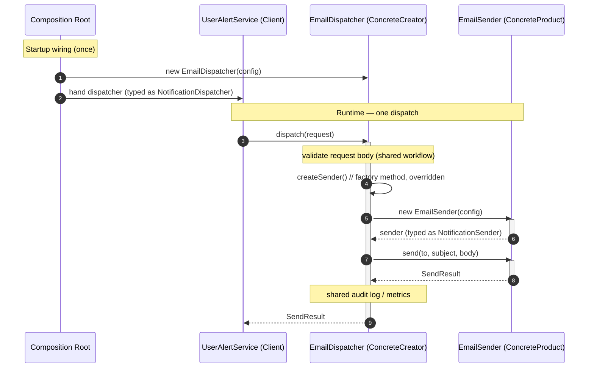

# Factory Method Pattern — Sequence Diagram

Shows the runtime message exchange for one dispatch using the Factory Method
(Creator/subclass) form, including the composition-root wiring.

**How to read it**
- The **Composition Root** picks and constructs a specific ConcreteCreator (`EmailDispatcher`), then hands it to the Client *typed as the base* `NotificationDispatcher` — done once at startup.
- At runtime the Client only calls the Creator's workflow method `dispatch()`; it never chooses or builds a concrete product.
- Inside `dispatch()`, the Creator calls **its own factory method** `createSender()` — never `new` directly. Polymorphism resolves it to the overriding subclass, which returns the product typed as the `NotificationSender` interface.
- Shared workflow (validate, audit log, metrics) lives in the Creator and runs identically for every channel; only the created product differs.
